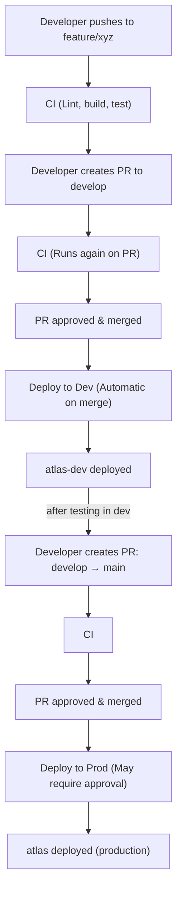

# CI/CD Setup Guide

This document explains how to configure GitHub Actions for automated deployments.

## Branch Strategy (GitFlow)

```
main (protected)         ← Production deployments
  ↑
develop (protected)      ← Development deployments
  ↑
feature/*, hotfix/*, bugfix/*  ← Developer branches
```

### Branch Rules

| Branch | Protection | Deployment |
|--------|------------|------------|
| `main` | Requires PR, approvals | Production |
| `develop` | Requires PR | Development |
| `feature/*` | None | None (CI only) |
| `hotfix/*` | None | None (CI only) |
| `bugfix/*` | None | None (CI only) |

## GitHub Environments

Create two environments in GitHub (Settings → Environments):

### 1. `development`
Used for develop branch deployments.

### 2. `production`
Used for main branch deployments.
- Optional: Add required reviewers for approval before deployment

## Required Secrets & Variables

Configure these for **each environment** (Settings → Environments → [env]):

### Required (for deployment to work)

| Name | Type | Description | Example |
|------|------|-------------|---------|
| `DATABRICKS_HOST` | Variable | Workspace URL | `https://your-workspace.cloud.databricks.com` |
| `DATABRICKS_CLIENT_ID` | **Secret** | Service Principal Client ID | `00000000-0000-0000-0000-000000000000` |
| `DATABRICKS_CLIENT_SECRET` | **Secret** | Service Principal Secret | `dose...` |

*Note: Application settings like SQL Warehouse IDs and LLM endpoints are now configured in the `variables:` block of `databricks.yml`, rather than GitHub Environments.*

> **Note:** The app uses OAuth automatically inside Databricks Apps, so `DATABRICKS_TOKEN` and `MODEL_SERVING_API_KEY` are **not needed**.

### Getting the Values

#### DATABRICKS_HOST
Your Databricks workspace URL:
```
https://your-workspace.cloud.databricks.com
```

#### DATABRICKS_CLIENT_ID & DATABRICKS_CLIENT_SECRET
Create a Service Principal for CI/CD:

1. Go to **Account Console** → **User management** → **Service principals**
2. Click **Add service principal**
3. Name it: `github-actions-deployer`
4. Generate an OAuth secret:
   - Click on the service principal
   - Go to **Secrets** tab
   - Click **Generate secret**
   - Copy the **Client ID** and **Secret** (secret is only shown once!)

5. Grant workspace access:
   - Go to your Workspace → **Settings** → **Identity and access**
   - Add the service principal with **Admin** role (needed to deploy apps)

## Workflow Files

| File | Trigger | Description |
|------|---------|-------------|
| `.github/workflows/ci.yml` | PRs to any branch | Lint, type-check, build, test |
| `.github/workflows/deploy-develop.yml` | PR merged to develop | Deploy to dev environment |
| `.github/workflows/deploy-main.yml` | PR merged to main | Deploy to production |
| `.github/workflows/lite-version.yml` | Push to develop | Creates a stripped-down `lite/develop` branch using `configuration.lite.yaml` |

> **Note:** Developers should never push directly to `develop` or `main`. All changes go through pull requests. The deploy workflows trigger automatically when PRs are merged.

## Setting Up Branch Protection

### For `develop` branch:
1. Go to Settings → Branches → Add rule
2. Branch name pattern: `develop`
3. Enable:
   - ✅ Require a pull request before merging
   - ✅ Require status checks to pass before merging
   - ✅ Require branches to be up to date before merging
4. Select required status checks:
   - `Frontend Lint & Build`
   - `Backend Lint & Test`

### For `main` branch:
1. Same as above, plus:
   - ✅ Require approvals (set to 1 or more)
   - ✅ Dismiss stale pull request approvals when new commits are pushed

## Workflow Diagram



## First-Time Setup Checklist

### Pre-Deployment (Before First Deploy)

- [ ] Create GitHub repository
- [ ] Run `./bootstrap.sh` to configure Databricks prerequisites (Secret Scope, Volumes)
- [ ] Configure `databricks.yml` variables for your environment
- [ ] Create Service Principal for CI/CD deployments
- [ ] Grant Service Principal admin access to workspace
- [ ] Create `development` environment in GitHub
- [ ] Create `production` environment in GitHub
- [ ] Add secrets to `development` environment
- [ ] Add secrets to `production` environment
- [ ] Set up branch protection for `develop`
- [ ] Set up branch protection for `main`
- [ ] Test deployment with a PR to develop

### Post-Deployment (After First Deploy)

> **IMPORTANT**: The Databricks App creates its own service principal automatically. 
> This "App SP" needs additional permissions that can only be configured AFTER deployment.

- [ ] Find the App's auto-created Service Principal (Apps → Your App → Permissions)
- [ ] Grant App SP `READ` access to `atlas-hub` secret scope
- [ ] Grant App SP `Can Use` access to Lakebase instance
- [ ] Grant App SP `Can Query` access to Model Serving endpoint
- [ ] Restart the app to pick up new permissions

### Granting App SP Access to Secrets

Run this in a Databricks notebook as a workspace admin (after the app deploys and you find its ID):

```python
from databricks.sdk import WorkspaceClient
from databricks.sdk.service.workspace import AclPermission

w = WorkspaceClient()

# Find your App SP ID: Apps → Your App → Permissions → Note the SP application ID
APP_SP_ID = "your-app-sp-application-id"  # REPLACE!

# Grant READ access to the app's service principal
w.secrets.put_acl(scope="atlas-hub", principal=APP_SP_ID, permission=AclPermission.READ)
print(f"Granted READ access to {APP_SP_ID}")

# Verify ACLs
print("\nACLs for atlas-hub:")
for acl in w.secrets.list_acls(scope="atlas-hub"):
    print(f"  {acl.principal}: {acl.permission}")
```

### Creating the GitHub PAT

1. Go to **GitHub** → **Settings** → **Developer settings** → **Personal access tokens** → **Tokens (classic)**
2. Click **Generate new token (classic)**
3. Name: `atlas-infra-bot` (or similar)
4. Expiration: Set as appropriate (90 days recommended, set a reminder)
5. Scopes: Select **`repo`** (Full control of private repositories)
6. Click **Generate token**
7. **Copy immediately** - token is only shown once!
8. Store in the secret scope using the command above

## Troubleshooting

### Deployment fails with "Authentication failed"
Ensure:
1. `DATABRICKS_CLIENT_ID` and `DATABRICKS_CLIENT_SECRET` are set correctly
2. The Service Principal has workspace access
3. The OAuth secret hasn't expired

### Deployment fails with "Permission denied"
The Service Principal needs:
1. Workspace Admin role (to create/deploy apps)
2. CAN MANAGE permissions on the target workspace path

### Deployment fails with "App not found"
The workflow will auto-create the app. Ensure the Service Principal has permissions to create apps.

### Build fails
Check Node.js version (should be 20) and Python version (should be 3.11).

## Security Best Practices

1. **Use separate Service Principals** for development and production environments
2. **Rotate secrets regularly** - OAuth secrets should be rotated periodically
3. **Use environment protection rules** - Require approval for production deployments
4. **Limit Service Principal permissions** - Only grant what's needed
