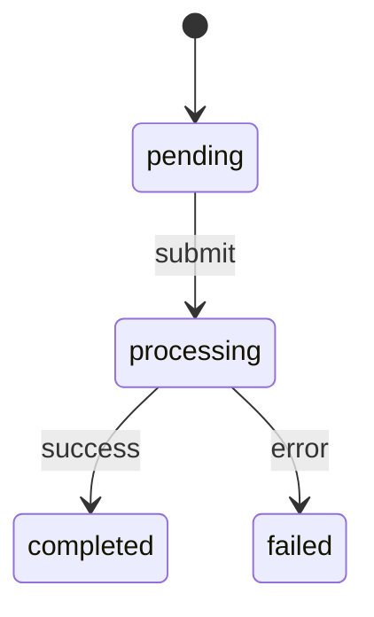

# State Machine Implementation Template

Use this template as your primary guide when creating a new state machine. Copy this file to `backend/app/state_machines/your_machine_name/plan.md` and fill it out before writing code. This serves as a design document, implementation checklist, and reference for agents and future developers.

> **Why this matters**: State machines are the core of our business logic. They must be resilient to server restarts (idempotent), traceable (fact-based), and scalable (async processing). A well-designed state machine handles failures gracefully and always knows "what happens next."

## 1. Metadata
Fill in the information below
- **Name**: `[Name]StateMachine`
    - *Convention*: `[Domain][Action]StateMachine` (e.g., `WorkspaceProvisioningStateMachine`).
- **Request Type**: `RequestType.[TYPE]` (Add to `backend/app/models/request.py`)
    - *Why*: This enum allows the `RequestFactory` to load the correct state machine class from the database record.
- **Description**: [Brief description of what this workflow does]
- **Ticket/Issue**: [Link to Jira/GitHub issue]

## 2. Prerequisites
Complete these before starting implementation
- [ ] **Request Type**: Added `[TYPE]` to `RequestType` enum in `backend/app/models/request.py`.
    - *Action*: Edit `backend/app/models/request.py` and add your new enum value.
- [ ] **Factory Registration**: Prepared to add to `backend/app/state_machines/factory.py`.
    - *Action*: You will need to import your new class and map the `RequestType` to it in `get_state_machine()`.

## 3. Design

### State Diagram
Define your states and transitions. Use Mermaid.
- Keep it simple, linear flows only. 
- Use "failed" states only for terminal failures; use retries for temporary issues.

### States & Facts
The system uses **Event Sourcing** principles. The state is derived from a history of immutable "Facts" (Events).
- **Completion Fact**: The specific fact that, when present, indicates this state is definitively "done". This maps to `STATE_COMPLETION_FACTS`.
    - *Why*: This allows the system to auto-recover state after a restart by replaying history. It also determines if a state is "checked off" in the UI.
- **Log Facts**: All facts that should be shown to the user in the UI timeline for this state. This maps to `STATE_LOG_FACTS`.
    - *Why*: Users need visibility into what happened (e.g., "Terraform Plan Applied") without seeing every internal debug event. limiting this reduces noise in the UI timeline.
- **Mapped Status**: The high-level status (e.g., `PROVISIONING`, `PENDING`) shown in the dashboard.
    - *Why*: The dashboard filters by these high-level statuses, allowing admins to see "all pending requests" without knowing the specific internal state name.

### Approvals (if any)
Consider if this workflow requires human approval or just agent reasoning and policy as code. Prefer automated approvals where possible. If a human approval is required, write a justification below and check the box, detailing if this is "for now" or "forever".

- [ ] Manager Approval (`manager`) - Checks `approval_received` with type `manager`.
- [ ] Data Owner Approval (`data_owner`) - Checks `approval_received` with type `data_owner`.
- [ ] Platform Admin Approval (`platform_admin`) - Checks `approval_received` with type `platform_admin`.
- [ ] Custom Approval: `[type]`

Justification: 

## 4. Implementation Checklist

### Step 1: File Creation
- [ ] Create `backend/app/state_machines/[machine_name]/state_machine.py`
    - *Structure*: We now use a folder-per-machine structure.
    - *Files*:
        - `state_machine.py`: The implementation.
        - `plan.md`: This design document.
        - `__init__.py`: (Optional, usually empty).
- [ ] Define class inheriting from `BaseRequestStateMachine`.
    - *Guidance*: Copy structure from `backend/app/state_machines/workspace_provision/state_machine.py` as a reference.

### Step 2: Define States & Transitions
- [ ] Define `statemachine.State` objects.
    - *Requirement*: Always have an `initial=True` state (usually `pending`) and a `final=True` state (usually `completed`).
    - *Naming*: Use snake_case for IDs (e.g., `provisioning_workspace`).
- [ ] Define transitions (e.g., `submit = pending.to(processing)`).
    - *Tip*: Transitions are "atomic" moves. Logic should happen *during* the transition or *after* entering the new state.

### Step 3: Configuration Mappings
- [ ] Override `STATE_COMPLETION_FACTS`.
    - *Why*: Tells the UI which event proves a step is done.
- [ ] Override `STATE_LOG_FACTS`.
    - *Why*: Tells the UI what history to show the user.
- [ ] Override `STATUS_MAPPING`.
    - *Why*: Maps internal technical states to user-friendly dashboard statuses.
- [ ] (Optional) Define `APPROVAL_NODES` for UI display names.
    - *Feature*: If you use standard approval states (`*_approval`), mapping them here gives them nice UI names like "Manager Approval" instead of "Manager_approval".

### Step 4: Implement Logic Hooks (The Core Logic)
This is where the work happens. The base class's `tick()` method calls these hooks.

- [ ] Implement `async def on_enter_[state]_async(self):` for states requiring external actions (Providers).
    - **CRITICAL - Idempotency**: State machines may crash or be restarted.
        - *Check First*: Before calling a provider (e.g., creating a repo), check if `self.has_[fact_name]` (e.g., `repo_created`) is already true.
        - *Do Work*: Call the Provider.
        - *Record Fact*: `add_fact(self.db, self.request.id, "fact_name", data)`.
        - *Handle Errors*: If a provider fails, raise `RetryableError` (for network blips) or `PermanentError` (for bad config). The worker handles the retry loop.
- [ ] Implement `def on_enter_[state](self):` for synchronous logic.
    - *Use Case*: Internal state updates, creating approval tasks, or simple logic that doesn't need async I/O. Use strictly for side-effect-free logic if possible.

### Step 5: Notifications (Optional)
- [ ] Send specific notifications using `await self._send_notification()`.
- [ ] *Note*: Approval states often handle their own notifications via the approval workflow (in `BaseRequestStateMachine`), but you can add custom ones for specific milestones (e.g., "Provisioning Complete").

## 5. Reusable Components (Cheatsheet)

The `BaseRequestStateMachine` provides "magic" helpers to make your life easier:

- **Approvals Logic**:
  - `self.create_approval_task("manager")` - Creates a `pending` record in the `approvals` table.
  - **Auto-Magic**: If you define a state ending in `_approval` (e.g., `manager_approval`) and map it in `APPROVAL_NODES`, the base class automatically creates the task on entry. You don't need to write `on_enter_manager_approval` yourself!

- **Notifications**:
  - `await self._send_notification(subject, body)` - Sends email to the requester safely.

- **Child Workflows**:
  - `child = self.spawn_child_request(RequestType.OTHER_TYPE, payload)` - Spawns a sub-task. useful for composing complex flows (e.g., Onboarding = specific provisioning tasks).

- **Facts Helper**:
  - `add_fact(self.db, self.request.id, "fact_name", data)` - The primary way to record history.
  - `self.has_fact_name` properties (e.g., `self.has_manager_approval`) - Auto-generated helpers (or standard ones in base) to check history.

## 6. Providers Reference

Providers are your interface to the outside world. Do not put HTTP calls or sub-process calls directly in the state machine.

| Provider | Import Path | Usage |
| :--- | :--- | :--- |
| **Terraform** | `app.providers.terraform.client` | Heavy infrastructure (workspaces, catalogs, cloud resources). Handles its own state locking. |
| **Databricks** | `app.providers.databricks.client` | SQL execution, cluster management, job triggering. |
| **GitHub** | `app.providers.github.client` | Repo creation, file content management, PRs. |
| **IDP** | `app.providers.idp.client` | EntraID/Okta group and user management. |
| **Training** | `app.providers.training.client` | Verify if a user has completed required compliance training. |

## 7. Testing Strategy

- [ ] **Unit Tests**:
    - *Location*: `backend/tests/state_machines/test_[name].py`.
    - *Strategy*: Mock the Provider. Assert that:
        1. Entering the state calls the provider.
        2. Successful provider call records the correct Fact.
        3. Fact recording triggers the transition to the next state.
- [ ] **Manual Verification**:
    - Trigger request via API/UI (or `create_request` tool).
    - Watch `backend.log` for transitions.
    - Verify `requests` table has correct status.
    - Verify `events` table has the flow of facts.

## 8. AI Agent Context

> **Instructions for AI Agents**:
> 0.  **Rosetta Stone**: Use `docs/ARCHITECTURE.md` as a reference for the overall architecture. ALWAYS refer to this first.
> 1.  **Composition over Inheritance**: Use Providers for logic. Do not write complex logic inside the state machine class itself.
> 2.  **Async by Default**: Any network call (DB, API) belongs in an `_async` hook.
> 3.  **Idempotency Check**: ALWAYS check `if self.has_[fact]: return` at the start of your async hooks. This prevents duplicate resource creation if the worker retries.
> 4.  **Fail Fast**: Raise `RetryableError` for temporary issues. Let the infrastructure handle the backoff.
> 5.  **One Fact per Step**: Ideally, one major action = one fact. This makes the timeline clean and debugging easy.
