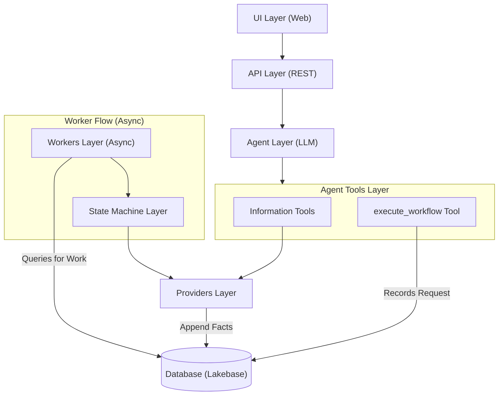

# Backend Architecture

## Overview

The Self-Service Center is a **Databricks App** that runs on the Databricks platform. It is organized around eight main architectural layers:

- **Web UI** - Provides a user interface for interacting with the hub.
- **API Endpoints** provide CRUD operations and serve the frontend UI and separate the UI from the business logic.
- **Agents** focus on understanding user intent, gathering information, triggering workflows, and routing users to other parts of the hub.
- **Agent Tools** are informational or validation operations used by the Agent to gather context.
- **State Machines** handle the orchestration of compound and atomic workflows, calling **Providers** to execute actions.
- **Providers** abstract external systems and infrastructure (Terraform, IDP, GitHub, Databricks, etc.) and are used by both Agent Tools and State Machines.
- **Workers** perform long-running tasks, such as polling for external events or executing external commands.
- **Database** stores the immutable history of **Facts** from which the system state is derived.

## Architecture Hierarchy



## Critical Architecture Requirements

### 0. LLM Chokepoint (Governance)
All requests, including those from administrators, must pass through the Agent (LLM) Layer. 

**Solution**: Centralized governance chokepoint. By routing all interactions through the LLM, the system can enforce complex governance rules, validate intent, and ensure compliance in a single, manageable layer before any state machine or infrastructure changes are triggered.

**Alternative**: Allow administrators to bypass the LLM layer and directly interact with the State Machine Layer. This would require additional governance controls and monitoring to ensure compliance and prevent unauthorized changes.

### 1. Async Processing
Infrastructure operations (Terraform, Databricks) can take 5-20 minutes. **State machine transitions cannot happen in blocking HTTP requests.** 

**Solution**: Polling worker that checks the database every 5 seconds and processes pending requests in parallel with proper locking. 

### 2. Heavy Lifting
Databricks Apps are not designed to handle heavy lifting. **All heavy lifting must be handled by external services.**

**Solution**: Workers Layer - Async task processing for long-running operations that calls APIs and services to perform the heavy lifting.

### 3. Fact-Based State Reconstruction
State machines must be resilient to restarts. If a container restarts during a long-running operation, the system must be able to resume exactly where it left off.

**Solution**: State is not treated as a static, mutable property in the database. Instead, the current state of any request is **derived at runtime** from a sequence of immutable facts (Events).

**Solution**: **Re-executable State Machines** - rather than relying on a stored status string, the system re-evaluates the state machine logic against the full history of recorded facts and external system state to determine the current state and the next valid transition. This ensures that the system is always self-consistent and self-healing.

### 4. Human-in-the-Loop
Approvals break continuous flow. State machines must pause and wait for external events.

**Solution**: `wait_for_event` pattern - state machine pauses, waits for API callback.

### 5. Failure Handling & Retries
Tools and providers will fail, especially Terraform operations. Infrastructure provisioning is inherently unreliable.

**Solution**: Multi-level retry strategies, failure notifications, error states, and rollback mechanisms.

## Architecture Principles

### Agent-Driven Workflows (Instruction-Based)

For **Compound Workflows** and **Atomic Workflows**, we leverage an **Agent-Driven** approach, even for administrators.

**Concept**:
Instead of hardcoding a form or ticket category for every new workflow, we define the workflow requirements in a **Markdown Instruction File** specific to that workflow. The Agent reads this file and conducts the "form filling" via natural language conversation. 

**Components**:
1.  **Instruction Files** (`backend/app/agents/instructions/*.md`):
    -   Contains the "Script" for the Agent.
    -   Lists required information to gather (e.g., "Ask for project name, cost center, and team members").
    -   Defines validation rules and policy checks.

2.  **Generic Execution Tool** (`execute_workflow`):
    -   A single, reusable tool: `execute_workflow(workflow_type: str, parameters: Dict[str, Any])`.
    -   The `parameters` argument effectively replaces the static form fields.
    -   The Agent populates `parameters` based on the data gathered during the chat as defined in the instruction file.

3.  **Flow**:
    -   User: "I need to onboard a new project."
    -   Agent: Detects intent -> Loads `onboarding.md` instructions.
    -   Agent: "Sure, what is the project name?" (following instructions).
    -   ... Conversation continues until all params gathered ...
    -   Agent: Calls `execute_workflow("project_onboarding", { "name": "...", ... })`.
    - Backend: Triggers `ProjectOnboardingStateMachine`.

**Important**: Each unique workflow type (e.g., "create_catalog", "onboard_project") MUST have its own dedicated State Machine class. Do not reuse generic state machines for distinct business processes. This ensures that the logic for each workflow is isolated, testable, and independently evolvable.

**TO CONSIDER:** having a sinlge generic tool for executing workflows may not work as predictably as having a specific execute_workflow_xyz tool for each workflow. Future testing may reveal this to be the case but there are some benefits to having a single tool since agents can be overloaded with too many tools.

### Tool Usage Patterns

We distinguish between **Agent Tools** and **System Actions**:

- **Agent Tools** (`app/tools`):
  - **Purpose**: Information gathering, validation, and "safe" actions for the LLM to take. These are generally read-only operations.
  - **Used By**: The Agent (LLM).
  - **Format**: Follow MCP schema (name, description, input_schema).
  - **Examples**: `DoesCatalogExistTool`, `SearchUserEntitlementsTool`.
  - **Restriction**: Agents should NOT have tools for major state mutations (e.g., "Provision Workspace", "Send Notification"). Those are deterministic outcomes handled by the State Machine.

- **System Actions** (State Machine Logic):
  - **Purpose**: Deterministic execution of business logic (provisioning, notifications, access grants).
  - **Used By**: The State Machine.
  - **Implementation**: State Machines call **Providers** directly (e.g., `self.notification_provider.send_email()`). They do NOT use the `app/tools` wrappers.
  - **Why**: Avoids "tool" bloat and keeps logical flow clear. The Agent doesn't decide to send an email; the State Machine does it because the state changed.

### Provider Abstraction

Providers are the primary interface for interacting with external systems. They abstract the complexity of authentication, authorization, and connection management, and provide a consistent interface for the rest of the system. They are used **directly** by the State Machines and are wrapped by the Tools to be used **indirectly** by the Agent. 

Providers encapsulate all interaction with external systems:
- **Authentication/Authorization** - Handle credentials, tokens, service principals
- **Connection Management** - Manage connections, retries, timeouts
- **System-Specific Logic** - Terraform commands, API calls, shell commands
- **Error Handling** - Translate system errors to domain errors

## Contributing Tools & Providers

### Adding a New Provider

1.  **Define Interface**: Create a new file in `app/providers/[name]/client.py`.
2.  **Inherit from Base**: Use `BaseProvider` from `app/providers/base.py`.
3.  **Implement Health Check**: Implement the `health_check()` method to verify connectivity and credentials.
4.  **Implement Business Methods**: Add methods for interacting with the external system (e.g., `create_repo`, `grant_access`).
5.  **Use Base Functionality**:
    - `self.config`: Access provider-specific configuration passed during initialization.
    - `get_config(key, default)`: Safely retrieve configuration values.
    - Standardized initialization pattern for consistent provider setup.
4.  **Error Handling**: Wrap system errors in `RetryableError` or `PermanentError`.
5.  **Configuration**: Use `self.config` for credentials. See [Configuration & Settings](#configuration--settings) for more information on secret and setting lineage.


### Adding a New Tool

All tools should be implemented using the **FastMCP** pattern (introduced in Feb 2026), which uses decorators instead of class inheritance. This is significantly simpler and more robust.

### Adding a New Tool

1.  **Define Input Schema**: Create a Pydantic model for tool arguments.
2.  **Use @tool Decorator**: Decorate your async function with `@tool` from `app/tools/mcp.py`.
3.  **Implement Logic**: Use appropriate providers to accomplish the task.
4.  **Register Tool**: Add the tool function to `AVAILABLE_TOOLS` in `app/tools/__init__.py`.
5.  **Use Base Functionality**:
    - **Pydantic Validation**: Automatic argument validation and type safety via `args_schema`.
    - **MCP Integration**: The `@tool` decorator handles metadata, description, and registration for LLM consumption.
    - **Standard Exceptions**: Use `RetryableError` or `PermanentError` for consistent error propagation to the state machine.
from typing import Dict, Any
from pydantic import BaseModel, Field
from app.tools.mcp import tool
from app.providers.my_system import MySystemProvider

class MyToolInput(BaseModel):
    arg1: str = Field(..., description="Description of the argument")

@tool(
    name="my_tool_name",
    description="Detailed description of what the tool does.",
    args_schema=MyToolInput
)
async def my_tool_name(arg1: str) -> Dict[str, Any]:
    """Docstring for the tool function."""
    # Instantiate provider here (stateless)
    provider = MySystemProvider(...)
    
    return await provider.do_something(arg1)
```

4.  **Register Tool**: Import and add the tool function to `AVAILABLE_TOOLS` in `app/tools/__init__.py`.

### Adding a New State Machine

State machines orchestrate business logic and manage the lifecycle of a request. Follow these steps to add a new one:

### Adding a New State Machine

1.  **Identify Request Type**: Add a new value to `RequestType` in `app/models/request.py`.
2.  **Inherit from Base**: Create a class that inherits from `BaseRequestStateMachine`.
3.  **Define States and Transitions**: Use the `statemachine` library syntax to define states and events.
4.  **Override Mappings**: Update `STATE_COMPLETION_FACTS`, `STATE_LOG_FACTS`, and `STATUS_MAPPING` as needed.
5.  **Implement Logic Hooks**: Implement `on_enter_<state>` for synchronous logic or `on_enter_<state>_async` for asynchronous side effects (calling providers).
6.  **Register in Factory**: Add the new state machine to `get_state_machine` in `app/state_machines/factory.py`.
7.  **Leverage Base Reusability**:
    - **Automated Reconcile/Tick**: The base class handles the core loop, state persistence (`save()`), and transition attempts.
    - **UI View Generation**: `to_state_machine_state()` automatically builds the frontend-ready timeline and logs.
    - **Approval Orchestration**: Use `create_approval_task()` to handle standardized approval workflows.
    - **Notification Helpers**: Use `_send_notification()` for standardized user communication.
    - **Fact-Based Properties**: Easily check for events using built-in properties like `has_manager_approval`.
    - **Workflow Chaining**: Use `spawn_child_request()` to trigger and track child workflows.

**Template**:
```python
# app/state_machines/my_workflow.py
from statemachine import State
from app.state_machines.base import BaseRequestStateMachine
from app.models.request import RequestStatus

class MyWorkflowStateMachine(BaseRequestStateMachine):
    # Define States
    pending = State("Pending", initial=True)
    processing = State("Processing")
    completed = State("Completed", final=True)
    
    # Define Transitions
    submit = pending.to(processing)
    finish = processing.to(completed)

    # State -> Fact mappings for UI and Poller
    STATE_COMPLETION_FACTS = {
        **BaseRequestStateMachine.STATE_COMPLETION_FACTS,
        "processing": "work_performed",
    }

    STATUS_MAPPING = {
        **BaseRequestStateMachine.STATUS_MAPPING,
        "processing": RequestStatus.PROVISIONING,
    }

    async def on_enter_processing_async(self):
        """Execute async work when entering the processing state."""
        # Use Providers to perform work
        # Mark progress by adding facts
        add_fact(self.db, self.request.id, "work_performed", {})
        # self.finish() # Trigger transition if needed
```

7.  **Register Request Type**: Ensure the new request type is added to `RequestType` enum in `app/models/request.py`.
8.  **Update Factory**:
```python
# app/state_machines/factory.py
from app.state_machines.my_workflow import MyWorkflowStateMachine

def get_state_machine(request: RequestModel, db: Session) -> BaseRequestStateMachine:
    # ...
    if r_type == RequestType.MY_NEW_WORKFLOW:
        return MyWorkflowStateMachine(request, db)
    # ...
```

## Configuration & Settings

The application uses a centralized configuration system built on `pydantic-settings`. This ensures strict type validation, default values, and a single source of truth for all application settings. Both app.yaml and .env files feed into this system, but we don't access them directly. Instead, we access the configuration through the `settings` object. This is done by importing `settings` from `app.core.config`.

### Configuration Sources

Settings are loaded in the following order of precedence:

1.  **Environment Variables** (OS-level or container-injected, like the default Databricks Apps environment variables)
2.  **`.env` file** (Local development only - using `python-dotenv`)
3.  **Default Values** (Defined in `app/core/config.py`)

### Key Files

-   `backend/app/core/config.py`: Defines the `Settings` class / schema. **All new configuration must be added here.**
-   `backend/.env`: Local secrets and overrides (ignored by git).
-   `backend/.env.example`: Template for required environment variables. The .env file is not committed to git, so this file is used to document the required environment variables and provide a template for local development.
-   `app.yaml` (Databricks Apps): Defines environment variables for the deployed production environment. This is the primary way to configure the application in production.

### Adding a New Setting

### Adding a New Setting

1.  **Add to Settings Class**: Add a new field to the `Settings` class in `app/core/config.py`.
2.  **Define Type and Default**: Use Pydantic types; default values are optional.
3.  **Leverage Base Reusability**:
    - **Env Variable Mapping**: Automatic mapping from environment variables (e.g., `MY_SETTING_NAME` -> `my_setting_name`).
    - **Validation**: Automatic type conversion and validation on startup.
    - **Secret Handling**: Use `SecretStr` for sensitive values to prevent accidental logging.
    - **Global Access**: Once added, the setting is available globally via the `settings` object.
    ```python
    from app.core.config import settings
    
    timeout = settings.MY_PROVIDER_TIMEOUT
    ```

### Handling Secrets & API Keys

**NEVER EVER hardcode secrets or API keys in the code. No excuses.**

When implementing a new Provider that requires authentication (e.g., `MyNewProvider`):

1.  **Add Configuration**: Add the API key/token variable to `app/core/config.py`.
2.  **Inject in Factory**: Update `app/core/config.py` or the provider factory to pass `settings` to the provider.
3.  **Validate in Provider**: In `app/providers/<provider>/client.py`, check for the key in `__init__` or `health_check`.

```python
# app/providers/my_new_provider/client.py
class MyNewProvider(BaseProvider):
    def __init__(self, config: dict = None):
        super().__init__(config)
        self.api_key = self.config.get("api_key") or settings.MY_PROVIDER_API_KEY
        
        if not self.api_key:
            # Don't crash on init, but health check should fail
            pass
            
            # OR raise error if strictly required for startup
            # raise ValueError("MY_PROVIDER_API_KEY is required")
```


## Layer Detailed Implementation

### Providers Layer (`app/providers/`)

**Purpose**: Abstract external systems and infrastructure. Handle all system-specific details.

**Characteristics**:
- Encapsulate authentication, connection management, and system-specific APIs
- Provide clean, domain-focused interfaces via specialized providers
- Inherit from `BaseProvider` (minimal interface for configuration and health checks)
- **Handle retries at provider level** - Immediate retries for transient errors using `tenacity`
- **Error classification** - Distinguish retryable vs permanent errors
- Handle timeouts, error translation
- Can be swapped out (e.g., Terraform → Pulumi) without changing state machine logic

**Provider-Level Retry Logic**:

Providers implement immediate retries for transient errors:

```python
# app/providers/terraform/client.py
from tenacity import retry, stop_after_attempt, wait_exponential, retry_if_exception_type
from app.core.exceptions import RetryableError, PermanentError
import subprocess

class TerraformProvider(BaseProvider):
    @retry(
        stop=stop_after_attempt(3),
        wait=wait_exponential(multiplier=1, min=1, max=8),
        retry=retry_if_exception_type((ConnectionError, TimeoutError, subprocess.TimeoutExpired))
    )
    async def apply(self, config: dict, variables: dict = None) -> dict:
        """Apply Terraform configuration with automatic retries."""
        try:
            # Run terraform apply
            result = await self._run_command(["terraform", "apply", "-auto-approve"])
            
            # Check for Terraform-specific errors
            if "Error:" in result["stderr"]:
                error_msg = result["stderr"]
                
                # Classify error
                if "state lock" in error_msg.lower():
                    raise RetryableError(f"Terraform state locked: {error_msg}")
                elif "authentication" in error_msg.lower():
                    raise PermanentError(f"Authentication failed: {error_msg}")
                elif "validation" in error_msg.lower():
                    raise PermanentError(f"Validation error: {error_msg}")
                else:
                    # Unknown error - treat as retryable
                    raise RetryableError(f"Terraform error: {error_msg}")
            
            return self._parse_output(result)
            
        except ConnectionError as e:
            raise RetryableError(f"Connection error: {str(e)}")
        except TimeoutError as e:
            raise RetryableError(f"Timeout error: {str(e)}")
        except PermanentError:
            raise  # Don't retry permanent errors
        except Exception as e:
            # Unexpected error - treat as retryable
            raise RetryableError(f"Unexpected error: {str(e)}")
```

**Error Classification in Providers**:

```python
# app/core/exceptions.py
class RetryableError(Exception):
    """Error that may succeed on retry."""
    pass

class PermanentError(Exception):
    """Error that won't succeed on retry."""
    pass

class ValidationError(PermanentError):
    """Validation error - permanent."""
    pass

class AuthenticationError(PermanentError):
    """Authentication error - permanent."""
    pass

class TimeoutError(RetryableError):
    """Timeout error - retryable."""
    pass

class ConnectionError(RetryableError):
    """Connection error - retryable."""
    pass
```

**Provider Examples**:

**Terraform Provider** (`providers/terraform/`):
- `create_workspace(name: str, config: dict) -> dict` - Create workspace via SDK
- `create_catalog(name: str, config: dict) -> dict` - Create Unity Catalog catalog via SDK
- `create_schema(name: str, config: dict) -> dict` - Create Unity Catalog schema via SDK
- `create_service_principal(name: str, config: dict) -> dict` - Create service principal
- `rotate_credentials(name: str, config: dict) -> dict` - Rotate credentials
- `grant_access(principal: str, resource: str, permissions: list) -> bool` - Grant access via SDK

**IDP Provider** (`providers/idp/`):
- `create_group(name: str, attributes: dict) -> dict` - Create group in IDP
- `add_to_group(user_id: str, group_id: str) -> bool` - Add user to group

**GitHub Provider** (`providers/github/`):
- `create_repo(name: str, config: dict) -> dict` - Create repository
- `create_from_template(template: str, name: str, config: dict) -> dict` - Create from template
- `run_shell_command(command: str, cwd: str = None) -> dict` - Execute gh CLI commands
- `set_permissions(repo: str, user: str, permission: str) -> bool` - Set repository permissions

**Databricks Provider** (`providers/databricks/`):
- `execute_sql(query: str, warehouse: str = None) -> dict` - Execute SQL query via SDK

**Notification Provider** (`providers/notifications/`):
- `send_email(to: str, subject: str, body: str) -> bool` - Send email
- `send_teams(webhook: str, message: dict) -> bool` - Send Teams message

### Agent Tools Layer (`app/tools/`)

**Purpose**: Operations that use providers to help the Agent understand the system state.

**Characteristics**:
- Stateless functions/classes
- Informational (validation, existence checks, search)
- Use providers to interact with external systems
- **Used by Agents** to gather context, validate parameters, or trigger state machines.
- **Workflows (State Machines) do NOT use these tools** - they call providers directly.

**Example Agent Tools**:
- `DoesCatalogExistTool` (`app/tools/catalog_existence.py`)
  - **Purpose**: Checks if a catalog exists in Unity Catalog.
  - **Uses**: `DatabricksProvider.execute_sql` to running `SHOW CATALOGS LIKE 'name'`.
  - **Why**: Allows the agent to verify if a requested catalog name is available or if a target catalog exists before proceeding with a request.

Note: As the system grows, more tools will be added here to wrap provider functionality for:
- Checking schema existence
- Searching for users/groups in the IDP
- Validating resource names against naming conventions
- checking current user entitlements

### Agent Layer (`app/agents/`)

**Purpose**: Understand user intent, gather information, and route users to appropriate forms.

**LLM Integration**: 
- Uses **Databricks Model Serving endpoints** for LLM inference
- Agent LLM model served via Databricks Model Serving
- Request classification models also served via Model Serving endpoints
- Simplifies deployment - no need to manage LLM infrastructure

**Responsibilities**:
- Process natural language queries via Databricks Model Serving
- Ask clarifying questions
- Use tools to validate information (e.g., check if catalog exists, check user entitlements)
- Route users to appropriate request forms
- Provide helpful guidance

**Agent Tools**:
Agent tools are higher-level wrappers around base tools that provide agent-specific functionality:
- `check_exists` - Uses `tools.validation.check_exists` internally (which uses `tools.databricks.sql.run_sql_query`)
- `search_user_entitlements` - Uses `tools.entitlements.search_user_entitlements`
- `check_request_history` - Uses `tools.requests.check_request_history`

**Flow**:
1. User submits query → Agent calls Databricks Model Serving endpoint for LLM inference
2. Agent determines intent → Uses `determine_request_type` tool (may use classification model endpoint)
3. Agent gathers information → Uses tools like `check_exists`, `search_user_entitlements`
4. Agent asks follow-up questions → Uses `generate_follow_up_questions` (via Model Serving)
5. Agent routes to form → Uses `determine_form_route` with prefill data

### Model Context Protocol (MCP) Integration

The Agent layer exposes its capabilities via the **Model Context Protocol (MCP)**, allowing both internal and external agents to discover and invoke tools in a standardized way.

**MCP Server Architecture**:
- **Embedded Server**: We run a FastMCP server *inside* the FastAPI application (`app/mcp_server.py`). 
- **Tool Registration**: Current agent tools are automatically registered with the MCP server.
- **Transport Mechanisms**:
    - **SSE (Server-Sent Events)**: Experimental endpoint at `/mcp/sse` for remote agent connection.
    - **Stdio**: A separate entrypoint (`backend/run_mcp.py`) allows running the server over standard input/output for local CLI usage or Cursor integration.

**Why MCP?**:
- **Standardization**: Decouples tool definition from the specific LLM provider.
- **Interoperability**: Allows other MCP-compliant clients (like Claude Desktop or IDEs) to use our backend tools directly.
- **Future Proofing**: Positions the architecture to easily swap or upgrade agent capabilities without rewriting tool interfaces.

### Database Layer (`app/db/`)

**Purpose**: Persistent storage for state machines and request data using Lakebase (PostgreSQL-based database).

**Technology**: 
- **Lakebase** - PostgreSQL-based database provided by Databricks
- **SQLAlchemy** - ORM for database operations
- **PostgreSQL** - Standard PostgreSQL features (ACID transactions, JSON support, etc.)
- **Alembic** - Database migrations

**Critical Requirements**:
- **Fact Persistence**: All significant events (approvals, provisioning starts, completions) must be persisted as immutable facts.
- **State Reconstruction**: The system must be able to rebuild the state machine's context by replaying facts from the database.
- **State Locking**: Prevent concurrent state transitions and ensure fact-recording atomicity.
- **ACID Transactions**: PostgreSQL provides ACID guarantees to ensure facts are recorded reliably.

**Database Schema** (PostgreSQL Tables):

```python
# app/db/request.py
from sqlalchemy import Column, String, DateTime, JSON, ForeignKey
from sqlalchemy.orm import relationship
from app.db.base import Base

class RequestModel(Base):
    __tablename__ = "requests"
    
    id = Column(String, primary_key=True)
    type = Column(String)  # RequestType enum
    title = Column(String)
    status = Column(String)  # Current state (State Machine reads/writes this)
    requester_email = Column(String, nullable=True)  # Who created the request
    state_context = Column(JSON)  # Stores variables (workspace_name, config, etc.)
    
    # State locking for idempotency
    locked_by = Column(String, nullable=True)  # Worker ID (e.g., 'poll-worker-hostname-12345')
    locked_until = Column(DateTime, nullable=True)  # Lock expiration timestamp
    
    # Timestamps
    created_at = Column(DateTime)
    updated_at = Column(DateTime)
    
    # State machine state
    current_state = Column(String)  # Current state ID
    parallel_paths = Column(JSON)
    completed_states = Column(JSON)
    active_states = Column(JSON)
    
    # Failure tracking
    failure_count = Column(Integer, default=0)
    last_failure = Column(DateTime, nullable=True)
    last_error = Column(JSON, nullable=True)
    retry_count = Column(Integer, default=0)
    max_retries = Column(Integer, default=3)
    
    # User-Agent Conversation
    conversation = Column(JSON, nullable=True)
    
    # Training flags
    requires_training = Column(Boolean, default=False)
    training_completed = Column(Boolean, default=False)
    
    # Environment
    environment = Column(String, nullable=True)
    
    # Hierarchy (Compound Workflows)
    parent_id = Column(String, ForeignKey("requests.id"), nullable=True)
    root_id = Column(String, ForeignKey("requests.id"), nullable=True)
    
    # Relationships
    approvals = relationship("ApprovalModel", back_populates="request")
    events = relationship("EventModel", back_populates="request")
    failures = relationship("FailureModel", back_populates="request")

class ApprovalModel(Base):
    __tablename__ = "approvals"
    
    id = Column(String, primary_key=True)
    request_id = Column(String, ForeignKey("requests.id"))
    approval_type = Column(String)  # 'manager', 'data_owner', 'platform_admin', etc.
    requested_by = Column(String)
    requested_by_email = Column(String)
    status = Column(String)  # 'pending', 'approved', 'rejected', 'delegated'
    approved_by = Column(String, nullable=True)
    approved_at = Column(DateTime, nullable=True)
    rejected_by = Column(String, nullable=True)
    rejected_at = Column(DateTime, nullable=True)
    rejection_note = Column(String, nullable=True)
    delegated_to = Column(String, nullable=True)
    delegated_to_email = Column(String, nullable=True)
    created_at = Column(DateTime)
    updated_at = Column(DateTime)
    
    request = relationship("RequestModel", back_populates="approvals")

class EventModel(Base):
    __tablename__ = "events"
    
    id = Column(String, primary_key=True)
    request_id = Column(String, ForeignKey("requests.id"))
    event_type = Column(String)  # 'state_transition', 'approval', 'notification', etc.
    event_data = Column(JSON)  # Event-specific data
    created_at = Column(DateTime)
    
    request = relationship("RequestModel", back_populates="events")

class FailureModel(Base):
    __tablename__ = "failures"
    
    id = Column(String, primary_key=True)
    request_id = Column(String, ForeignKey("requests.id"))
    task_id = Column(String)  # Worker/task ID
    failure_type = Column(String)  # 'provider_error', 'tool_error', 'timeout', 'validation_error'
    error_message = Column(String)
    error_details = Column(JSON)  # Full error stack trace, context
    retry_count = Column(Integer)  # Retry attempt number
    occurred_at = Column(DateTime)
    resolved = Column(Boolean, default=False)  # Whether failure was resolved
    resolved_at = Column(DateTime, nullable=True)
    
    request = relationship("RequestModel", back_populates="failures")
```

**State Locking Implementation** (Lakebase/PostgreSQL):

```python
# app/state_machines/lock.py
from datetime import datetime, timedelta
from sqlalchemy.orm import Session
from app.db.request import RequestModel

def acquire_lock(db: Session, request_id: str, worker_id: str, timeout_minutes: int = 5) -> bool:
    """Acquire lock on request state using PostgreSQL. Returns True if lock acquired."""
    request = db.query(RequestModel).filter(RequestModel.id == request_id).first()
    if not request:
        return False
    
    # Check if already locked and not expired
    if request.locked_by and request.locked_until:
        if request.locked_until > datetime.utcnow():
            return False  # Locked by another worker
        # Lock expired, we can take it
    
    # Acquire lock using PostgreSQL UPDATE with WHERE clause for atomicity
    # This provides ACID guarantees
    rows_updated = db.query(RequestModel).filter(
        RequestModel.id == request_id,
        db.or_(
            RequestModel.locked_by.is_(None),
            RequestModel.locked_until < datetime.utcnow()
        )
    ).update({
        RequestModel.locked_by: worker_id,
        RequestModel.locked_until: datetime.utcnow() + timedelta(minutes=timeout_minutes)
    })
    
    db.commit()
    return rows_updated > 0

def release_lock(db: Session, request_id: str):
    """Release lock on request state."""
    request = db.query(RequestModel).filter(RequestModel.id == request_id).first()
    if request:
        request.locked_by = None
        request.locked_until = None
        db.commit()

def heartbeat_lock(db: Session, request_id: str, worker_id: str, timeout_minutes: int) -> bool:
    """Extend lock expiration time (heartbeat) for a request.
    Only extends if the lock is still held by the same worker."""
    request = db.query(RequestModel).filter(RequestModel.id == request_id).first()
    if not request or request.locked_by != worker_id:
        return False
    
    # Extend the lock timeout
    rows_updated = db.query(RequestModel).filter(
        RequestModel.id == request_id,
        RequestModel.locked_by == worker_id
    ).update({
        RequestModel.locked_until: datetime.utcnow() + timedelta(minutes=timeout_minutes)
    })
    
    db.commit()
    return rows_updated > 0
```

**State Locking Mechanism**:
- Before transitioning, worker acquires lock: `UPDATE requests SET locked_by='worker-1', locked_until=NOW()+INTERVAL '5 minutes' WHERE id='req-123' AND locked_by IS NULL`
- If lock acquisition fails, another worker is processing → skip
- Lock expires after timeout (prevents deadlocks)
- **Lock Heartbeat**: For long-running operations (provisioning), worker starts a background heartbeat task that periodically extends the lock expiration (every 5 minutes by default). This prevents locks from expiring during 20-minute Terraform applies.
- State is persisted after each transition

### Workers Layer (`app/workers/`)

**Purpose**: Async task processing for long-running operations (Terraform, Databricks provisioning).

**Why Needed**:
- Terraform `apply` can take 5-20 minutes
- Databricks cluster creation can take 10-15 minutes
- HTTP requests timeout after 30-60 seconds
- **State machine transitions cannot happen in blocking HTTP requests**

**Solution**: Polling worker that runs continuously, checking the database every 5 seconds for pending requests and processing them in parallel with proper locking.

**Worker Flow**:
1. API receives request → Creates request in DB with `status='pending'`
2. API returns `201 Created` with request ID
3. Frontend polls `/api/v1/requests/{request_id}/status`
4. Polling worker (runs every 5 seconds):
   - Queries database for pending requests (not completed/rejected/failed)
   - Filters out locked requests (unless lock expired)
   - Processes requests in parallel (max 10 concurrent)
   - For each request:
     - Acquires lock (5 min timeout for normal, 30 min for provisioning)
     - Loads state machine from DB
     - **Calls `state_machine.tick()`** - Handles transitions and synchronous entry hooks
     - Saves state back to DB if changed or status sync needed
     - **Calls `state_machine.execute_tasks()`** - Runs asynchronous `on_enter` hooks
     - Releases lock
   - On error: Handles retryable vs permanent errors, logs failures

**Key Principle**: The poller is completely ignorant of business logic. It only:
- Finds requests to process
- Acquires/releases locks
- Calls `state_machine.tick()`
- Calls `state_machine.execute_tasks()`
- Saves state if changed

All business logic (reconciliation, transitions, fact conversion, state processing) lives in the state machine via transitions and `on_enter` hooks.

**Key Features**:
- **State Locking**: Prevents concurrent processing of same request
- **Lock Heartbeat**: For long-running operations (e.g., Terraform), worker periodically extends lock expiration
- **Parallel Processing**: Processes multiple requests concurrently (configurable limit)
- **Error Handling**: Distinguishes retryable vs permanent errors
- **Retry Logic**: Tracks retry count, exponential backoff on next poll cycle
- **Self-Healing**: Expired locks allow recovery from stuck workers

**Configuration** (in `app/core/config.py`):
- `POLLER_INTERVAL_SECONDS`: How often to poll (default: 5 seconds)
- `POLLER_BATCH_SIZE`: Max requests to process per cycle (default: 50)
- `POLLER_MAX_CONCURRENT`: Max parallel processing (default: 10)
- `POLLER_LOCK_TIMEOUT_MINUTES`: Lock timeout for normal ops (default: 5 minutes)
- `POLLER_LOCK_TIMEOUT_LONG_RUNNING_MINUTES`: Lock timeout for provisioning (default: 30 minutes)
- `POLLER_HEARTBEAT_INTERVAL_SECONDS`: How often to heartbeat locks for long-running ops (default: 300 seconds / 5 minutes)

**Retry Strategies**:

Retries happen at multiple levels:

1. **Provider Level** - Immediate retries for transient errors (network, timeouts)
   - Exponential backoff: 1s, 2s, 4s, 8s
   - Max 3 retries at provider level
   - Retry on: ConnectionError, TimeoutError, 5xx HTTP errors

2. **Tool Level** - Retries for tool-specific failures
   - Configurable retry count per tool
   - Terraform: 2 retries (infrastructure is expensive to retry)
   - API calls: 3 retries
   - Database queries: 5 retries (cheap to retry)

3. **Worker Level** - Polling worker retries
   - Retryable errors: Increment retry count, will be retried on next poll cycle
   - Permanent errors: Mark request as failed immediately
   - Max retries: Configurable per request (default: 3)
   - Exponential backoff: Implemented by poller interval (5 seconds) + retry count tracking

**Worker Implementation**:
```python
# app/workers/poller.py
async def process_single_request(semaphore, request_id):
    """Process a single request with locking and error handling."""
    async with semaphore:
        # Load request and acquire lock
        if not acquire_lock(db, request_id, worker_id, lock_timeout):
            return  # Another worker is processing

        try:
            # Load state machine
            sm = load_state_machine(request, db)
            
            # Let state machine handle ALL logic (reconciliation & transitions)
            changed = sm.tick()
            
            # Save if state changed
            if changed:
                save_state_machine(db, request, sm)
                db.commit()
            
            # Execute tasks (side effects)
            await sm.execute_tasks()
            
        except RetryableError as e:
            await _handle_retryable_error(db, request, e, worker_id)
        except PermanentError as e:
            await _handle_permanent_error(db, request, e, worker_id)
```

### State Machine Layer (`app/state_machines/`)

**Purpose**: Orchestrate complex business logic, handle state transitions, and ensure idempotency.

**Responsibility**:
- **Fact-Based Decision Making**: Transitions are determined by deriving the current state from a sequence of immutable facts (Events).
- **Side Effects**: Directly calls **Providers** to execute actions (e.g., provisioning infrastructure) via async hooks.
- **Process Orchestration**: Manages the lifecycle of a request, including approvals, long-running tasks, and sub-tasks.

**Core Logic (`tick` loop)**:

The polling worker calls `tick()` periodically. The state machine re-evaluates its state based on facts and processes the current state.

```python
# app/state_machines/base.py
class BaseRequestStateMachine(StateMachine):
    def tick(self) -> bool:
        """Process one tick - handles all business logic."""
        initial_state = self.current_state.id
        
        # 1. Try transitions based on available facts
        # Each transition has a 'cond="has_fact_name"' guard
        self._try_transitions()
        
        # 2. Handle state entry hooks
        if self.current_state.id != initial_state:
            logger.info(f"[{self.request.id}] Transition: {initial_state} -> {self.current_state.id}")
            self._call_on_enter_hooks(initial_state, self.current_state.id)
            return True # State changed
            
        return False
```

**Fact-Based Architecture**:

The system uses a **Hybrid Fact-Based Approach**:

1. **Facts as Source of Truth**: Immutable events stored in the `events` table represent what has actually happened:
   - `request_submitted`, `approval_received`, `training_completed`, `workspace_created`, `provisioning_started`, etc.

2. **State as Memoized Cache**: The `status` and `current_state` columns in the `requests` table are cached values updated after transitions.

3. **Self-Healing Reconciliation**:
   - Every `tick()`, `_try_transitions()` re-evaluates guards against the latest facts.
   - If an action (e.g., Terraform) succeeded but the state wasn't updated (e.g., due to a crash), the next `tick()` will see the `workspace_created` fact and automatically transition the state forward.

4. **Idempotency Guards**: State machine actions check facts before execution:
   - `if has_fact(self.db, self.request.id, "workspace_created"): return`
   - This prevents duplicate side effects and handles partial failures.

**Key Features**:
- **Hierarchical (Compound) Workflows**: Parent state machines can spawn child requests and wait for their completion facts.
- **Fail-Back & Compensation**: Rollback states can be defined to undo previous actions on permanent failure.
- **Manual Intervention**: Admins can record facts manually to "unstick" or "resume" workflows.

**State Machine Actions**:
State machine actions are orchestrated sequences that call multiple tools:
- **Approval Actions** (`actions/approval.py`):
  - `check_approval_requirements()` → Uses `tools.entitlements.check_approval_requirements`
  - `notify_approvers()` → Uses `tools.notifications.send_notification` (async task)
  - `wait_for_approval()` → **Pauses state machine, waits for API callback**

- **Provisioning Actions** (`actions/provisioning.py`):
  - `provision_workspace()` → Calls `tools.workspace.create_workspace` (async task)
  - `setup_permissions()` → Calls `tools.access.grant_access`
  - `configure_networking()` → Calls `tools.networking.configure`

- **Training Actions** (`actions/training.py`):
  - `check_training_status()` → Queries training system
  - `notify_training_required()` → Uses `tools.notifications.send_notification` (async task)
  - `wait_for_training()` → **Pauses state machine, waits for training completion event**

- **Error Handling Actions** (`actions/error_handling.py`):
  - `handle_retryable_error(error, context)` → Logs error, increments retry count, schedules retry
  - `handle_permanent_error(error, context)` → Moves to failed state, notifies user
  - `rollback_operation(operation_type, context)` → Rolls back failed operation
  - `notify_failure(failure_type, error_message)` → Sends failure notifications

**Wait-for-Event Pattern**:

When state machine enters a state that requires human action (approval, training), it:
1. Saves state to database with `status='manager_approval'` (or `'training_pending'`)
2. Triggers notification action (async)
3. **Pauses** - Does not automatically transition
4. Waits for API callback: `POST /api/v1/requests/{request_id}/approve` or `/complete-training`
5. Polling worker (next cycle) detects approval → Processes transition automatically
6. Worker processes transition → State machine continues

**Orchestrators**:
Orchestrators coordinate multiple actions and tools:
- `workspace_provision.py` - Orchestrates full workspace provisioning workflow
- `data_access.py` - Orchestrates data access request workflow
- `service_principal.py` - Orchestrates service principal creation workflow

#### State Machine Action Pattern

State machine actions orchestrate multiple tools:

```python
# app/state_machines/actions/provisioning.py
from app.tools.databricks.workspace import create_workspace
from app.tools.databricks.access import grant_access
from app.tools.notifications import send_notification

async def provision_workspace(request_id: str, config: dict) -> dict:
    """Orchestrate workspace provisioning."""
    
    # Step 1: Create workspace
    workspace = await create_workspace(
        name=config["name"],
        config=config["workspace_config"]
    )
    
    # Step 2: Grant access
    await grant_access(
        user=config["requested_by"],
        resource=f"workspace:{workspace['id']}",
        permissions=config["permissions"]
    )
    
    # Step 3: Notify user
    await send_notification(
        user=config["requested_by"],
        message=f"Workspace {workspace['name']} has been provisioned",
        type="success"
    )
    
    return workspace
```

**Flow Example (Workspace Provisioning with Fact-Based Approach)**:
1. Request created → State saved to DB with `status='pending'` (memoized cache)
2. Polling worker (runs every 5 seconds) finds pending request
3. Worker acquires lock → Loads state machine → Calls `tick()`
   - `tick()` checks facts: No facts yet → stays in `pending`
   - Records fact: `request_submitted` → Transitions to `manager_approval`
   - **Transition triggers `on_enter_manager_approval`**: creates approval task
   - Saves state to DB (memoized cache): `status='manager_approval'`
4. Worker releases lock → **Pauses** (waiting for approval fact)
5. Manager approves via Admin Dashboard → API: `POST /api/v1/requests/{request_id}/approve`
   - Records fact: `approval_received` with `{approval_type: 'manager', approved_by: 'manager_123'}`
   - Returns: "Approval recorded. State will be updated by poller."
6. Polling worker (next cycle, ~5 seconds later):
   - Acquires lock → Loads state machine → Calls `tick()`
   - `tick()` checks facts: Sees `approval_received` fact
   - Calculates target state: `training_pending` (if training required) or `provisioning`
   - Transitions to target state → Saves state (memoized cache)
7. If training required:
   - User completes training → API: `POST /api/v1/requests/{request_id}/complete-training`
   - Records fact: `training_completed`
   - Next poll cycle: `tick()` sees fact → Transitions to `terraform_planning`
8. Worker processes provisioning (long-running, lock held for 30 minutes):
   - **Transition triggers `on_enter_terraform_planning_async`**
   - Poller calls `execute_tasks()` which runs the async hook
   - **Idempotency Guard**: Hook checks facts - `has_fact('terraform_plan_started')?`
     - If yes: Returns (already started)
     - If no: Proceeds with plan
   - Records fact: `terraform_plan_started`
   - Releases lock
9. Next poll cycle:
   - `tick()` checks facts: Sees `terraform_plan_received`
   - Calculates target state: `completed`
   - Transitions to `completed` → Saves state (memoized cache)
10. **Self-Healing Example**: If Terraform succeeds but worker crashes before recording fact:
    - Next poll: `tick()` doesn't see `provisioning_completed` fact
    - Hook checks cloud provider: Resource exists!
    - Hook records fact: `provisioning_completed` (with details)
    - Next poll: `tick()` sees fact → Transitions to `completed`
    - **No duplicate creation** - hook's idempotency guard prevents it

### API Layer (`app/api/`)

**Purpose**: Provide REST endpoints for the frontend UI.

**Responsibilities**:
- CRUD operations for requests
- Agent conversation endpoints
- Approval management endpoints
- Admin endpoints
- Health checks

**Characteristics**:
- Thin layer that delegates to services
- Handles HTTP request/response
- Input validation
- Error handling

**Example Flow**:
1. Frontend calls `POST /api/v1/requests/`
2. API endpoint validates input
3. API calls `services.request_service.create_request()`
4. Service creates state machine and initializes workflow
5. API returns request object to frontend

### Services Layer (`app/services/`)

**Purpose**: Business logic that can be shared between API endpoints and state machines.

**Responsibilities**:
- Request lifecycle management
- Approval workflow logic
- Entitlement management
- Data validation and transformation

**Usage**:
- API endpoints call services for business logic
- State machines may call services for complex operations
- Services may call tools for low-level operations


## Key Design Decisions

1. **Providers abstract external systems** - All external system interaction goes through providers
2. **Tools are system-agnostic** - Tools don't know about Terraform, GitHub, IDP directly
3. **Tools are stateless** - No internal state, can be called from anywhere
4. **Agents use tools for information** - Agents don't execute workflows, they gather info
5. **State machines orchestrate workflows** - State machines call tools in sequence to complete tasks
6. **State is persisted** - State machines save to database after each transition
7. **State is locked** - Prevents concurrent transitions, ensures idempotency
8. **Long-running operations are async** - Terraform, provisioning run in background workers
9. **API returns 202 Accepted** - For async operations, frontend polls for status
10. **Wait-for-event pattern** - State machines pause for human approvals, resume on API callback
11. **API endpoints are thin** - Delegate to services, which may use tools or state machines
12. **Services contain business logic** - Shared between API and state machines
13. **Clear separation** - Each layer has a distinct responsibility
14. **Easy to swap providers** - Change Terraform → Pulumi by swapping provider, tools unchanged
15. **Testable** - Mock providers for testing tools without external dependencies
16. **Prefer Databricks Python SDK** - Always use `databricks-sdk` (WorkspaceClient) over REST API calls for Databricks operations. SDK provides type safety, better error handling, and automatic retries. Only use REST API when SDK doesn't support a feature (e.g., Model Serving endpoints).

## Benefits of Provider Abstraction

1. **System Agnostic Tools**: Tools don't care if we use Terraform or Pulumi
2. **Easy Migration**: Swap providers without changing tools
3. **Testability**: Mock providers for unit testing tools
4. **Centralized Auth**: All authentication handled in providers
5. **Error Translation**: Providers translate system errors to domain errors
6. **Connection Management**: Providers handle retries, timeouts, connection pooling
7. **Consistent Interface**: All providers follow same interface pattern

## Failure Handling Architecture

### Error Classification

Errors are classified into three categories:

1. **Retryable Errors** - Transient failures that may succeed on retry
   - Network timeouts
   - Temporary service unavailability (5xx HTTP errors)
   - Rate limiting (429 HTTP errors)
   - Connection errors
   - Terraform state lock conflicts

2. **Permanent Errors** - Failures that won't succeed on retry
   - Validation errors (invalid configuration)
   - Authorization errors (permission denied)
   - Resource conflicts (name already exists)
   - Invalid credentials

3. **Unexpected Errors** - Unknown errors treated as retryable
   - Unhandled exceptions
   - Provider bugs
   - System errors

### Retry Strategy

**Exponential Backoff with Jitter**:
- Retry delays: 1s, 2s, 4s, 8s, 16s (max 30s)
- Jitter: ±20% to prevent thundering herd
- Max retries: 3-5 depending on operation type
- Terraform operations: 2 retries (expensive)
- API calls: 3 retries
- Database queries: 5 retries (cheap)

**Retry Levels**:
1. **Provider Level** - Immediate retries for network/connection errors
2. **Tool Level** - Retries for tool-specific failures
3. **Worker Level** - ARQ task retries with exponential backoff

### Failure States

State machine includes failure states:
- `failed` - Permanent failure, no more retries
- `retrying` - Temporary failure, will retry
- `rollback_in_progress` - Rolling back failed operation
- `rollback_failed` - Rollback also failed (manual intervention needed)

### Rollback Strategy

**Automatic Rollback**:
- On Terraform failure → Attempt `terraform destroy`
- On partial provisioning → Rollback completed steps
- On access grant failure → Revoke granted access

**Rollback Limitations**:
- Some operations are not reversible (e.g., data deletion)
- Rollback itself can fail (logged, requires manual intervention)
- Rollback is best-effort, not guaranteed

### Notification Strategy

**Failure Notifications**:
1. **User Notification** - Email on any failure
   - Retryable: "Your request encountered an error and will be retried"
   - Permanent: "Your request failed. Please contact support."
2. **Admin Notification** - Slack/Teams for permanent failures
   - Alert channel for immediate attention
   - Includes error details and request context
3. **Progress Updates** - During long-running operations
   - Progress percentage updates
   - Step-by-step status

### Dead Letter Queue

**Permanent Failures**:
- After max retries exceeded → Move to dead letter queue
- Requires manual review and intervention
- Admin dashboard shows failed requests
- Admins can:
  - View error details
  - Manually retry
  - Mark as resolved
  - Cancel request

## Implementation Requirements

### Required Dependencies

Add to `requirements.txt`:
- `databricks-sdk` - Databricks Python SDK (preferred over REST API for all Databricks operations)
- `sqlalchemy` - ORM for database operations
- `alembic` - Database migrations
- `psycopg2` or `asyncpg` - PostgreSQL driver for Lakebase
- `tenacity` - Retry library with exponential backoff

### Database Setup

1. **Lakebase (PostgreSQL)** - For state persistence
   - PostgreSQL-based database provided by Databricks
   - Standard PostgreSQL features (ACID transactions, JSON support)
   - Access via SQLAlchemy ORM
2. **Database Migrations** - Schema managed via Alembic
   - Tables created via Alembic migrations
   - Schema evolution handled by Alembic

### Model Serving Setup

1. **Databricks Model Serving Endpoints** - For LLM and classification models
   - Agent LLM model endpoint
   - Request type classification model endpoint
   - Endpoints managed via Databricks UI/API
   - Models accessed via REST API from app (Model Serving endpoints use REST API, not SDK)

### Worker Setup

1. **Polling Worker Process** - Runs continuously as background task
   - Started automatically with FastAPI application (via `startup_event`)
   - Runs in same process as API (can be separated if needed)
   - Polls database every 5 seconds (configurable)
   - Processes requests in parallel with concurrency limits
2. **State Locking** - Prevents concurrent processing
   - Uses database-level locking (PostgreSQL ACID guarantees)
   - Lock timeout: 5 minutes (normal), 30 minutes (provisioning)
   - **Lock Heartbeat**: For provisioning operations, worker periodically extends lock expiration (every 5 minutes) to prevent expiration during long-running Terraform applies
   - Expired locks allow recovery from stuck workers
3. **Error Handling** - Built into worker loop
   - Retryable errors: Increment retry count, retry on next poll
   - Permanent errors: Mark as failed immediately
   - All failures logged to `failures` table

### Databricks App Deployment

1. **App Deployment**:
   - Deploy as Databricks App
   - FastAPI app runs on Databricks compute
   - Access to Lakebase (PostgreSQL) database
   - Access to Unity Catalog for data operations
2. **Model Serving Endpoints**:
   - Deploy LLM models to Model Serving
   - Configure endpoints via Databricks UI
   - Access endpoints via REST API from app
3. **Lakebase Database**:
   - PostgreSQL database provided by Databricks
   - Tables created via Alembic migrations
   - Standard PostgreSQL connection (psycopg2/asyncpg)
   - ACID transactions for state management

### API Endpoints

**New Endpoints Needed**:
- `POST /api/v1/requests/{request_id}/approve` - Approval callback
- `POST /api/v1/requests/{request_id}/reject` - Rejection callback
- `POST /api/v1/requests/{request_id}/complete-training` - Training completion callback
- `GET /api/v1/requests/{request_id}/status` - Polling endpoint for status
- `GET /api/v1/requests/{request_id}/failures` - Get failure history
- `POST /api/v1/requests/{request_id}/retry` - Manually retry failed request
- `POST /api/v1/requests/{request_id}/cancel` - Cancel request
- `GET /api/v1/requests/failed` - List all failed requests (admin)

## Future Considerations

- **Provider Registry**: Central registry for provider discovery and configuration
- **Provider Middleware**: Logging, metrics, retry logic at provider level
- **Provider Versioning**: Support for provider versioning and backward compatibility
- **Tool Registry**: Central registry for tool discovery and documentation
- **Tool Middleware**: Additional middleware layer for tools (caching, rate limiting)
- **Multi-Provider Support**: Support for multiple providers of same type (e.g., multiple IDPs)
- **State Machine Visualization**: Real-time state visualization for debugging
- **Task Monitoring**: Dashboard for monitoring async task progress
- **Failure Analytics**: Dashboard for failure rates, common errors, retry success rates
- **Automatic Recovery**: Self-healing mechanisms for common failure patterns
- **Circuit Breaker Pattern**: Temporarily disable failing providers to prevent cascade failures
- **Health Checks**: Monitor provider health and automatically failover
- **Proactive Agentic Monitoring**: run without a user to provide proactive monitoring of system health and issues

## Feature Management / Disabling Features

Features (Tools and Workflows) can be manually disabled by modifying the codebase. This is preferred over complex configuration flags to keep the codebase simple.

### Disabling Tools

To disable a tool, comment it out in the `AVAILABLE_TOOLS` registry in `backend/app/tools/__init__.py`.

**Example:**
```python
# backend/app/tools/__init__.py

AVAILABLE_TOOLS = [
    DoesCatalogExistTool(),
    # GetCatalogListTool(),  <-- Disabled
    GetSchemaListTool(),
    ...
]
```

### Disabling Workflows

To disable a workflow, you must prevent the State Machine from being instantiated for that request type. Comment out the mapping in `backend/app/state_machines/factory.py`.

**Example:**
```python
# backend/app/state_machines/factory.py

def get_state_machine(request: RequestModel, db: Session) -> BaseRequestStateMachine:
    ...
    if r_type == RequestType.WORKSPACE_PROVISION:
        return WorkspaceProvisionStateMachine(request, db)
    
    # elif r_type == RequestType.PROJECT_ONBOARDING:   <-- Disabled
    #    return ProjectOnboardingStateMachine(request, db)
    ...
```

Optionally, you can also comment out the Enum value in `backend/app/models/request.py` to prevent the API from even validating the request type, though disabling the factory is usually sufficient to stop execution.


