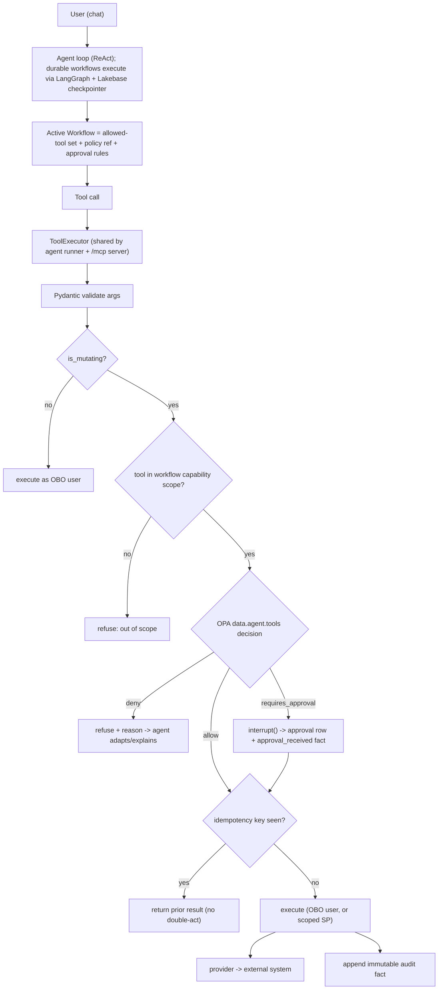
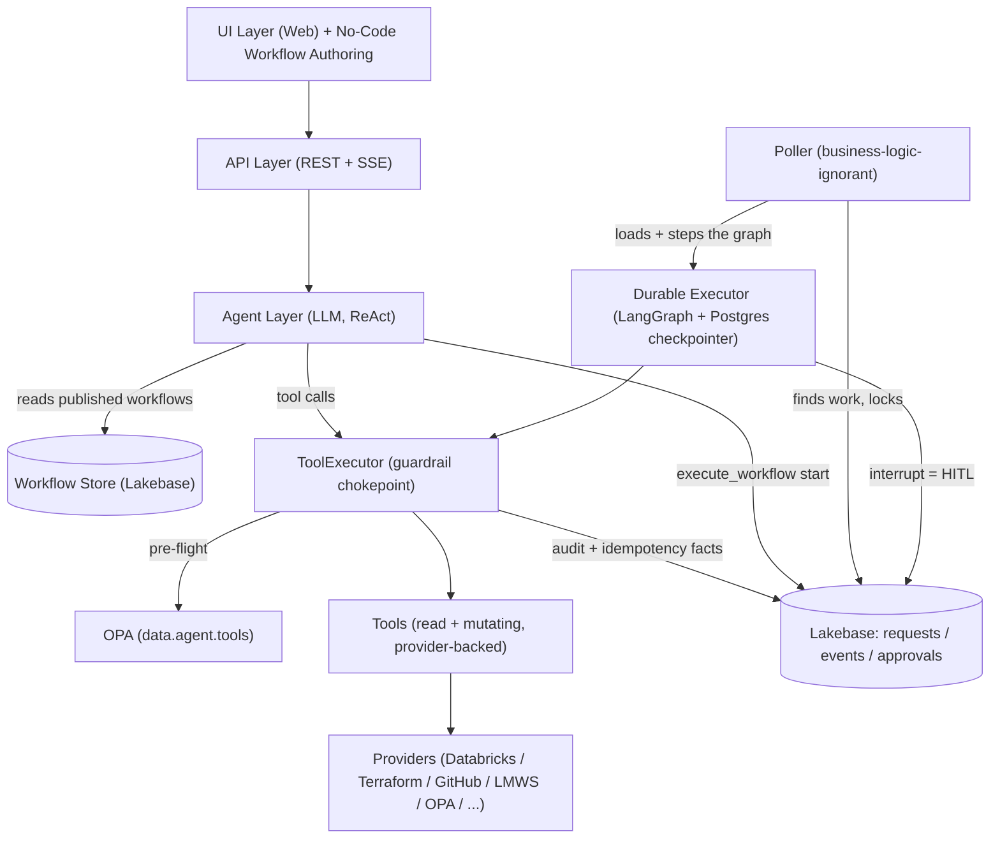
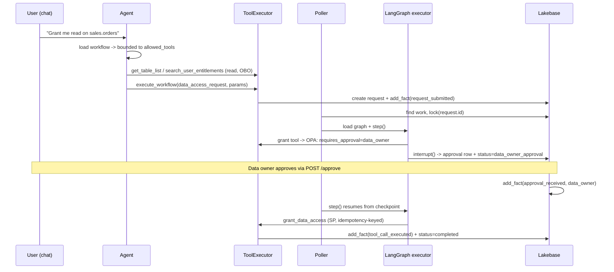

# Backend Architecture

This is a **no-code, governed agentic platform**: administrators author workflows as data
(prompt + allowed tools + policy + approval rules), and a single unified agent orchestrates
provider-backed tools to fulfill requests under a guardrail stack, with long-running work
executed durably on a LangGraph + Lakebase (Postgres) runtime.

## 1. Core Model: A Solution, Not a Framework

Adding a capability does **not** require a developer to write Python and redeploy. Three
concepts make the platform configurable rather than coded:

| Concept | How it works |
|---|---|
| **Workflows** | admin-authored, DB-backed records (prompt + allowed tools + policy + approval rules), authored in a visual editor or by the agent itself |
| **Tools** | the agent orchestrates provider-backed tools directly, under a guardrail stack |
| **Execution** | durable agentic execution: a LangGraph graph per workflow type + a Lakebase (Postgres) checkpointer |

The one deliberate trade-off: we give up **deterministic execution *path*** (a hand-coded,
fixed step sequence) in exchange for no-code authoring and agentic flexibility. **Every other
property the platform needs is preserved** — not by a deterministic state machine, but by a
**guardrail stack** plus a **durable runtime**.

### Invariants

- The **governance chokepoint** principle: all requests pass through the agent.
- **Async processing**: long-running ops (5–20 min) run outside HTTP requests, driven by the poller.
- **Immutable facts** in the `events` table are the audit trail and idempotency ledger.
- **Lakebase (Postgres)** is the system of record; `requests` / `events` / `approvals` tables persist.
- The **approval API and UI** (`POST /requests/{id}/approve`) drive human-in-the-loop.

## 2. Core Requirements and Their Mechanisms

| Requirement | Mechanism |
|---|---|
| Determinism of **outcome** | OPA policy pre-flight + typed tool schemas + plan→confirm→apply |
| **Idempotency** | Idempotency keys in the `ToolExecutor`, keyed on `(scope_id, tool_call_id)` |
| **Durability / crash-resume** | LangGraph checkpointer (Lakebase) keyed on `request.id` |
| **Long-running tolerance** | Async tool handles (pending-poll pattern) inside graph nodes + poller |
| **Human-in-the-loop** | LangGraph `interrupt()`; approval fact resumes the graph |
| **Governance / audit** | One `ToolExecutor` chokepoint → one audit fact per mutating call |
| **Bounded blast radius** | Capability scoping per workflow + OPA approval gates (see below) |
| Determinism of **path** | **Intentionally traded away** for no-code authoring + agentic flexibility |

## 3. The Guardrail Stack

Governance is defense-in-depth around the agent, building on the three governance layers in
[GOVERNANCE.md](./GOVERNANCE.md). Capability scoping + OPA gates inside the `ToolExecutor`
provide deterministic *enforcement* without a deterministic *path*.



Guardrail layers, ranked by **worst-case** bounding power (not average-case):

1. **Capability scoping per workflow** — a workflow declares its `allowed_tools`; the agent in that workflow's context structurally cannot call anything else. Bounds blast radius before policy runs.
2. **OPA approval gate** on `infra` / `membership` / `destructive` classes — irreversible/high-impact actions require human sign-off, decided in version-controlled Rego.
3. **Plan → confirm → apply** — mutating tools return a diff; the user confirms before apply (generalizes Terraform's plan/apply).
4. **OBO + Unity Catalog floor** — read tools and (where applicable) data grants run as the caller, who can never exceed their own UC permissions.
5. **Idempotency + durable checkpointing** — re-entry after a crash returns the prior result instead of re-acting.
6. **Least-privilege scoped credentials** — SP-privileged tools use narrowly scoped creds.
7. **Eval / sandbox before publish** — a workflow is tested against a sandbox workspace before it can go live.

## 4. Blast-Radius Model (Identity & Bounds)

A key finding from the provider audit: **OBO + Unity Catalog cannot be the primary safety
bound**, because nearly every real mutation runs as a **service principal**, and
Terraform/GitHub/LMWS are not UC-governed at all. Only `DatabricksProvider.execute_sql` even
accepts an OBO token, and today it is used only for reads.

Therefore every tool is tagged with a **`side_effect_class`** that determines its bound:

| `side_effect_class` | Examples | Identity today | Primary bound |
|---|---|---|---|
| `read` | catalog/table/list, search, audit reads | OBO user | **OBO + UC** |
| `data_grant` | UC grant/revoke (`grant_access`) | service principal | **OPA approval gate + capability scope** (see decision below) |
| `infra` | Terraform apply, workspace/volume/SP/repo create | Git bot / app SP | **OPA approval gate + scoped creds** (no UC bound) |
| `membership` | LMWS group changes | app SP → job → LMWS service account | **OPA approval gate** (no UC bound) |
| `destructive` | enforcement `kill`, deletes | app SP | **Hard approval gate + reversibility/compensation** |
| `notify` | email / slack / teams | app identity | **Rate limit + audit** (low blast radius) |

### Decision: data-access grants stay SP-executed behind a gate

`grant_access` runs the GRANT as the **service principal**, not the requester, because the
requester usually does **not** hold `WITH GRANT` rights on the target — which is the entire
reason an approval workflow exists. Re-plumbing grants to OBO would only help the rare case
where the requester is already an owner. **`data_grant` stays SP-executed and is bounded by a
mandatory OPA approval gate plus capability scoping**, rather than relying on OBO+UC. OBO+UC
remains the bound for `read` tools.

## 5. Architecture Layers



- **Agent Layer** — single unified ReAct agent. Its tool set per conversation is the active
  workflow's `allowed_tools`. It both *gathers/validates* and, within rails, *orchestrates execution*.
- **ToolExecutor** — the chokepoint every tool call flows through (agent path and `/mcp` path).
- **Durable Executor** — the only execution engine. A LangGraph graph per workflow type,
  checkpointed to Lakebase, resumed by the poller.

## 6. Component: The ToolExecutor (Interceptor)

A single shared executor that both the agent runner and the embedded MCP server delegate to, so
every tool call carries identity (OBO) and governance regardless of the entry path.

```python
@dataclass
class ToolContext:
    scope_id: str            # request.id for workflow tools; agent_session_id otherwise
    tool_call_id: str        # idempotency correlation (from the runner)
    obo_token: str | None    # caller's On-Behalf-Of token
    user_identity: dict      # email, roles, entitlements
    db: Session
    workflow: Workflow | None      # active workflow -> capability scope

class ToolExecutor:
    async def run(self, tool: McpTool, ctx: ToolContext, **args) -> dict:
        args = tool.validate(args)                       # Pydantic (free win)
        if not tool.is_mutating:
            return await tool.execute(_obo_token=ctx.obo_token, **args)

        if ctx.workflow and tool.name not in ctx.workflow.allowed_tools:
            return refuse("tool not in workflow capability scope")

        decision = await opa.evaluate(
            tool.policy_ref, "data.agent.tools.decision",
            {"tool": tool.name, "side_effect_class": tool.side_effect_class,
             "args": args, "user": ctx.user_identity, "target": _target(args)},
        )
        if not decision["allow"]:
            return refuse(decision["reason"])
        if decision["requires_approval"]:
            interrupt(approval_type=decision["approval_type"])   # LangGraph HITL

        key = idempotency_key(ctx.scope_id, ctx.tool_call_id, tool.name, args)
        if has_fact(ctx.db, ctx.scope_id, "tool_call_executed", idempotency_key=key):
            return get_cached_result(ctx.db, key)

        result = await tool.execute(_obo_token=ctx.obo_token, **args)
        add_fact(ctx.db, ctx.scope_id, "tool_call_executed",
                 {"tool": tool.name, "idempotency_key": key, "result_summary": summarize(result)},
                 actor=ctx.user_identity["email"])
        return result
```

Wiring:
- The agent runner calls `await tool_executor.run(tool, ctx, **args)` rather than the tool directly.
- The MCP server registers a shim that also routes through `ToolExecutor`, so external MCP clients keep per-user permissions and the same guardrails.
- An `agent_session_id` on the conversation request provides a `scope_id` for non-workflow tool calls; workflow tools reuse the `request.id` they create.

## 7. Component: Tool Metadata + OPA Policy

### `@tool` metadata

```python
@tool(
    name="grant_data_access",
    description="Grant a principal access to a UC table/schema/volume.",
    args_schema=GrantInput,
    is_mutating=True,
    side_effect_class="data_grant",     # drives the guardrail bound
    policy_ref="agent/tools/data_grant", # Rego package
    required_role=None,
)
async def grant_data_access(...): ...
```

Every tool is classified; `is_mutating` (not a heuristic exclusion list) drives whether the
governance pipeline runs.

### Unified Tool Catalog (one registry, three usage contexts)

Tool *availability* is data-driven, not hardcoded. A single DB-backed catalog
(`tool_registry` + `mcp_sources`, owned by `ToolRegistryService`) is the source of truth for
*every* tool origin, governing where each tool may be used for a given user:

- **One catalog, three origins.** `app/tools/catalog.py` unifies the two code definition sites
  into one name -> `McpTool` resolver: `origin="local"` (chat tools auto-discovered by
  `load_tools()`) and `origin="workflow"` (provider-backed workflow building blocks defined in
  `app/workflows/tools.py`, e.g. `grant_uc_access`, `terraform_apply`). `origin="mcp"` rows are
  tools discovered from a registered Databricks MCP server, wrapped by a `RemoteMcpTool` adapter
  (`app/tools/external/`). All three expose the same `McpTool` surface and flow through the same
  `ToolExecutor` (OPA pre-flight, audit, idempotency).
- **Three usage contexts (the columns).** Each row toggles independently:
  `enabled_for_main_agent` (unified self-service chat), `enabled_for_workflow_agent`
  (workflow-authoring chat), and `enabled_for_workflow_execution` (usable as a workflow graph
  step / building block). So e.g. `ask_your_data` never appears while authoring,
  `preview_workflow_spec` never appears in the main chat, and provider tools like
  `terraform_apply` are workflow-execution-only and never chat-callable. This replaced the old
  static `required_role` filter + `_AUTHORING_TOOL_NAMES` whitelist in `api/v1/agent.py`.
- **Seed defaults preserve the safety invariant.** `local` chat tools seed onto the chat
  contexts (authoring set -> workflow agent; everything-but-build-tools -> main agent);
  `workflow` provider tools seed `workflow_execution`-only and OFF for both chat surfaces. The
  per-workflow `allowed_tools` capability scope (enforced in `ToolExecutor`) still narrows which
  execution tools a given workflow may call; the column is the global "may be used in workflows
  at all" gate. The authoring tool picker (`available_tools(db)`) reflects this column, while
  `get_tool`/`has_tool` resolve from the code catalog so already-published specs never break.
- **Per-tool gating.** Each row also carries `allowed_roles` (empty = all roles; Platform Admin
  always passes), `identity_mode` (`sp` | `obo`), `exposed_via_mcp` (publish over the in-app
  `/mcp` MCP server for external agents/apps; `get_external_tools()` reads this, seeded from the
  code-declared `external=True` attribute), and `enabled` (master switch).
- **MCP discovery.** Admins register MCP server endpoints (`McpSourceModel`): managed servers
  (`/api/2.0/mcp/functions/{catalog}/{schema}`, `/api/2.0/mcp/sql`, `/api/2.0/mcp/genie`,
  `/api/2.0/mcp/ai-search/...`), external connections (`/api/2.0/mcp/external/{connection}`), or
  custom app servers. On sync, the **Service Principal** `WorkspaceClient` +
  `DatabricksMCPClient(server_url).list_tools()` enumerates what the SP can see. Newly
  discovered tools default disabled and unassigned (opt-in only).
- **Identity at call time.** `identity_mode="obo"` runs the tool with the forwarded user token
  (UC enforces the user's grants); `"sp"` runs as the app Service Principal. The
  `RemoteMcpTool` adapter honors this per tool.
- **Surfaces:** admin UI at `/governance/tool-registry` (under the Admin nav group), API at
  `/api/v1/tool-registry` (per-tool gating writes require Platform/Governance Admin; MCP source
  management + discovery require Platform Admin), gated by the `tool_registry` feature flag.

> Note: the MLflow `SelfServiceResponsesAgent` (Model Serving) path is not yet registry-aware — it
> still uses the full `AGENT_TOOLS` set. Wiring serving-time scoping through the registry is a
> follow-up.

### OPA package `data.agent.tools`

The executor consumes a decision returned by this package:

```rego
package agent.tools

# input: {tool, side_effect_class, args, user, roles, entitlements, target}
default decision := {"allow": false, "requires_approval": false, "reason": "no matching rule"}

decision := d {
    input.side_effect_class == "read"
    d := {"allow": true, "requires_approval": false}
}

decision := d {
    input.side_effect_class == "data_grant"
    d := {"allow": true, "requires_approval": true, "approval_type": "data_owner"}
}

decision := d {
    input.side_effect_class in {"infra", "membership"}
    d := {"allow": true, "requires_approval": true, "approval_type": "platform_admin"}
}

decision := d {
    input.side_effect_class == "destructive"
    d := {"allow": true, "requires_approval": true, "approval_type": "platform_admin",
          "reason": "destructive action requires explicit sign-off"}
}
```

## 8. Component: The Workflow Object (No-Code Authoring)

Workflows are DB-backed and admin-authored, modeled on the Context Catalog
(domains/documents with draft→publish) — the proven precedent for admin-authored content the
agent consumes at runtime.

```python
class WorkflowModel(Base):
    id: str
    name: str
    trigger_phrases: list[str]        # feeds the capabilities index
    instructions_markdown: str        # the "script" the agent follows
    allowed_tools: list[str]          # CAPABILITY SCOPE — the primary structural bound
    parameter_schema: dict            # JSON Schema for execute_workflow params
    approval_rules: dict              # or a policy_ref into data.agent.tools
    required_role: str | None
    graph_spec: dict | None           # declarative graph (workflows-as-data)
    status: str                       # draft | published
    created_by / updated_at / version
```

- **Authoring UI**: a tree/list + markdown editor + a tool picker (from the live tool registry,
  so renames don't silently break a workflow) + a parameter-schema builder + an approval-rules
  form, plus a visual graph studio (see §13).
- **Publication**: published workflows feed the capabilities index **live** (no redeploy); the
  agent loads a workflow's full instructions on demand and is bounded to its `allowed_tools` for
  that conversation.
- **AI-assisted authoring**: the agent helps draft a workflow (instructions, suggested tools,
  parameter schema) from a natural-language description.

## 9. Component: Durable Execution (LangGraph)

Every workflow type runs as a LangGraph graph with an `AsyncPostgresSaver` checkpointer on
Lakebase, keyed on `request.id` as the thread id. There is no other engine.

- **Nodes** call tools through the `ToolExecutor` (so the same guardrails apply inside the graph).
- **HITL** uses `interrupt()`; `POST /requests/{id}/approve` writes the `approval_received` fact
  and the graph resumes (directly, or on the next poll cycle).
- **Idempotency** is enforced by the executor's keys, so a node re-entered after a crash does not re-act.
- **Status mapping**: `RequestStatus` is a fixed enum the UI timeline depends on. Each graph
  declares a `node → RequestStatus` mapping so the timeline keeps rendering.

### End-to-end: a data-access workflow



What stays stable so the UI, approvals, and ops are uniform: the `requests` / `events` /
`approvals` tables, `state_context` as graph input, the approval API
(`POST /requests/{id}/approve` → `approval_received` fact), poller locking/retry/heartbeat, and
compound `parent_id` / `root_id` linkage.

## 10. Eval & Sandbox Harness

Before a workflow can be published it must pass an automated **pre-publish** harness that:
- runs the workflow against a **sandbox workspace**;
- asserts the agent **cannot call tools outside the workflow's `allowed_tools`**;
- asserts OPA **approval gates fire** for the declared `side_effect_class`;
- runs **regression checks** on agent behavior (golden transcripts) to catch prompt drift.

This pre-publish harness is the *gate*; §11 Pillar 4 adds the **production** half of the loop
(MLflow tracing, inference tables, and a scheduled LLM-as-a-judge job) so quality is measured
continuously after publish, not just once before it.

## 11. Databricks Platform Best Practices (North Star)

The platform adopts the full **"North Star"** best-practice set proven out in the reference
template (`supply-chain-agent`), organized as four pillars. The goal is a copy-pasteable,
governed, observable agent where security, observability, and governance are built in from day
one — and where reusing the pattern requires changing little more than the prompt and the
tools/workflows granted in Unity Catalog.

### Pillar 1 — App & Orchestration (Databricks Apps)

- Serverless Databricks Apps hosting; **native SSO + identity propagation**
  (`X-Forwarded-Access-Token`); LangGraph engine in-process behind FastAPI; SSE to the UI.
- **Governance default — OBO, no silent SP fallback.** In any *deployed* app the agent runs
  strictly On-Behalf-Of the signed-in user; if no OBO token is present it **refuses** to run as
  the service principal (escape hatch: `ALLOW_SP_FALLBACK=true`). See `model.py:load_context`.

### Pillar 2 — Model Control & Guardrails (AI Gateway)

- Route every LLM call through an **AI Gateway endpoint** (OpenAI-compatible path
  `{host}/ai-gateway/mlflow/v1`) instead of calling Model Serving directly. This buys:
  - **Decoupled model routing** — no hardcoded model/version in app code; swap models without a
    redeploy.
  - **Zero-downtime A/B testing** — `traffic_config` traffic split across `served_entities`
    (e.g. 80/20 Claude/Llama), tuned live (`scripts/create_ab_test_route.py`).
  - **Input guardrails** (PII, safety, invalid keywords, valid topics) + **centralized
    rate/cost limits** per user/service.
- **No output guardrails; keep token streaming.** AI Gateway *output* guardrails buffer the
  **full** response to inspect it, so the endpoint cannot stream token-by-token. Output
  guardrails are **not** enabled — always-on SSE token streaming is preserved (the UX leans
  heavily on it). Model-side safety is enforced via **input guardrails** + rate/cost limits
  (stream-safe); action-side safety is enforced by the `ToolExecutor` + OPA.
- AI Gateway guards **LLM I/O** (content safety, PII, cost); the `ToolExecutor` + OPA guard
  **actions/side effects**. These are **complementary layers**.

### Pillar 3 — Governance & Security (Unity Catalog)

- OBO execution end-to-end; fine-grained SQL `GRANT`; HITL write approvals on mutating actions.
- **Tool home — tools are local + self-hosted, exposed via a custom MCP provider.** Tools stay
  as local Python `McpTool`s, executed and hosted **in-app** behind the `ToolExecutor` + OPA
  (they are *not* moved to UC functions). They are authored so the in-app MCP server
  (`mcp_server.py`, mounted at `/mcp`) can be **registered as a custom MCP provider in AI
  Gateway**, making selected tools reusable by other agents/apps. A **per-tool `external`
  switch** (default `False`) controls exposure: only `external=True` tools are published over
  the MCP server; everything else stays app-internal. This keeps one execution + governance
  path (`ToolExecutor`/OPA) while still letting the platform reuse tools.
- **Capability scoping:** with tools local, the per-workflow `allowed_tools` set + OPA are the
  capability scope (not UC `GRANT EXECUTE`). OBO + UC still bound the *data* a tool can read.

### Pillar 4 — Observability & Evaluation (MLflow & Delta)

- **MLflow `ResponsesAgent` contract.** The agent is structured as a native
  `mlflow.pyfunc.ResponsesAgent` (`predict` / `predict_stream` yielding
  `ResponsesAgentStreamEvent`), which standardizes the agent I/O contract, makes it
  loggable/servable as an MLflow model, and turns on **automatic multi-step tracing**
  (`mlflow.langchain.autolog()`); every response carries a `trace_id`. The SSE layer is a thin
  adapter that maps `ResponsesAgentStreamEvent`s to the wire.
- **Inference Tables.** AI Gateway payload logging captures all prompts/responses to a Delta
  table (`AutoCaptureConfigInput`, `scripts/enable_inference_tables.py`).
- **Active feedback loop.** Thumbs up/down in the UI, keyed by `trace_id`, written to Delta.
- **LLM-as-a-judge.** A scheduled Databricks **job** reads recent traces/inference tables, runs
  `mlflow.evaluate` with a judge model (relevance, professionalism, tool accuracy), and writes
  scores to a Delta table for a dashboard (`evals/run_llm_judge.py`).
- This **extends** §10 — the pre-publish harness is the gate; MLflow tracing + inference tables +
  the judge job are the **continuous, in-production** measurement.

## 12. Open Decisions

- **Self-healing reconcile**: add a node-level pre-check on resume (re-derive state from external
  truth, e.g. "Terraform actually succeeded → advance") rather than relying on checkpoint state
  alone — decide how far to carry this.
- **Off-the-shelf MCP servers** for standard Databricks/UC ops vs. thin in-house tools over
  existing providers — where is the cut line? Org-specific systems (LMWS, GitOps tag management,
  Terraform conventions) will not have off-the-shelf equivalents.
- **Token-level streaming** and richer progress UI for long-running graph nodes.
- **Workflow storage**: UC-Volume markdown (platform-governed, OBO-discovered, zero infra) vs.
  the Lakebase-backed Workflow object (structured action metadata: `allowed_tools`,
  `parameter_schema`, approval policy) vs. a hybrid that keeps structured metadata in Lakebase
  while instruction content is UC-Volume-governed.

## 13. Implementation Status (living)

- **Foundations.**
  - Tool governance metadata on `McpTool` + `@tool`: `side_effect_class`
    (`read|app_write|data_grant|infra|membership|notify|destructive`), `is_mutating`,
    `policy_ref` (`backend/app/tools/mcp.py`). All tools classified.
  - Shared `ToolExecutor` (`backend/app/tools/tool_executor.py`): inject identity →
    Pydantic-validate → OPA pre-flight (mutating) → idempotency replay → execute → audit fact.
  - `runner.py` and `mcp_server.py` both route through it (identity injection centralized; the
    `/mcp` path does not bypass governance).
  - OPA package `data.agent.tools` (`backend/policies/agent_tools.rego`) →
    `{allow, requires_approval, approval_type, reason}`. The agent-tool OPA policy is **enforced
    in deployed envs** (`databricks.yml` var `agent_tool_opa_enforce` defaults true; code default
    stays shadow so local/CI runs without a policy server don't fail closed), with a loud startup
    warning whenever mutating-tool OPA is in shadow. `agent_tools.rego` carves out
    `execute_workflow` (the entry tool) from approval-gating so enforce mode can't deadlock
    initiation — real infra/data approvals fire in-graph.
- **Durable engine.**
  - LangGraph + checkpointer (`langgraph`, `langgraph-checkpoint-sqlite/postgres`).
  - Checkpointer factory (`backend/app/workflows/checkpointer.py`): AsyncSqliteSaver (local) /
    AsyncPostgresSaver (Lakebase), thread = `request.id`.
  - `DurableWorkflowExecutor` (`backend/app/workflows/executor.py`) + graph registry
    (`backend/app/workflows/graphs/`). Every graph is generated from the declarative spec catalog
    with native `interrupt()` HITL; provisioning runs through the `ToolExecutor`. The poller
    (`_process_request_state_machine`) advances these graphs and resumes gates from
    approval/event facts (`approval_received`/`training_completed`/`pr_merged`/`request_rejected`);
    only `request.status` is synced for the UI.
  - Verified end-to-end: fresh run pauses at approval interrupt; idle tick makes no progress;
    **crash-resume** (new executor instance) resumes from the checkpoint and grants exactly once;
    rejection path terminates.
- **Workflows as data.**
  - Declarative `WorkflowSpec` (gates + steps) → generic `build_spec_graph`
    (`app/workflows/spec.py`). All registered request types are data-defined `graph_spec`s,
    bundled as one JSON file per workflow under `app/workflows/graphs/catalog/*.json` and loaded
    by `specs.py::_load_catalog()`. A request's `type` is a free string validated at creation and
    at agent submission against `WorkflowService.known_request_types()` — a new workflow requires
    **no enum entry, no `specs.py` edit, and no redeploy**. `requires_training` is derived from
    whether the effective spec has a `training` gate.
  - A safe JSON **expression mini-language** (`app/workflows/expr.py`, no `eval`/`exec`) powers
    `args`/`auto_approve`/`for_each`/`item_args`; a **tool registry**
    (`app/workflows/tool_registry.py`) resolves a step's tool by name; `spec_from_dict` +
    `validate_spec_dict` (`app/workflows/spec_loader.py`) compile a serializable spec into the
    runtime `WorkflowSpec`. Data access (multi-owner) uses a `resolve_data_owners` step that lifts
    resolved owners into context for a `data_owner` gate's `approvers_from` expression, plus a
    `for_each` grant fan-out.
  - Provider operations are wrapped as mutating tools (`app/workflows/tools.py`): `grant_uc_access`,
    `terraform_plan/apply`, `create_uc_object`, `create_service_principal`, `github_*`,
    `add_group_membership`, `send_notification`, `sentinel_*`, `run_notebook_job`,
    `spawn_child_request`, `update_allowlist`, `execute_report` — each tagged with a
    `side_effect_class`, all executed through the `ToolExecutor` (kept out of `app/tools/` so they
    aren't chat-exposed pre-capability-scoping).
- **Workflow authoring.** `WorkflowModel` (`app/db/workflow.py`) holds key/name/goal/instructions
  + guardrail metadata (allowed_tools, policy_ref, params_schema, request_type) + draft/publish +
  version. `WorkflowService` does CRUD + publish + idempotent seed. `/api/v1/workflows`
  (admin-gated) + the React **Workflows** authoring page (`src/pages/admin/Workflows.tsx`). The
  agent reads **published workflows from the DB** live:
  `prompts._get_cached_capabilities_section()` and `get_workflow_instructions` query the DB
  (filesystem fallback).
- **Visual workflow editor.** A reactflow **studio** in the Workflows admin
  (`src/components/admin/Workflow*.tsx`) authors `graph_spec` with no code: a 3-pane layout
  (drag-to-reorder stage list │ live canvas │ stage inspector), friendly forms for gates (approver
  + auto-approve condition builder) and steps (tool picker from `meta/tools`, approvals,
  expression-aware args editor with a raw-JSON escape hatch), and an unsaved-changes guard.
  `src/lib/workflowSpec.ts` translates the `$`-expression language to/from the friendly models.
- **Author lifecycle: test → ship safely.** A **dry-run** (`POST /workflows/test-spec` →
  `app/workflows/dry_run.py`) compiles a *draft* spec and walks it against a sample request —
  evaluating the same expressions the executor would, **running no tools and writing nothing** —
  to project which gates auto-approve and the exact args each step receives. Publishing goes
  through a **blast-radius confirmation** (gates/steps/mutating-actions, external-MCP steps,
  missing-request-type warning) that validates before the workflow goes live.
- **Evaluator (advisory safety + completeness scoring).** `POST /workflows/evaluate-spec` →
  `app/workflows/evaluator.py::evaluate_spec` returns a deterministic, side-effect-free report:
  a **risk score** 0–100 (higher = riskier; tiers low/medium/high/critical) driven by each
  mutating step's `side_effect_class` blast radius, whether risky mutations sit behind a human
  approval gate, fan-out, and gates that auto-approve unconditionally; a **quality score** 0–100
  (higher = better; poor/fair/good/excellent) driven by structural validity, the same
  `lint_step_tool_args`/`lint_subworkflow_refs` lints, and reliability gaps (missing `success_fact`,
  a `data_owner` gate with no approver source, no actionable stage); and **findings**
  (`severity`, `category`, `message`, `stage`, `fix`). It reuses `validate_spec_dict` + the tool
  registry — it runs no tool, calls no LLM, and is **advisory only (never blocks publish)**. Surfaced
  in the editor via an **Evaluate** button (`WorkflowEvaluationModal`) and to the authoring assistant
  via the read-only `evaluate_workflow_spec` tool; the LLM "is this safe/complete?" reasoning lives
  in the assistant, which calls the evaluator for the hard numbers and explains/proposes fixes.
- **Versioning + env promotion.** Each publish writes an immutable snapshot to `workflow_versions`
  (`WorkflowVersionModel`); `GET /workflows/{id}/versions` + `POST /workflows/{id}/rollback` give
  history and one-click restore (as a *draft* for review). Portable **export/import**
  (`GET /workflows/export/bundle`, `POST /workflows/import/bundle`, format `selfservice.workflows/v1`,
  keyed by `key`) supports the **dev → staging → prod** flow: export from one env, import into the
  next as **drafts**, dry-run, then publish.
- **Live graph run visualization.** `GET /api/v1/requests/{id}/graph`
  (`app/workflows/render.py::live_graph`) returns the request's authored `graph_spec` plus
  per-node live status (`done`/`current`/`pending`/`rejected`), derived from the same fact log +
  status the timeline uses (published DB spec preferred, then code catalog, then a synthesized
  shape). The request-detail modal has a **Workflow** tab (`src/components/RequestGraphView.tsx`)
  that renders the graph with run-state rings/badges and polls until terminal.
- **Eval harness.** The harness captures a **golden transcript** per graph (ordered tool calls +
  mutating count + gates + final status) to `app/workflows/golden_transcripts.json`; the default
  run compares against it and fails on drift (`--capture` to refresh after intended changes). A
  `--sandbox` mode runs against real providers in a throwaway workspace (not for CI). Publish has a
  **side-effect-free behavioral gate** (`_behavioral_publish_gate` → dry-run projection) that
  compiles the spec and resolves every tool by name before a workflow goes live.
- **Databricks best practices.**
  - **AI Gateway routing**: `AgentLLMClient` prefers `settings.AI_GATEWAY_ENDPOINT` over the
    direct serving endpoint, so model routing / A-B split, rate + cost limits, and INPUT
    guardrails live in the gateway (config, not code). Output guardrails intentionally omitted to
    keep SSE token streaming always-on (`databricks.yml` var `ai_gateway_endpoint`).
  - **Native MLflow `ResponsesAgent`** (`app/agents/responses_agent.py`): `SelfServiceResponsesAgent`
    wraps the governed `AgentRunner` and implements `predict` / `predict_stream` over the OpenAI
    Responses contract (text deltas + `function_call`/`function_call_output`/reasoning items,
    `trace_id` in `custom_outputs`). The in-app SSE protocol is retained as the richer transport;
    the ResponsesAgent is the deployable/Playground surface over the *same* loop.
  - **MLflow tracing** (`app/agents/tracing.py`): one trace per turn (root `agent_turn` AGENT
    span) with child `llm_call_*` and `tool:*` spans; `trace_id` surfaced on the terminal SSE
    `done` event. Dependency-tolerant no-op when disabled.
  - **Observability**: `POST /api/v1/agent/feedback` attaches human feedback to a turn's
    `trace_id` (`mlflow.log_feedback`); scheduled `agent_quality_judge` job
    (`app/jobs/llm_judge.py` + `databricks.yml`) scores recent traces with an LLM judge. Inference
    tables configured on the gateway/serving endpoint.
  - **ResponsesAgent deployment**: `app/agents/agent_entry.py` is the MLflow models-from-code
    entry; `scripts/register_responses_agent.py` logs + registers it to Unity Catalog and (with
    `--deploy`) provisions a Model Serving endpoint via `databricks-agents`. Startup logs the
    active governance posture, LLM routing (gateway vs. direct), and tracing state.
- **Vendor-neutral identity.** A pluggable `IdentityGroupProvider` (`app/providers/identity/`)
  with `noop` (default), `rest` (SCIM/Entra/Okta/custom), and `lmws` backends chosen by
  `settings.IDENTITY_PROVIDER`. `add_group_membership` + the generic `group_lookup`/`member_lookup`
  tools route through it. Access/approver group names come from configurable UC tag keys
  (`ACCESS_GROUP_TAG_KEY`/`APPROVER_GROUP_TAG_KEY`).
- **Agent-driven workflow authoring.** The same unified agent can co-author no-code workflows for
  admins. The tools (`app/tools/authoring/workflow_authoring.py`), gated with
  `required_role="Governance Admin"`, wrap the same `WorkflowService` / `spec_loader` / `dry_run` /
  `evaluator` / publish gate the visual editor uses: `list_workflow_building_blocks`, `get_workflow`,
  `search_similar_workflows`, `validate_workflow_spec`, `preview_workflow_spec` (dry-run),
  `evaluate_workflow_spec` (advisory risk/quality), `save_workflow_draft` (`app_write`),
  and `publish_workflow` (`app_write`, runs the full pre-publish gate + version snapshot). A
  conditional **prompt section** (`_get_authoring_section`) appears only when the user holds the
  authoring tools, instructing the agent to start from `list_workflow_building_blocks`, then
  validate → preview → evaluate → save draft → publish only on explicit confirmation. The mutating
  tools route through the governed `ToolExecutor` (audited).
- **Authoring source of truth is `list_workflow_building_blocks`.** The agent learns the real step
  tools (with exact arg names), gate types, stage kinds (including `subworkflow` for compound
  workflows), spec shape, and expression operators from that live tool — always in sync with the
  code. The legacy seeded "Authoring Workflows — Guide" Context Catalog document was removed (it
  drifted from the spec model and the shared `search_context_catalog` tool could surface this
  admin-only doc to the main self-service agent); `app/services/authoring_guide.py` now only
  cleans up that doc on startup (idempotent).
- **Training LMS (admin-authored tracks + UC-Volume media + consumption).** The Training page is
  no longer driven by a static `training.json`; tracks/courses live in the DB and media bytes live
  on a Unity Catalog Volume (never in the DB), modeled on the Context Catalog precedent.
  - **Schema** (`app/db/training.py`): `TrainingTrackModel` → `TrainingCourseModel` →
    `TrainingMediaModel` (metadata + UC Volume `storage_path`) and `TrainingConsumptionModel`
    (per-learner, per-media progress). `TrainingCompletionModel` is retained as the Academy-CSV
    authority for course-code-pinned `training` gates, now tagged with `source` (`academy` |
    `in_app`).
  - **Storage** (`app/providers/training/storage.py`): `TrainingMediaStorage` writes/reads media
    via the Databricks Files API when `TRAINING_VOLUME_PATH` is set, with a local-dir fallback for
    dev. Reads are **Range-aware** so the learner UI can seek within a video; the API streams via
    `GET /training/media/{id}/stream` (206 Partial Content).
  - **Service** (`app/services/training_service.py`): CRUD for tracks/courses/media, playback
    heartbeat recording, and the consumption→completion rule — watching every video in a course
    past `TRAINING_COMPLETION_THRESHOLD` writes a `TrainingCompletionModel` (`source="in_app"`) so
    **in-app consumption satisfies the same workflow training gates** as an Academy completion.
    Also per-course consumption analytics and the catalog import.
  - **Catalog scrape** (`app/providers/training/catalog_scraper.py`): no customer-facing
    Academy API exists, so the admin "Sync from Catalog" action scrapes the public
    `databricks.com/training/catalog` (via the SSRF-safe `safe_fetch`) for course titles +
    stable course-detail deeplinks and upserts them as `source="catalog"` courses; course titles
    link to the deeplink in the UI.
  - **API/UI**: `/api/v1/training` gains admin CRUD + media upload + Range stream + `/consumption`
    + `/catalog/sync` + `/analytics/consumption` (writes gated to Platform/Governance Admin). The
    learner `Training.tsx` plays videos with a native HTML5 player that posts progress heartbeats;
    the admin **Training Studio** (`src/pages/admin/TrainingAdmin.tsx`, `/build/training`, gated by
    the `training_admin` feature flag/ui tab) manages tracks/courses/media, catalog sync, the
    consumption dashboard, and the legacy Academy CSV upload. A one-time idempotent seeder
    (`app/services/training_seed.py`) migrates the legacy `training.json` into DB rows on first
    boot.
- **Agent Skills (OBO author-once `SKILL.md` folders).** Users (and the agent, on their behalf)
  can author reusable *skills* — a folder with a `SKILL.md` (YAML frontmatter `name` +
  `description`, then markdown instructions) the agent can load on demand. There is **no new page**:
  a single global modal (`src/components/skills/SkillsModal.tsx`, mounted in `Layout`, opened from a
  Sidebar "Skills" launcher via `skillsStore`) lists/edits/creates skills with a Monaco editor and
  an embedded `ChatView` "Skill assistant" that co-authors them.
  - **Storage is fully OBO** (`app/providers/skills/client.py` → `SkillsProvider`): every call
    builds a user-scoped `WorkspaceClient(token=<forwarded OBO token>)`, so Unity Catalog / the
    Workspace ACLs decide what each user can see/edit — we never re-implement permission checks.
    Two scopes: **personal** skills live in the user's Workspace folder
    (`/Workspace/Users/<email>/.skills/<slug>/SKILL.md`, read/written via the Workspace API with
    `RAW` format so content round-trips), and **shared** skills live in any `.skills` directory on a
    UC Volume the user can read/write (read/written via the Files API). Shared skills are discovered
    by a **bounded** OBO walk of catalogs → schemas → volumes (caps + optional allowlist via
    `SKILLS_SCAN_*` settings) looking for `.skills` dirs; the walk is best-effort and degrades
    silently on permission errors.
  - **API** (`/api/v1/skills`, gated by the `skills` feature flag): `GET /` (list), `GET /locations`
    (where the caller can create), `GET/POST /` + `PUT/DELETE /{id}` for CRUD. `{id}` is an opaque
    URL-safe encoding of `store|dir_path`. The OBO token is read from `request.state.token`.
  - **Agent tools** (`app/tools/skills/skill_authoring.py`, `skills` feature flag, OBO via injected
    `_obo_token`/`_user_email`): `list_skills`, `list_skill_locations`, `get_skill` (read) and
    `save_skill`, `delete_skill` (`app_write` — audited, no approval gate). Unlike workflow
    authoring these need **no special role** — they only ever touch the caller's own scope. A
    conditional prompt block (`_get_skills_section` in `app/agents/prompts.py`) appears whenever the
    skill tools are present and guides the agent to interview the user, draft a clear SKILL.md, and
    save only on explicit confirmation. The modal's embedded chat reacts to `save_skill` results
    (via `onToolResult`) to refresh the list and hydrate the editor.
- **Remaining:** pooled Postgres checkpointer; wire the SSE `trace_id` into the chat-UI feedback
  control; end-to-end validation of the ResponsesAgent registration + `--sandbox` harness against
  a live workspace (both require workspace credentials).
