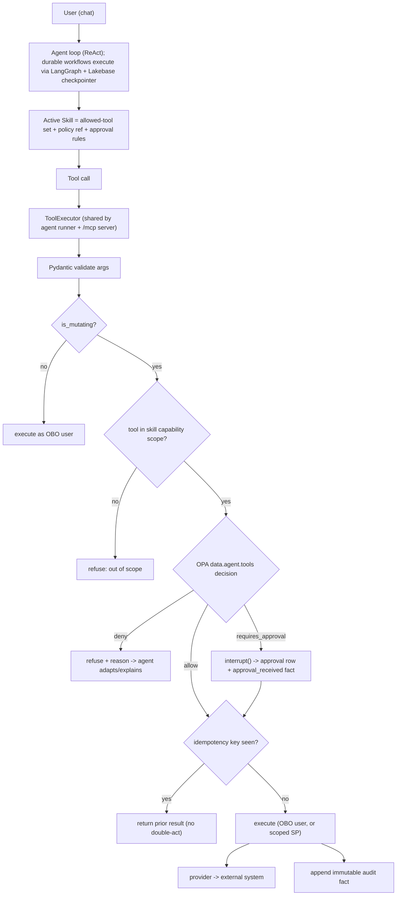
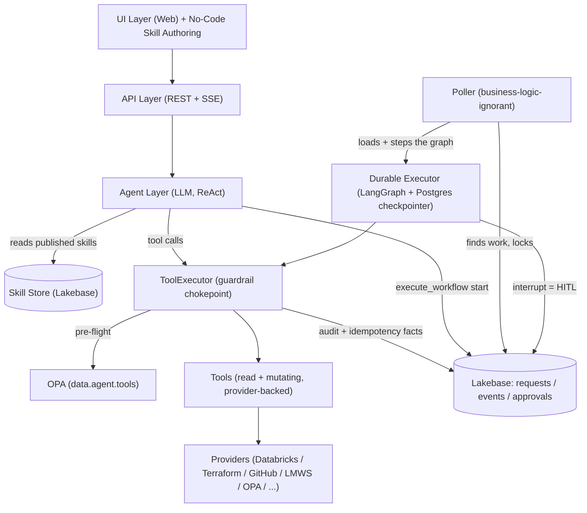
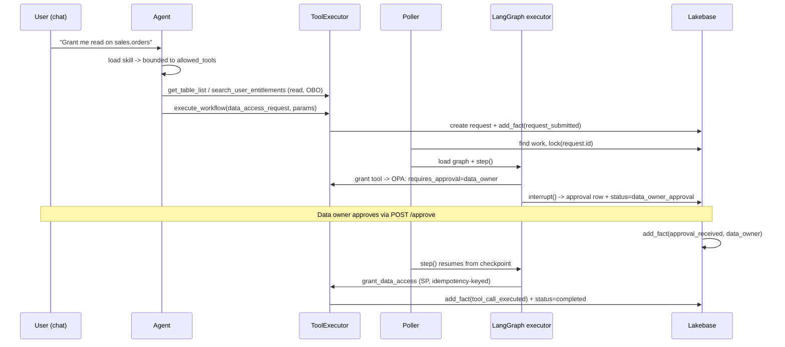

# Backend Architecture — V2 (Target State)

> **Status: proposed target architecture.** This document describes the V2 design we are
> refactoring toward. The currently-running system is described in
> [ARCHITECTURE.md](./ARCHITECTURE.md), which remains authoritative until the **V2 cutover**,
> at which point it is fully replaced. **This is an all-or-nothing migration** — there is no
> per-workflow legacy/V2 routing. The legacy state machine engine is deleted at cutover (see
> [Migration: All-or-Nothing Cutover](#10-migration-all-or-nothing-cutover)).

## 1. The Shift: From Framework to Solution

V1 is a **framework**: adding a capability means a developer writes Python — a new state
machine class, provider methods, tool wrappers, and instruction files — then redeploys. That
is powerful but it is not installable by an administrator and not a product.

V2 turns the framework into a **no-code solution** by remapping three concepts:

| V1 (framework, code) | V2 (solution, configured) |
|---|---|
| **Workflows** = hand-coded state machine classes (~5,800 lines across 26 classes) | **Skills** = admin-authored, DB-backed records (prompt + allowed tools + policy + approval rules) |
| **Providers** = internal Python abstractions, called only by state machines | **Tools** = the agent orchestrates provider-backed tools directly, under a guardrail stack |
| **State machine engine** = custom `tick()`/fact-reconciliation loop (`python-statemachine`) | **Durable agentic execution** = LangGraph graph + Lakebase (Postgres) checkpointer |

The trade we are explicitly making: we give up **deterministic execution *path*** (the exact,
hand-coded step sequence) in exchange for no-code authoring and agentic flexibility. **Every
other property the platform needs is preserved** — not by a deterministic state machine, but
by a **guardrail stack** plus a **durable runtime**.

### What does NOT change

- The **governance chokepoint** principle: all requests still pass through the agent.
- **Async processing**: long-running ops (5–20 min) still run outside HTTP requests, driven by the poller.
- **Immutable facts** in the `events` table remain the audit trail and idempotency ledger.
- **Lakebase (Postgres)** remains the system of record; `requests`/`events`/`approvals` tables persist.
- The **approval API and UI** (`POST /requests/{id}/approve`) are reused unchanged.

## 2. Core Requirements and How V2 Satisfies Them

The hard requirements from V1 are unchanged; only the *mechanism* changes.

| Requirement | V1 mechanism | V2 mechanism |
|---|---|---|
| Determinism of **outcome** | State machine logic | OPA policy pre-flight + typed tool schemas + plan→confirm→apply |
| **Idempotency** | Fact guards in `on_enter_*` hooks | Idempotency keys in the `ToolExecutor`, keyed on `(scope_id, tool_call_id)` |
| **Durability / crash-resume** | Re-executable state machine + fact replay | LangGraph checkpointer (Lakebase) keyed on `request.id` |
| **Long-running tolerance** | `execute_tasks()` async hooks + poller | Async tool handles (pending-poll pattern) inside graph nodes + poller |
| **Human-in-the-loop** | `wait_for_event` + poller detects approval fact | LangGraph `interrupt()`; approval fact resumes the graph |
| **Governance / audit** | Per-workflow hooks scattered across classes | One `ToolExecutor` chokepoint → one audit fact per mutating call |
| **Bounded blast radius** | Deterministic SM never improvises | Capability scoping per skill + OPA approval gates (see below) |
| Determinism of **path** | Guaranteed | **Intentionally traded away** |

## 3. The Guardrail Stack

V2 governance is defense-in-depth around the agent, evolving the three governance layers in
[GOVERNANCE.md](./GOVERNANCE.md). Layer 2 ("State Machine Conditions") is replaced by
**capability scoping + OPA gates inside the ToolExecutor** — deterministic *enforcement* without
a deterministic *path*.



Guardrail layers, ranked by **worst-case** bounding power (not average-case):

1. **Capability scoping per skill** — a skill declares its `allowed_tools`; the agent in that skill's context structurally cannot call anything else. Bounds blast radius before policy runs.
2. **OPA approval gate** on `infra` / `membership` / `destructive` classes — irreversible/high-impact actions require human sign-off, decided in version-controlled Rego.
3. **Plan → confirm → apply** — mutating tools return a diff; the user confirms before apply (generalizes Terraform's plan/apply).
4. **OBO + Unity Catalog floor** — read tools and (where applicable) data grants run as the caller, who can never exceed their own UC permissions.
5. **Idempotency + durable checkpointing** — re-entry after a crash returns the prior result instead of re-acting.
6. **Least-privilege scoped credentials** — SP-privileged tools use narrowly scoped creds.
7. **Eval / sandbox before publish** — a skill is tested against a sandbox workspace before it can go live.

## 4. Blast-Radius Model (Identity & Bounds)

A key finding from the provider audit: **OBO + Unity Catalog cannot be the primary safety
bound**, because nearly every real mutation runs as a **service principal**, and
Terraform/GitHub/LMWS are not UC-governed at all. Only `DatabricksProvider.execute_sql` even
accepts an OBO token, and today it is used only for reads.

Therefore every tool is tagged with a **`side_effect_class`** that determines its bound:

| `side_effect_class` | Examples | Identity today | Primary V2 bound |
|---|---|---|---|
| `read` | catalog/table/list, search, audit reads | OBO user | **OBO + UC** |
| `data_grant` | UC grant/revoke (`grant_access`) | service principal | **OPA approval gate + capability scope** (see decision below) |
| `infra` | Terraform apply, workspace/volume/SP/repo create | Git bot / app SP | **OPA approval gate + scoped creds** (no UC bound) |
| `membership` | LMWS group changes | app SP → job → LMWS service account | **OPA approval gate** (no UC bound) |
| `destructive` | enforcement `kill`, deletes | app SP | **Hard approval gate + reversibility/compensation** |
| `notify` | email / slack / teams | app identity | **Rate limit + audit** (low blast radius) |

### Decision: data-access grants stay SP-executed behind a gate

`grant_access` runs the GRANT as the **service principal**, not the requester, because the
requester usually does **not** hold `WITH GRANT` rights on the target — which is the entire
reason an approval workflow exists. Re-plumbing grants to OBO would only help the rare case
where the requester is already an owner. **V2 keeps SP execution for `data_grant` and bounds it
with a mandatory OPA approval gate plus capability scoping**, rather than relying on OBO+UC.
OBO+UC remains the bound for `read` tools.

## 5. Architecture Layers (V2)



- **Agent Layer** — single unified ReAct agent. Its tool set per conversation is the active
  skill's `allowed_tools`. It both *gathers/validates* and, within rails, *orchestrates execution*.
- **ToolExecutor** — the new chokepoint every tool call flows through (agent path and `/mcp` path).
- **Durable Executor** — the only execution engine. A LangGraph graph per workflow type,
  checkpointed to Lakebase, resumed by the poller.

## 6. Component: The ToolExecutor (Interceptor)

V1 has no tool middleware. The cleanest insertion point is a single shared executor that both
the agent runner and the embedded MCP server delegate to (today the `/mcp` server bypasses
`McpTool.execute()` and loses OBO/role context entirely).

```python
@dataclass
class ToolContext:
    scope_id: str            # request.id for workflow tools; agent_session_id otherwise
    tool_call_id: str        # idempotency correlation (from the runner)
    obo_token: str | None    # caller's On-Behalf-Of token
    user_identity: dict      # email, roles, entitlements
    db: Session
    skill: Skill | None      # active skill -> capability scope

class ToolExecutor:
    async def run(self, tool: McpTool, ctx: ToolContext, **args) -> dict:
        args = tool.validate(args)                       # Pydantic (free win)
        if not tool.is_mutating:
            return await tool.execute(_obo_token=ctx.obo_token, **args)

        if ctx.skill and tool.name not in ctx.skill.allowed_tools:
            return refuse("tool not in skill capability scope")

        decision = await opa.evaluate(
            tool.policy_ref, "data.agent.tools.decision",
            {"tool": tool.name, "side_effect_class": tool.side_effect_class,
             "args": args, "user": ctx.user_identity, "target": _target(args)},
        )
        if not decision["allow"]:
            return refuse(decision["reason"])
        if decision["requires_approval"]:
            interrupt(approval_type=decision["approval_type"])   # LangGraph HITL

        key = idempotency_key(ctx.scope_id, ctx.tool_call_id, tool.name, args)
        if has_fact(ctx.db, ctx.scope_id, "tool_call_executed", idempotency_key=key):
            return get_cached_result(ctx.db, key)

        result = await tool.execute(_obo_token=ctx.obo_token, **args)
        add_fact(ctx.db, ctx.scope_id, "tool_call_executed",
                 {"tool": tool.name, "idempotency_key": key, "result_summary": summarize(result)},
                 actor=ctx.user_identity["email"])
        return result
```

Wiring:
- Replace the bare call in the agent runner (`await matching_tool.execute(**fn_args)`) with `await tool_executor.run(tool, ctx, **args)`.
- Register a shim in the MCP server that also routes through `ToolExecutor` so external MCP clients keep per-user permissions and the same guardrails.
- A new `agent_session_id` on the conversation request provides a `scope_id` for non-workflow tool calls; workflow tools reuse the `request.id` they create.

## 7. Component: Tool Metadata + OPA Policy

### `@tool` additions

```python
@tool(
    name="grant_data_access",
    description="Grant a principal access to a UC table/schema/volume.",
    args_schema=GrantInput,
    is_mutating=True,
    side_effect_class="data_grant",     # drives the guardrail bound
    policy_ref="agent/tools/data_grant", # Rego package
    required_role=None,
)
async def grant_data_access(...): ...
```

All ~45 existing tools get classified; the old `get_read_only_tools()` heuristic (which only
excluded `execute_workflow`) is replaced by `is_mutating`.

### New OPA package `data.agent.tools`

No existing Rego covers agent tool calls; this is new. It returns a decision the executor
consumes:

```rego
package agent.tools

# input: {tool, side_effect_class, args, user, roles, entitlements, target}
default decision := {"allow": false, "requires_approval": false, "reason": "no matching rule"}

decision := d {
    input.side_effect_class == "read"
    d := {"allow": true, "requires_approval": false}
}

decision := d {
    input.side_effect_class == "data_grant"
    d := {"allow": true, "requires_approval": true, "approval_type": "data_owner"}
}

decision := d {
    input.side_effect_class in {"infra", "membership"}
    d := {"allow": true, "requires_approval": true, "approval_type": "platform_admin"}
}

decision := d {
    input.side_effect_class == "destructive"
    d := {"allow": true, "requires_approval": true, "approval_type": "platform_admin",
          "reason": "destructive action requires explicit sign-off"}
}
```

## 8. Component: The Skill Object (No-Code Authoring)

Skills replace `backend/app/agents/instructions/*.md` (filesystem, dev-deployed, cached at
process start). They are DB-backed and admin-authored, modeled on the existing Context Catalog
(domains/documents with draft→publish), which is the proven precedent for admin-authored
content the agent consumes at runtime.

```python
class SkillModel(Base):
    id: str
    name: str
    trigger_phrases: list[str]        # feeds the capabilities index
    instructions_markdown: str        # the "script" the agent follows
    allowed_tools: list[str]          # CAPABILITY SCOPE — the primary structural bound
    parameter_schema: dict            # JSON Schema for execute_workflow params
    approval_rules: dict              # or a policy_ref into data.agent.tools
    required_role: str | None
    engine: str                       # "v2"
    graph_ref: str | None             # optional declarative graph for hot/irreversible paths
    status: str                       # draft | published
    created_by / updated_at / version
```

- **Authoring UI**: clone the Context Catalog admin page — tree/list + markdown editor + a
  tool picker (from the live tool registry, so renames don't silently break a skill) + a
  parameter-schema builder + an approval-rules form.
- **Publication**: published skills feed the capabilities index **live** (no redeploy); the
  agent loads a skill's full instructions on demand and is bounded to its `allowed_tools` for
  that conversation.
- **AI-assisted authoring**: the agent helps draft a skill (instructions, suggested tools,
  parameter schema) from a natural-language description.

## 9. Component: Durable Execution (LangGraph)

Every workflow type runs as a LangGraph graph with an `AsyncPostgresSaver` checkpointer on
Lakebase, keyed on `request.id` as the thread id. There is no other engine.

- **Nodes** call tools through the `ToolExecutor` (so the same guardrails apply inside the graph).
- **HITL** uses `interrupt()`; the existing `POST /requests/{id}/approve` writes the
  `approval_received` fact and the graph resumes (either directly via `graph.resume(thread_id=request.id, ...)` or on the next poll cycle — mirroring V1's async contract).
- **Idempotency** is enforced by the executor's keys, so a node re-entered after a crash does not re-act.
- **Status mapping**: `RequestStatus` is a fixed 8-value enum the UI timeline depends on. Each
  graph declares a `node → RequestStatus` mapping so `to_state_machine_state()` keeps rendering.

### End-to-end: a data-access skill



## 10. Migration: All-or-Nothing Cutover

V2 is a **single hard cutover**, not a gradual coexistence. There is no `workflow_engines:`
routing, no polymorphic `get_executor`, and no period where legacy state machines and LangGraph
graphs run side by side. The legacy `python-statemachine` engine, `WORKFLOW_REGISTRY`, the
`@workflow` decorator, `tick()`/`execute_tasks()`, and all 26 state machine classes are
**deleted at cutover**. The poller calls the V2 executor directly:

```python
# poller._process_request_state_machine (V2 — the only path)
graph = load_graph(request, db)        # LangGraph graph for request.type
await graph.step()                     # resume from Lakebase checkpoint until next interrupt
graph.persist()                        # sync current_state + RequestStatus from checkpoint
```

What stays stable across the cutover (so the UI, approvals, and ops are unchanged): the
`requests` / `events` / `approvals` tables, `state_context` as graph input, the approval API
(`POST /requests/{id}/approve` → `approval_received` fact), poller locking/retry/heartbeat, and
compound `parent_id` / `root_id` linkage.

### Cutover prerequisites

Before flipping, **all 26 current workflow types must be re-expressed as V2 graphs/skills** and
pass the [eval & sandbox harness](#12-eval--sandbox-harness). Cutover gating:

- All workflow types have a published V2 skill + graph and green evals.
- All ~45 tools are classified (`is_mutating` / `side_effect_class`) and the `data.agent.tools`
  OPA policy is authored and enforced (not shadow mode).
- A **drain or migrate** plan for in-flight V1 requests: either drain to terminal state before
  cutover (preferred — short freeze), or write a one-time backfill that seeds LangGraph
  checkpoints from existing `current_state` + facts.

### Build sequence (pre-cutover, behind a feature build, not in production routing)

These are development milestones that culminate in the single cutover — they are **not**
incremental production releases of mixed engines:

1. **Foundations**: add `is_mutating`/`side_effect_class` to all tools; extract the
   `ToolExecutor` and route the runner + `/mcp` through it (Pydantic validation + audit facts;
   OPA initially in shadow/log mode to tune policy). Author the `data.agent.tools` package.
2. **Engine + first graph**: stand up the LangGraph executor with the Lakebase checkpointer and
   prove one representative graph end-to-end (`data_access_request`): `interrupt()` approval,
   idempotency keys, crash-resume.
3. **Authoring**: DB-backed Skill object + admin UI (Context Catalog clone) + eval/sandbox
   harness; port every instruction file to a published skill + graph.
4. **Coverage**: re-express the remaining workflow types (by `side_effect_class`: read/notify →
   data_grant → infra/membership/destructive), each green in the harness.
5. **Cutover**: drain/migrate in-flight requests, switch the poller to the V2 path, delete the
   legacy engine, ship.

## 11. What V2 Keeps / Replaces / Retires

- **Keep**: providers (the muscle behind tools), OPA, facts/audit, OBO, Lakebase, the chat/SSE
  UI, the poller shell + locking, the approval API, Context Catalog (template for Skill authoring).
- **Replace**: 26 hand-coded state machines → authored Skills executed by a LangGraph executor;
  `wait_for_event` + poller-detects-fact → `interrupt()` + checkpointer; scattered per-workflow
  idempotency hooks → one `ToolExecutor`.
- **Retire / shrink**: most of the ~1,700 lines of SM framework glue and ~5,800 lines of
  per-workflow Python; the `tick()`/reconcile engine.

## 12. Eval & Sandbox Harness

Before a skill can be published it must pass an automated **pre-publish** harness that:
- runs the skill against a **sandbox workspace**;
- asserts the agent **cannot call tools outside the skill's `allowed_tools`**;
- asserts OPA **approval gates fire** for the declared `side_effect_class`;
- runs **regression checks** on agent behavior (golden transcripts) to catch prompt drift.

This pre-publish harness is the *gate*; §13 Pillar 4 adds the **production** half of the loop
(MLflow tracing, inference tables, and a scheduled LLM-as-a-judge job) so quality is measured
continuously after publish, not just once before it.

## 13. Databricks Platform Best Practices (North Star)

V2 adopts the full **"North Star"** best-practice set proven out in the reference template
(`supply-chain-agent`), organized as four pillars. The goal is a copy-pasteable, governed,
observable agent where security, observability, and governance are built in from day one — and
where reusing the pattern requires changing little more than the prompt and the tools/skills
granted in Unity Catalog. Each pillar below is reconciled against the existing V2 design: where
it **reinforces** us, and the few places it forces a **decision**.

### Pillar 1 — App & Orchestration (Databricks Apps)

- Serverless Databricks Apps hosting; **native SSO + identity propagation**
  (`X-Forwarded-Access-Token`); LangGraph engine in-process behind FastAPI; SSE to the UI.
- **Governance default — OBO, no silent SP fallback.** In any *deployed* app the agent runs
  strictly On-Behalf-Of the signed-in user; if no OBO token is present it **refuses** to run as
  the service principal (escape hatch: `ALLOW_SP_FALLBACK=true`). See `model.py:load_context`.
- *Reconciliation:* fully aligned with V2 (LangGraph all-or-nothing, FastAPI, SSE, OBO floor).
  Net-new is only **formalizing the refuse-SP-fallback rule** as code, not convention.

### Pillar 2 — Model Control & Guardrails (AI Gateway)

- Route every LLM call through an **AI Gateway endpoint** (OpenAI-compatible path
  `{host}/ai-gateway/mlflow/v1`) instead of calling Model Serving directly. This buys:
  - **Decoupled model routing** — no hardcoded model/version in app code; swap models without a
    redeploy.
  - **Zero-downtime A/B testing** — `traffic_config` traffic split across `served_entities`
    (e.g. 80/20 Claude/Llama), tuned live (`scripts/create_ab_test_route.py`).
  - **Input guardrails** (PII, safety, invalid keywords, valid topics) + **centralized
    rate/cost limits** per user/service.
- **DECISION — no output guardrails; keep token streaming.** AI Gateway *output* guardrails
  buffer the **full** response to inspect it, so the endpoint cannot stream token-by-token. V2
  **does not enable output guardrails** — we preserve always-on SSE token streaming (our UX leans
  heavily on it). Safety on the model side is enforced via **input guardrails** (PII, safety,
  keywords, topics) + rate/cost limits, which are stream-safe; safety on the *action* side is
  enforced by the `ToolExecutor` + OPA. We therefore do **not** build the reference's adaptive
  stream/blocking split — the streaming path is the only path.
- *Reconciliation:* AI Gateway guards **LLM I/O** (content safety, PII, cost); the `ToolExecutor`
  + OPA guard **actions/side effects**. These are **complementary layers** — keep both.

### Pillar 3 — Governance & Security (Unity Catalog)

- **UC Function Tool Registry.** Register data-plane tools as **UC functions** and discover them
  per-user by querying `system.information_schema.routines`, then load via `UCFunctionToolkit`.
  Because discovery runs under the caller's OBO identity, the agent only ever sees the tools the
  *caller* has `GRANT EXECUTE` on — **platform-native capability scoping**, no code changes when
  tools are added (`registry.get_langchain_tools`).
- **Skills via UC Volumes.** Shared skills are `.md` files in a UC Volume named `skills`,
  discovered via `system.information_schema.volumes` and governed by **READ** grants; read on
  demand by the `read_skill` tool. Each user also gets **personal skills** in their own workspace
  folder (OBO), always available to them (`registry.discover_skills`, `user_skills.py`).
- OBO execution end-to-end; fine-grained SQL `GRANT`; HITL write approvals on mutating functions.
- *Reconciliation / decisions:*
  - **Tool home (DECISION — keep tools local + self-hosted; expose via a custom MCP provider).**
    We do **not** move tools into UC functions. Tools stay as local Python `McpTool`s, executed
    and hosted **in-app** behind the `ToolExecutor` + OPA. They are authored so the in-app MCP
    server (`mcp_server.py`, mounted at `/mcp`) can be **registered as a custom MCP provider in
    AI Gateway**, making selected tools reusable by other agents/apps. A **per-tool `external`
    switch** (default `False`) controls exposure: only `external=True` tools are published over
    the MCP server; everything else stays app-internal. This keeps one execution + governance
    path (`ToolExecutor`/OPA) while still letting the platform reuse tools.
  - **Capability scoping:** with tools local, the per-skill `allowed_tools` set + OPA remain the
    capability scope (not UC `GRANT EXECUTE`). OBO + UC still bound the *data* a tool can read.
  - **Skill storage (open):** UC-Volume markdown (platform-governed, OBO-discovered, zero infra)
    vs. the DB-backed **Skill object** we specified for no-code authoring + structured action
    metadata (`allowed_tools`, `parameter_schema`, `approval policy`). Recommended **hybrid**:
    keep the structured action metadata in Lakebase for authoring + capability scoping, while
    skill *instruction content* is discoverable/governable the UC-Volume way.

### Pillar 4 — Observability & Evaluation (MLflow & Delta)

- **MLflow `ResponsesAgent` contract (DECISION — adopt natively, do not home-roll).** Structure
  the agent as a native `mlflow.pyfunc.ResponsesAgent` (`predict` / `predict_stream` yielding
  `ResponsesAgentStreamEvent`), **replacing** the custom `AgentRunner` + bespoke SSE event
  protocol rather than bolting tracing onto it. This standardizes the agent I/O contract, makes
  it loggable/servable as an MLflow model, and turns on **automatic multi-step tracing**
  (`mlflow.langchain.autolog()`); every response carries a `trace_id`. The SSE layer becomes a
  thin adapter that maps `ResponsesAgentStreamEvent`s to the wire, not a parallel protocol.
- **Inference Tables.** AI Gateway payload logging captures all prompts/responses to a Delta
  table (`AutoCaptureConfigInput`, `scripts/enable_inference_tables.py`).
- **Active feedback loop.** Thumbs up/down in the UI, keyed by `trace_id`, written to Delta.
- **LLM-as-a-judge.** A scheduled Databricks **job** reads recent traces/inference tables, runs
  `mlflow.evaluate` with a judge model (relevance, professionalism, tool accuracy), and writes
  scores to a Delta table for a dashboard (`evals/run_llm_judge.py`).
- *Reconciliation:* this **extends** §12 — the pre-publish harness is the gate; MLflow tracing +
  inference tables + the judge job are the **continuous, in-production** measurement. Rewire any
  existing feedback feature to the MLflow `trace_id`.

### Optional artifact

The reference ships an **in-app "North Star" architecture slideshow**
(`src/ArchitecturePresentation.tsx`) used for demos/onboarding. We may port it as a
self-contained UI artifact (no backend calls) to communicate the V2 architecture in-product.

## 14. Open Decisions

- **Self-healing reconcile**: V1 re-derives state from *external truth* ("Terraform actually
  succeeded → advance"). V2 should add a node-level pre-check on resume rather than relying on
  checkpoint state alone — decide how far to carry this.
- **Off-the-shelf MCP servers** for standard Databricks/UC ops vs. thin in-house tools over
  existing providers — where is the cut line? Org-specific systems (LMWS, GitOps tag management,
  Terraform conventions) will not have off-the-shelf equivalents.
- **Unified Skill object** (knowledge + action) vs. keeping Context Catalog (knowledge) separate
  from action skills.
- **Token-level streaming** and richer progress UI for long-running graph nodes.
- **Streaming vs. output guardrails** (§13 Pillar 2): RESOLVED → **no output guardrails**; keep
  always-on SSE token streaming. Model-side safety via input guardrails + rate/cost limits only.
- **`ResponsesAgent` adoption** (§13 Pillar 4): RESOLVED → **adopt the native MLflow
  `ResponsesAgent` contract** and replace the custom `AgentRunner` + bespoke SSE protocol (SSE
  becomes a thin adapter). Do not home-roll.
- **Tool home** (§13 Pillar 3): RESOLVED → **keep tools local + self-hosted** behind
  `ToolExecutor`/OPA, exposed selectively as a **custom MCP provider in AI Gateway** via a
  **per-tool `external` switch** (default off). Tools are *not* moved to UC functions.
- **Skill storage** (§13 Pillar 3): still open — UC Volume vs. Lakebase Skill object vs. hybrid.

## 15. Implementation Status (living)

Built additively pre-cutover; the legacy engine still runs the product until M5.

- **M1 — Foundations (DONE, verified).**
  - Tool governance metadata on `McpTool` + `@tool`: `side_effect_class`
    (`read|app_write|data_grant|infra|membership|notify|destructive`), `is_mutating`,
    `policy_ref` (`backend/app/tools/mcp.py`). All tools classified (40 read,
    `execute_workflow`→`infra`, `submit_feedback`→`app_write`).
  - Shared `ToolExecutor` (`backend/app/tools/tool_executor.py`): inject identity →
    Pydantic-validate → OPA pre-flight (mutating) → idempotency replay → execute → audit fact.
  - `runner.py` and `mcp_server.py` both route through it (identity injection centralized;
    the `/mcp` path no longer bypasses governance).
  - OPA package `data.agent.tools` (`backend/policies/agent_tools.rego`) →
    `{allow, requires_approval, approval_type, reason}`. Shadow mode by default
    (`AGENT_TOOL_OPA_ENFORCE`); enforce mode verified to gate `manager`/`admin` approvals.
- **M2 — Durable engine (DONE, verified).**
  - LangGraph + checkpointer (`langgraph`, `langgraph-checkpoint-sqlite/postgres`).
  - Checkpointer factory (`backend/app/v2/checkpointer.py`): AsyncSqliteSaver (local) /
    AsyncPostgresSaver (Lakebase), thread = `request.id`.
  - `DurableWorkflowExecutor` (`backend/app/v2/executor.py`) + graph registry
    (`backend/app/v2/graphs/`). `data_access` ported as a graph (`graphs/data_access.py`)
    with native `interrupt()` HITL; provisioning runs through the M1 `ToolExecutor` via a
    `data_grant` tool (`backend/app/v2/tools.py`, kept out of `app/tools/` so it isn't
    chat-exposed pre-capability-scoping).
  - Verified end-to-end: fresh run pauses at approval interrupt; idle tick makes no progress;
    **crash-resume** (new executor instance) resumes from the checkpoint and grants exactly
    once; rejection path terminates. (The old `V2_ENGINE_ENABLED` flag has been removed — V2
    is the only engine; the poller advances these graphs unconditionally.)
- **M4 — Workflow coverage (DONE, verified).**
  - Declarative `WorkflowSpec` (gates + steps) -> generic `build_spec_graph` (`app/v2/spec.py`):
    the "skills as data" thesis. All 25 registered request types expressed as graphs
    (`app/v2/graphs/specs.py`); `data_access` keeps a dedicated graph.
  - Provider operations wrapped as mutating V2 tools (`app/v2/tools.py`): `grant_uc_access`,
    `terraform_plan/apply`, `create_uc_object`, `create_service_principal`, `github_*`,
    `add_group_membership`, `send_notification`, `sentinel_*`, `run_notebook_job`,
    `spawn_child_request`, `update_allowlist`, `execute_report` — each tagged with a
    `side_effect_class`, all executed through the M1 `ToolExecutor`.
  - Eval/sandbox harness (`app/v2/harness.py`): **25/25 graphs green**, gates pause/resume,
    all 24 mutating ops routed through the `ToolExecutor` (no raw provider calls).
- **M5 — Cutover (DONE, verified).**
  - Poller `_process_request_state_machine` now advances the V2 durable executor and resumes
    gates from approval/event facts (`approval_received`/`training_completed`/`pr_merged`/
    `request_rejected`); only `request.status` is synced for the UI.
  - V2 UI-state renderer (`app/v2/render.py`) replaces `to_state_machine_state()`; API
    (`requests.py`, `request_service.py`, `tags.py`) repointed; `build_tag_sql` relocated to
    `app/v2/tag_sql.py`.
  - **Legacy engine deleted**: all 23 state-machine packages + `base.py`/`factory.py`/
    `persistence.py`/`decorators.py`/`databricks_job_*` removed. Only `facts.py` (audit/
    idempotency store) and `lock.py` (poller locks) survive in `app/state_machines/`.
  - App boots clean (`import app.main` + poller + API) with the engine gone.
- **BP — Databricks best practices (DONE, verified).**
  - **AI Gateway routing**: `AgentLLMClient` prefers `settings.AI_GATEWAY_ENDPOINT` over the
    direct serving endpoint, so model routing / A-B split, rate + cost limits, and INPUT
    guardrails live in the gateway (config, not code). Output guardrails intentionally omitted
    to keep SSE token streaming always-on. New `databricks.yml` var `ai_gateway_endpoint`.
  - **Native MLflow `ResponsesAgent`** (`app/agents/responses_agent.py`): `AtlasResponsesAgent`
    wraps the governed `AgentRunner` and implements `predict` / `predict_stream` over the OpenAI
    Responses contract (text deltas + `function_call`/`function_call_output`/reasoning items,
    `trace_id` in `custom_outputs`). The in-app SSE protocol is retained as the richer transport;
    the ResponsesAgent is the deployable/Playground surface over the *same* loop.
  - **MLflow tracing** (`app/agents/tracing.py`): one trace per turn (root `agent_turn` AGENT
    span) with child `llm_call_*` (LLM) and `tool:*` (TOOL) spans; `trace_id` surfaced on the
    terminal SSE `done` event and the `run()` shim. Dependency-tolerant no-op when disabled.
    Verified end-to-end (mocked LLM, local MLflow): trace recorded, child spans present,
    `ResponsesAgent.predict` emits `function_call -> function_call_output -> message`.
  - **Observability**: `POST /api/v1/agent/feedback` attaches human feedback to a turn's
    `trace_id` (`mlflow.log_feedback`); scheduled `agent_quality_judge` job
    (`app/jobs/llm_judge.py` + `databricks.yml`) scores recent traces with an LLM judge and
    writes `LLM_JUDGE` assessments for judge-vs-human agreement. Inference tables configured on
    the gateway/serving endpoint (deploy). New deps: `mlflow-skinny`, `numpy`, `pandas`.
- **M3 — Skill authoring (DONE, verified).** "Workflows as data": `SkillModel`
  (`app/db/skill.py`) holds key/name/goal/instructions + guardrail metadata (allowed_tools,
  policy_ref, params_schema, request_type) + draft/publish + version. `SkillService` does CRUD +
  publish + idempotent **seed-from-filesystem** (the 21 legacy `instructions/*.md` import as
  published skills on first boot). `/api/v1/skills` (admin-gated) + React **Skills** authoring
  page (`src/pages/admin/Skills.tsx`, Build & Customize). The agent now reads **published skills
  from the DB** live: `prompts._get_cached_capabilities_section()` and
  `get_workflow_instructions` query the DB (filesystem fallback). Verified: 21 seeded,
  create/publish lifecycle, capabilities list reflects DB edits.
- **De-Qualcomm (DONE).**
  - **B5 + A1 (identity)**: vendor-neutral `IdentityGroupProvider` (`app/providers/identity/`)
    with `noop` (default), `rest` (SCIM/Entra/Okta/custom), and `lmws` (legacy adapter) backends
    chosen by `settings.IDENTITY_PROVIDER`. `add_group_membership` + the new generic
    `group_lookup`/`member_lookup` tools route through it (the Qualcomm-specific
    `lmws_list_retrieve`/`lmws_member_retrieve` tools removed). Access/approver group names now
    come from configurable UC tag keys (`ACCESS_GROUP_TAG_KEY`/`APPROVER_GROUP_TAG_KEY`).
  - **A2-A4 + B6-B13 (content/branding/deploy)**: neutralized seed Context Catalog content,
    branding (logo/command-center URLs blanked), deploy defaults (notification email, clone
    source), dev-script hardcoded paths, and `package.json` name. Frontend community links were
    already `example.com` placeholders.
- **Test suite reconciliation (DONE).** The V1 `python-statemachine` engine deleted in M5 left
  ~18 obsolete test modules (the whole `tests/unit/state_machines/`, both `tests/integration/`
  workflow tests, the `tests/harness/` `StateMachineTestHarness`, and one engine-based test in
  `test_reports.py`) importing now-deleted modules — they broke collection for the *entire* suite.
  Those were removed (their behavior is now covered by the V2 graph harness), and two real
  regressions the suite caught were fixed: the runner test's fake tool needed the new
  `is_mutating`/`side_effect_class` classification the `ToolExecutor` reads, and the LMWS test
  asserted a hardcoded `clone_source` that de-Qualcomm intentionally made config-driven. New
  pytest coverage was added for the V2 surface: the graph harness (run as a subprocess),
  `SkillService` CRUD/publish/seed, the pluggable `IdentityGroupProvider`, the `ToolExecutor`
  (shadow vs. enforce posture), and the MLflow tracing no-op path. **Full suite: 155 passed.**
- **No-code workflow core (DONE).** The execution graph itself is now data, not just the
  instruction/prompt layer. A safe JSON **expression mini-language** (`app/v2/expr.py`, no
  `eval`/`exec`) replaces the Python lambdas for `args`/`auto_approve`/`for_each`/`item_args`; a
  **tool registry** (`app/v2/tool_registry.py`) resolves a step's tool by name; and
  `spec_from_dict` + `validate_spec_dict` (`app/v2/spec_loader.py`) compile a serializable spec
  into the same runtime `WorkflowSpec` the graph builder consumes. `graphs/specs.py` is now a
  **`SPECS` dict catalog** (all 22 workflows as data) — the harness still reports 25/25 green with
  identical ToolExecutor counts (31/24), proving parity with the old lambda specs. Skills gained a
  `graph_spec` JSON column; the executor resolves a request's graph via `build_graph_for`, which
  prefers a **published skill's `graph_spec` (DB)** over the code catalog and falls back safely on
  any error. The catalog is seeded onto skills at boot (`seed_specs_from_catalog`) so the
  workflows are immediately editable data. Skills API exposes `graph_spec` plus
  `POST /skills/validate-spec` and `GET /skills/meta/tools` for the (still-to-build) visual editor.
- **Visual workflow editor (DONE).** A reactflow **studio** in the Skills admin (`src/pages/admin/Skills.tsx`,
  `src/components/admin/Workflow*.tsx`) authors `graph_spec` with no code: a full-width 3-pane layout
  (drag-to-reorder stage list │ live canvas │ stage inspector), friendly forms for gates (approver +
  auto-approve condition builder) and steps (tool picker from `meta/tools`, approvals, expression-aware
  args editor with a raw-JSON escape hatch), and an unsaved-changes guard. `src/lib/workflowSpec.ts`
  translates the `$`-expression language to/from the friendly models.
- **Author lifecycle: test → ship safely (DONE).** A **dry-run** (`POST /skills/test-spec` → `app/v2/dry_run.py`)
  compiles a *draft* spec and walks it against a sample request — evaluating the same expressions the
  executor would, **running no tools and writing nothing** — to project which gates auto-approve and the
  exact args each step receives (sample input is auto-scaffolded from the fields the workflow reads).
  Publishing goes through a **blast-radius confirmation** (gates/steps/mutating-actions, external-MCP
  steps, missing-request-type warning) that validates before it lets the skill go live.
- **Versioning + env promotion (DONE).** Each publish writes an immutable snapshot to `skill_versions`
  (`SkillVersionModel`); `GET /skills/{id}/versions` + `POST /skills/{id}/rollback` give history and
  one-click restore (restores as a *draft* for review before re-publishing). Portable
  **export/import** (`GET /skills/export/bundle`, `POST /skills/import/bundle`, format `atlas.skills/v1`,
  keyed by `key` with no ids/status/version) supports the **dev → staging → prod** flow: export published
  workflows from one env, import into the next as **drafts** (default), dry-run them, then publish.
- **Guardrail hardening (DONE).** Capability scope is now a structural bound in the `ToolExecutor`:
  a `ToolContext.allowed_tools` list refuses any out-of-scope *mutating* tool before policy/execution
  (reads stay broad for info-gathering; `None` = unscoped legacy agent). The agent-tool **OPA policy is
  enforced in deployed envs** (`databricks.yml` var `agent_tool_opa_enforce` defaults true; code default
  stays shadow so local/CI runs without a policy server don't fail closed), with a loud startup warning
  whenever mutating-tool OPA is in shadow. `agent_tools.rego` carves out `execute_workflow` (the entry
  tool) from approval-gating so enforce mode can't deadlock initiation — real infra/data approvals fire
  in-graph. The dead `V2_ENGINE_ENABLED` flag was removed.
- **Live graph run visualization (DONE).** `GET /api/v1/requests/{id}/graph` (`app/v2/render.py::live_graph`)
  returns the request's authored `graph_spec` plus per-node live status (`done`/`current`/`pending`/
  `rejected`), derived from the same fact log + status the timeline uses (published DB spec preferred, then
  code catalog, then a synthesized shape). The request-detail modal gained a **Workflow** tab
  (`src/components/RequestGraphView.tsx`) that renders the graph via `WorkflowGraphPreview` with run-state
  rings/badges and polls until terminal.
- **Eval harness upgrade (DONE).** The harness now captures a **golden transcript** per graph (ordered
  tool calls + mutating count + gates + final status) to `app/v2/golden_transcripts.json`; the default
  run compares against it and fails on drift (`--capture` to refresh after intended changes). A
  `--sandbox` mode skips the fakes to run against real providers in a throwaway workspace (not for CI).
  Publish gained a **side-effect-free behavioral gate** (`_behavioral_publish_gate` → dry-run projection)
  that compiles the spec and resolves every tool by name before a skill goes live (the full hermetic
  harness can't run in-process — it monkeypatches module globals).
- **ResponsesAgent deployment (DONE, workspace-run).** `app/agents/agent_entry.py` is the MLflow
  models-from-code entry; `scripts/register_responses_agent.py` logs + registers it to Unity Catalog and
  (with `--deploy`) provisions a Model Serving endpoint via `databricks-agents`, attaching the LLM/gateway
  serving endpoints as resources. Decoupled from `databricks.yml` because the new Unity AI Gateway serving
  objects aren't yet bundle-declarable; the running app adopts a gateway purely via `AI_GATEWAY_ENDPOINT`.
  Startup now logs the active governance posture, LLM routing (gateway vs. direct), and tracing state.
- **Remaining:** pooled Postgres checkpointer; wire the SSE `trace_id` into the chat-UI feedback control;
  end-to-end validation of the ResponsesAgent registration + `--sandbox` harness against a live workspace
  (both require workspace credentials).
