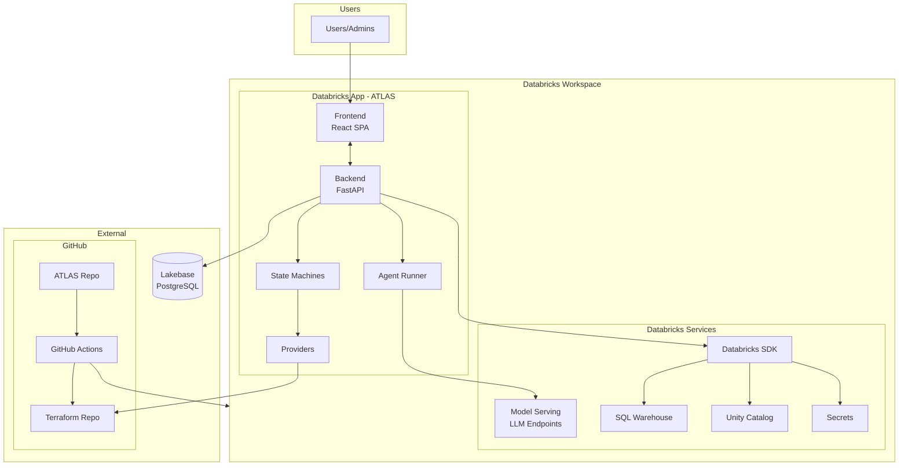

# ATLAS - Physical Architecture Diagram

## Overview
This document describes the ATLAS architecture for recreating in Gliffy or similar tools.

---

## Architecture Diagram (Text Representation)

```
┌─────────────────────────────────────────────────────────────────────────────────────────┐
│                                    DATABRICKS WORKSPACE                                  │
│  ┌───────────────────────────────────────────────────────────────────────────────────┐  │
│  │                              DATABRICKS APPS                                       │  │
│  │  ┌─────────────────────────────────────────────────────────────────────────────┐  │  │
│  │  │                           ATLAS APPLICATION                                  │  │  │
│  │  │                                                                              │  │  │
│  │  │   ┌──────────────┐         ┌──────────────────────────────────────────┐     │  │  │
│  │  │   │   FRONTEND   │         │              BACKEND (FastAPI)            │     │  │  │
│  │  │   │              │  REST   │                                           │     │  │  │
│  │  │   │  React SPA   │◄───────►│  ┌─────────┐  ┌─────────┐  ┌──────────┐  │     │  │  │
│  │  │   │  TypeScript  │  API    │  │  Agent  │  │  State  │  │ Providers│  │     │  │  │
│  │  │   │  Vite        │         │  │  Runner │  │ Machines│  │          │  │     │  │  │
│  │  │   └──────────────┘         │  │  (LLM)  │  │         │  │-Terraform│  │     │  │  │
│  │  │                            │  └────┬────┘  └────┬────┘  │-Databricks│ │     │  │  │
│  │  │                            │       │            │       └─────┬────┘  │     │  │  │
│  │  │                            └───────┼────────────┼─────────────┼───────┘     │  │  │
│  │  │                                    │            │             │             │  │  │
│  │  └────────────────────────────────────┼────────────┼─────────────┼─────────────┘  │  │
│  └───────────────────────────────────────┼────────────┼─────────────┼────────────────┘  │
│                                          │            │             │                   │
│  ┌───────────────────────────────────────┼────────────┼─────────────┼────────────────┐  │
│  │                            DATABRICKS SERVICES     │             │                │  │
│  │                                       │            │             │                │  │
│  │  ┌────────────────────┐   ┌──────────▼────────┐   │   ┌────────▼────────┐       │  │
│  │  │   Model Serving    │   │    Databricks     │   │   │  Unity Catalog  │       │  │
│  │  │                    │◄──┤       SDK         │   │   │                 │       │  │
│  │  │  - Gemini 2.5      │   │                   │   │   │  - Catalogs     │       │  │
│  │  │  - Claude          │   │  - Secrets API    │   │   │  - Schemas      │       │  │
│  │  │  - GPT-4           │   │  - Jobs API       │   │   │  - Tables       │       │  │
│  │  └────────────────────┘   │  - SQL Warehouse  │   │   │  - Grants       │       │  │
│  │                           └───────────────────┘   │   └─────────────────┘       │  │
│  │                                                   │                              │  │
│  │  ┌────────────────────┐                          │                              │  │
│  │  │   SQL Warehouse    │◄─────────────────────────┘                              │  │
│  │  │                    │   Query Execution                                       │  │
│  │  │   (Serverless)     │                                                         │  │
│  │  └────────────────────┘                                                         │  │
│  └──────────────────────────────────────────────────────────────────────────────────┘  │
└─────────────────────────────────────────────────────────────────────────────────────────┘
           │                                                           │
           │                                                           │
           ▼                                                           ▼
┌─────────────────────────┐                               ┌─────────────────────────┐
│       LAKEBASE          │                               │      GITHUB             │
│    (PostgreSQL)         │                               │                         │
│                         │                               │  ┌───────────────────┐  │
│  ┌───────────────────┐  │                               │  │  Terraform Repo   │  │
│  │     edas_hub      │  │                               │  │                   │  │
│  │                   │  │                               │  │  - envs/dev/      │  │
│  │  - requests       │  │                               │  │  - envs/staging/  │  │
│  │  - approvals      │  │                               │  │  - envs/prod/     │  │
│  │  - events         │  │                               │  │  - modules/       │  │
│  │  - delegations    │  │                               │  └─────────┬─────────┘  │
│  │  - users          │  │                               │            │            │
│  └───────────────────┘  │                               │  ┌─────────▼─────────┐  │
│                         │                               │  │  GitHub Actions   │  │
└─────────────────────────┘                               │  │                   │  │
                                                          │  │  - terraform plan │  │
                                                          │  │  - terraform apply│  │
                                                          │  └───────────────────┘  │
                                                          │                         │
                                                          │  ┌───────────────────┐  │
                                                          │  │   ATLAS Repo      │  │
                                                          │  │                   │  │
                                                          │  │  - GitHub Actions │  │
                                                          │  │  - Deploy to DBX  │  │
                                                          │  └───────────────────┘  │
                                                          └─────────────────────────┘
```

---

## Component Breakdown for Gliffy

### Layer 1: User Interface
| Component | Type | Color Suggestion |
|-----------|------|------------------|
| Frontend (React SPA) | Rectangle | Light Blue |
| User Browser | Actor/Person | - |

### Layer 2: Databricks Apps (Container)
| Component | Type | Color Suggestion |
|-----------|------|------------------|
| ATLAS Application | Container (dashed) | Light Gray |
| Backend (FastAPI) | Rectangle | Orange |
| Agent Runner | Rectangle (inside Backend) | Yellow |
| State Machines | Rectangle (inside Backend) | Yellow |
| Providers | Rectangle (inside Backend) | Yellow |

### Layer 3: Databricks Services
| Component | Type | Color Suggestion |
|-----------|------|------------------|
| Model Serving (LLM) | Rectangle | Purple |
| Databricks SDK | Rectangle | Blue |
| SQL Warehouse | Cylinder/Database | Blue |
| Unity Catalog | Rectangle | Green |
| Secrets | Rectangle | Red |

### Layer 4: External Services
| Component | Type | Color Suggestion |
|-----------|------|------------------|
| Lakebase (PostgreSQL) | Cylinder/Database | Dark Blue |
| GitHub | Cloud | Black/Gray |
| Terraform Repo | Folder | Orange |
| GitHub Actions | Rectangle | Green |

---

## Data Flow Arrows

### Request Flow (User → Backend)
1. User → Frontend (HTTPS)
2. Frontend → Backend REST API (HTTPS)
3. Backend → Agent Runner (Internal)
4. Agent Runner → Model Serving (HTTPS)
5. Agent Runner → Tools (Internal)

### State Machine Flow
1. Backend → State Machine (Internal)
2. State Machine → Providers (Internal)
3. Terraform Provider → GitHub (HTTPS/Git)
4. Databricks Provider → Unity Catalog (SDK)

### Data Persistence
1. Backend → Lakebase (PostgreSQL wire protocol)
2. Backend → Databricks Secrets (SDK)

### CI/CD Flow
1. Developer → GitHub (Git push)
2. GitHub Actions → Databricks Workspace (Deploy)
3. GitHub Actions → Terraform (Plan/Apply)
4. Terraform → Unity Catalog (Create resources)

---

## Mermaid Diagram (Alternative)



---

## Gliffy Recreation Steps

### Step 1: Create Containers
1. Create large rectangle "Databricks Workspace" (outermost)
2. Inside, create "Databricks Apps" container
3. Inside Apps, create "ATLAS Application" container
4. Create "Databricks Services" container below Apps

### Step 2: Add Components
1. Add Frontend box (left side of ATLAS)
2. Add Backend box (right side of ATLAS)
3. Inside Backend, add: Agent Runner, State Machines, Providers
4. In Services: Model Serving, SDK, SQL Warehouse, Unity Catalog

### Step 3: Add External Systems
1. Add Lakebase database cylinder (bottom left)
2. Add GitHub cloud (bottom right)
3. Inside GitHub: Terraform Repo, GitHub Actions, ATLAS Repo

### Step 4: Connect with Arrows
1. User → Frontend (solid arrow)
2. Frontend ↔ Backend (bidirectional)
3. Backend → each Databricks service
4. Backend → Lakebase
5. Providers → GitHub/Terraform
6. GitHub Actions → Databricks (deploy)

### Step 5: Add Labels
1. Label arrows with protocols: REST, SDK, Git, PostgreSQL
2. Add component descriptions in smaller text
3. Add color legend

---

## Export Formats
- **PNG/SVG**: For documentation
- **Gliffy native**: For editing
- **Draw.io/Lucidchart**: Alternative tools (compatible structure)
