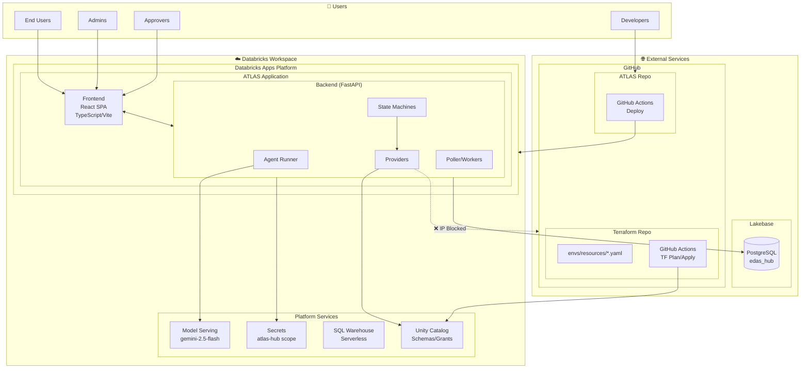

# ATLAS - Detailed Physical Architecture

## High-Level Architecture Diagram

```
┌──────────────────────────────────────────────────────────────────────────────────────────────────────────────────┐
│                                              USERS                                                                │
│                                                                                                                   │
│    ┌─────────────┐         ┌─────────────┐         ┌─────────────┐         ┌─────────────┐                       │
│    │  End Users  │         │   Admins    │         │  Approvers  │         │ Developers  │                       │
│    │  (Request)  │         │  (Manage)   │         │  (Approve)  │         │  (Deploy)   │                       │
│    └──────┬──────┘         └──────┬──────┘         └──────┬──────┘         └──────┬──────┘                       │
│           │                       │                       │                       │                              │
└───────────┼───────────────────────┼───────────────────────┼───────────────────────┼──────────────────────────────┘
            │                       │                       │                       │
            │ HTTPS                 │ HTTPS                 │ HTTPS                 │ Git Push
            ▼                       ▼                       ▼                       ▼
┌───────────────────────────────────────────────────────────────────────────────────────────────────────────────────┐
│                                         DATABRICKS WORKSPACE                                                       │
│                                    (fe-stable-xxx.cloud.databricks.com)                                           │
│                                                                                                                   │
│  ┌─────────────────────────────────────────────────────────────────────────────────────────────────────────────┐  │
│  │                                      DATABRICKS APPS PLATFORM                                                │  │
│  │                                                                                                              │  │
│  │  ┌────────────────────────────────────────────────────────────────────────────────────────────────────────┐ │  │
│  │  │                                    ATLAS APPLICATION                                                    │ │  │
│  │  │                              (edas-hub-dev.databricksapps.com)                                         │ │  │
│  │  │                                                                                                         │ │  │
│  │  │  ┌──────────────────────┐              ┌────────────────────────────────────────────────────────────┐  │ │  │
│  │  │  │      FRONTEND        │              │                    BACKEND (FastAPI)                       │  │ │  │
│  │  │  │                      │              │                                                             │  │ │  │
│  │  │  │  ┌────────────────┐  │    REST      │  ┌─────────────┐  ┌─────────────┐  ┌─────────────────────┐ │  │ │  │
│  │  │  │  │  React SPA     │  │    API       │  │   Agent     │  │    API      │  │      Workers        │ │  │ │  │
│  │  │  │  │                │  │◄────────────►│  │   Runner    │  │   Routes    │  │                     │ │  │ │  │
│  │  │  │  │  - Chat UI     │  │   /api/v1    │  │             │  │             │  │  ┌───────────────┐  │ │  │ │  │
│  │  │  │  │  - Requests    │  │              │  │  - LLM Call │  │  - /agent   │  │  │    Poller     │  │ │  │ │  │
│  │  │  │  │  - Approvals   │  │              │  │  - Tools    │  │  - /requests│  │  │               │  │ │  │ │  │
│  │  │  │  │  - Admin       │  │              │  │  - Context  │  │  - /approvals│ │  │  Process Open │  │ │  │ │  │
│  │  │  │  │                │  │              │  │             │  │  - /users   │  │  │  Requests     │  │ │  │ │  │
│  │  │  │  └────────────────┘  │              │  └──────┬──────┘  └──────┬──────┘  │  └───────┬───────┘  │ │  │ │  │
│  │  │  │                      │              │         │                │         │          │          │ │  │ │  │
│  │  │  │  Tech Stack:         │              │         │                │         │          │          │ │  │ │  │
│  │  │  │  - TypeScript        │              │         ▼                ▼         │          ▼          │ │  │ │  │
│  │  │  │  - Vite              │              │  ┌─────────────────────────────────────────────────────┐ │ │  │ │  │
│  │  │  │  - TailwindCSS       │              │  │                  STATE MACHINES                      │ │ │  │ │  │
│  │  │  │                      │              │  │                                                      │ │ │  │ │  │
│  │  │  └──────────────────────┘              │  │  ┌──────────────┐ ┌──────────────┐ ┌──────────────┐ │ │ │  │ │  │
│  │  │                                        │  │  │CreateSchema  │ │WorkspaceProv │ │ServicePrinc  │ │ │ │  │ │  │
│  │  │                                        │  │  │StateMachine  │ │StateMachine  │ │StateMachine  │ │ │ │  │ │  │
│  │  │                                        │  │  │              │ │              │ │              │ │ │ │  │ │  │
│  │  │                                        │  │  │pending       │ │pending       │ │pending       │ │ │ │  │ │  │
│  │  │                                        │  │  │  ↓           │ │  ↓           │ │  ↓           │ │ │ │  │ │  │
│  │  │                                        │  │  │tf_planning   │ │tf_planning   │ │tf_planning   │ │ │ │  │ │  │
│  │  │                                        │  │  │  ↓           │ │  ↓           │ │  ↓           │ │ │ │  │ │  │
│  │  │                                        │  │  │awaiting_appr │ │awaiting_appr │ │awaiting_appr │ │ │ │  │ │  │
│  │  │                                        │  │  │  ↓           │ │  ↓           │ │  ↓           │ │ │ │  │ │  │
│  │  │                                        │  │  │tf_applying   │ │tf_applying   │ │tf_applying   │ │ │ │  │ │  │
│  │  │                                        │  │  │  ↓           │ │  ↓           │ │  ↓           │ │ │ │  │ │  │
│  │  │                                        │  │  │completed     │ │completed     │ │completed     │ │ │ │  │ │  │
│  │  │                                        │  │  └──────┬───────┘ └──────┬───────┘ └──────┬───────┘ │ │ │  │ │  │
│  │  │                                        │  │         │                │                │         │ │ │  │ │  │
│  │  │                                        │  └─────────┼────────────────┼────────────────┼─────────┘ │ │  │ │  │
│  │  │                                        │            │                │                │           │ │  │ │  │
│  │  │                                        │            ▼                ▼                ▼           │ │  │ │  │
│  │  │                                        │  ┌─────────────────────────────────────────────────────┐ │ │  │ │  │
│  │  │                                        │  │                    PROVIDERS                         │ │ │  │ │  │
│  │  │                                        │  │                                                      │ │ │  │ │  │
│  │  │                                        │  │  ┌──────────────┐ ┌──────────────┐ ┌──────────────┐ │ │ │  │ │  │
│  │  │                                        │  │  │  Terraform   │ │  Databricks  │ │ Notification │ │ │ │  │ │  │
│  │  │                                        │  │  │  Provider    │ │  Provider    │ │  Provider    │ │ │ │  │ │  │
│  │  │                                        │  │  │  (GitOps)    │ │  (SDK)       │ │  (Email/Slack)│ │ │ │  │ │  │
│  │  │                                        │  │  │              │ │              │ │              │ │ │ │  │ │  │
│  │  │                                        │  │  │ - Clone repo │ │ - UC Catalog │ │ - SMTP       │ │ │ │  │ │  │
│  │  │                                        │  │  │ - Write YAML │ │ - Schemas    │ │ - Slack API  │ │ │ │  │ │  │
│  │  │                                        │  │  │ - Commit     │ │ - Grants     │ │ - Teams API  │ │ │ │  │ │  │
│  │  │                                        │  │  │ - Push       │ │ - Warehouses │ │              │ │ │ │  │ │  │
│  │  │                                        │  │  │ - Create PR  │ │ - Jobs       │ │              │ │ │ │  │ │  │
│  │  │                                        │  │  └──────┬───────┘ └──────┬───────┘ └──────────────┘ │ │ │  │ │  │
│  │  │                                        │  │         │                │                          │ │ │  │ │  │
│  │  │                                        │  └─────────┼────────────────┼──────────────────────────┘ │ │  │ │  │
│  │  │                                        │            │                │                            │ │  │ │  │
│  │  │                                        └────────────┼────────────────┼────────────────────────────┘ │  │ │  │
│  │  │                                                     │                │                              │  │ │  │
│  │  └─────────────────────────────────────────────────────┼────────────────┼──────────────────────────────┘  │ │  │
│  │                                                        │                │                                 │ │  │
│  │    App Service Principal: app-xxxxx edas-hub-dev       │                │                                 │ │  │
│  │                                                        │                │                                 │ │  │
│  └────────────────────────────────────────────────────────┼────────────────┼─────────────────────────────────┘ │  │
│                                                           │                │                                   │  │
│  ┌────────────────────────────────────────────────────────┼────────────────┼─────────────────────────────────┐ │  │
│  │                              DATABRICKS PLATFORM SERVICES               │                                 │ │  │
│  │                                                        │                │                                 │ │  │
│  │  ┌──────────────────┐   ┌──────────────────┐   ┌──────▼──────────┐   ┌─▼────────────────┐               │ │  │
│  │  │  MODEL SERVING   │   │  SECRETS SERVICE │   │  SQL WAREHOUSE  │   │  UNITY CATALOG   │               │ │  │
│  │  │                  │   │                  │   │                 │   │                  │               │ │  │
│  │  │  Endpoints:      │   │  Scope: atlas-hub│   │  ID: 5c5e40da.. │   │  Metastore       │               │ │  │
│  │  │                  │   │                  │   │                 │   │                  │               │ │  │
│  │  │  - gemini-2.5    │   │  Secrets:        │   │  - Serverless   │   │  ┌────────────┐ │               │ │  │
│  │  │    -flash        │   │  - github-pat    │   │  - Auto-scale   │   │  │  Catalogs  │ │               │ │  │
│  │  │  - claude-sonnet │   │  - lakebase-pwd  │   │  - Query exec   │   │  │            │ │               │ │  │
│  │  │  - gpt-4o        │   │  - github-app-   │   │                 │   │  │  main      │ │               │ │  │
│  │  │                  │   │    private-key   │   │                 │   │  │  prod_cat  │ │               │ │  │
│  │  │  API:            │   │                  │   │                 │   │  │  dev_cat   │ │               │ │  │
│  │  │  /serving-       │   │  ACLs:           │   │                 │   │  └────────────┘ │               │ │  │
│  │  │   endpoints/     │   │  - app SP: READ  │   │                 │   │                  │               │ │  │
│  │  │   {endpoint}/    │   │  - users: READ   │   │                 │   │  ┌────────────┐ │               │ │  │
│  │  │   invocations    │   │                  │   │                 │   │  │  Schemas   │ │               │ │  │
│  │  │                  │   │                  │   │                 │   │  │  Grants    │ │               │ │  │
│  │  └────────┬─────────┘   └────────┬─────────┘   └────────┬────────┘   │  │  Tables    │ │               │ │  │
│  │           │                      │                      │            │  └────────────┘ │               │ │  │
│  │           │                      │                      │            └────────┬─────────┘               │ │  │
│  └───────────┼──────────────────────┼──────────────────────┼─────────────────────┼─────────────────────────┘ │  │
│              │                      │                      │                     │                           │  │
└──────────────┼──────────────────────┼──────────────────────┼─────────────────────┼───────────────────────────┘  │
               │                      │                      │                     │                              │
               │ LLM API              │ SDK                  │ JDBC/SQL            │ SDK                         │
               │                      │                      │                     │                              │
               ▼                      ▼                      ▼                     ▼                              │
┌──────────────────────────────────────────────────────────────────────────────────────────────────────────────────┘
│
│
▼
┌─────────────────────────────────────────────────────────────────────────────────────────────────────────────────┐
│                                           EXTERNAL SERVICES                                                      │
│                                                                                                                  │
│  ┌─────────────────────────────┐                    ┌────────────────────────────────────────────────────────┐  │
│  │         LAKEBASE            │                    │                      GITHUB                             │  │
│  │    (Managed PostgreSQL)     │                    │               (databricks-field-eng org)                │  │
│  │                             │                    │                                                         │  │
│  │  Host: instance-xxx.        │                    │  ┌─────────────────────────────────────────────────┐   │  │
│  │        database.cloud.      │                    │  │        REPO 1: fe-agentic-self-service          │   │  │
│  │        databricks.com       │                    │  │                 (ATLAS App Code)                 │   │  │
│  │  Port: 5432                 │                    │  │                                                  │   │  │
│  │                             │                    │  │  Branches:                                       │   │  │
│  │  ┌───────────────────────┐  │                    │  │  - main (production)                             │   │  │
│  │  │   Database: edas_hub  │  │                    │  │  - develop (development)                         │   │  │
│  │  │                       │  │                    │  │  - feature/* (features)                          │   │  │
│  │  │   Tables:             │  │                    │  │  - bugfix/* (fixes)                              │   │  │
│  │  │   ├─ requests         │  │                    │  │                                                  │   │  │
│  │  │   ├─ approvals        │  │                    │  │  ┌──────────────────────────────────────────┐   │   │  │
│  │  │   ├─ events           │  │                    │  │  │         .github/workflows/               │   │   │  │
│  │  │   ├─ failures         │  │                    │  │  │                                          │   │   │  │
│  │  │   ├─ delegations      │  │                    │  │  │  deploy-develop.yml                      │   │   │  │
│  │  │   └─ users            │  │                    │  │  │  ├─ Trigger: push to develop             │   │   │  │
│  │  │                       │  │                    │  │  │  ├─ Build frontend                       │   │   │  │
│  │  │   Roles:              │  │                    │  │  │  ├─ Deploy to Databricks workspace       │   │   │  │
│  │  │   ├─ edas_app (app)   │  │                    │  │  │  └─ Update Databricks App                │   │   │  │
│  │  │   └─ PUBLIC (all)     │  │                    │  │  │                                          │   │   │  │
│  │  │                       │  │                    │  │  │  deploy-main.yml                         │   │   │  │
│  │  └───────────────────────┘  │                    │  │  │  ├─ Trigger: push to main                │   │   │  │
│  │                             │                    │  │  │  └─ Deploy to production                 │   │   │  │
│  │  Connection:                │                    │  │  └──────────────────────────────────────────┘   │   │  │
│  │  postgresql://edas_app:     │                    │  │                                                  │   │  │
│  │    {pwd}@{host}:5432/       │                    │  └──────────────────────────────────────────────────┘   │  │
│  │    databricks_postgres      │                    │                                                         │  │
│  │                             │                    │  ┌─────────────────────────────────────────────────┐   │  │
│  └─────────────────────────────┘                    │  │      REPO 2: fe-agentic-self-service-terraform  │   │  │
│                                                     │  │               (Infrastructure as Code)          │   │  │
│                                                     │  │                                                  │   │  │
│                                                     │  │  Structure:                                      │   │  │
│                                                     │  │  ├─ envs/                                        │   │  │
│                                                     │  │  │   ├─ dev/                                     │   │  │
│                                                     │  │  │   │   ├─ main.tf                              │   │  │
│                                                     │  │  │   │   ├─ variables.tf                         │   │  │
│                                                     │  │  │   │   └─ resources/                           │   │  │
│                                                     │  │  │   │       ├─ schema1.yaml  ◄── ATLAS writes   │   │  │
│                                                     │  │  │   │       └─ schema2.yaml      these files    │   │  │
│                                                     │  │  │   ├─ staging/                                 │   │  │
│                                                     │  │  │   └─ prod/                                    │   │  │
│                                                     │  │  └─ modules/                                     │   │  │
│                                                     │  │      ├─ schema/                                  │   │  │
│                                                     │  │      ├─ catalog/                                 │   │  │
│                                                     │  │      └─ grants/                                  │   │  │
│                                                     │  │                                                  │   │  │
│                                                     │  │  ┌──────────────────────────────────────────┐   │   │  │
│                                                     │  │  │         .github/workflows/               │   │   │  │
│                                                     │  │  │                                          │   │   │  │
│                                                     │  │  │  terraform.yml                           │   │   │  │
│                                                     │  │  │  ├─ Trigger: PR or push                  │   │   │  │
│                                                     │  │  │  │                                       │   │   │  │
│                                                     │  │  │  │  On PR:                               │   │   │  │
│                                                     │  │  │  │  ├─ terraform init                    │   │   │  │
│                                                     │  │  │  │  ├─ terraform plan                    │   │   │  │
│                                                     │  │  │  │  └─ Post plan as PR comment           │   │   │  │
│                                                     │  │  │  │                                       │   │   │  │
│                                                     │  │  │  │  On merge to main:                    │   │   │  │
│                                                     │  │  │  │  ├─ terraform init                    │   │   │  │
│                                                     │  │  │  │  └─ terraform apply                   │   │   │  │
│                                                     │  │  │  │                                       │   │   │  │
│                                                     │  │  │  └─ Secrets:                             │   │   │  │
│                                                     │  │  │      ├─ DATABRICKS_HOST                  │   │   │  │
│                                                     │  │  │      ├─ SP_INFRA_PROVISIONER_CLIENT_ID   │   │   │  │
│                                                     │  │  │      └─ SP_INFRA_PROVISIONER_SECRET      │   │   │  │
│                                                     │  │  └──────────────────────────────────────────┘   │   │  │
│                                                     │  │                                                  │   │  │
│                                                     │  └──────────────────────────────────────────────────┘   │  │
│                                                     │                                                         │  │
│                                                     │  Service Principals in GitHub Secrets:                  │  │
│                                                     │  ├─ atlas-infra-provisioner-sp (Terraform apply)        │  │
│                                                     │  └─ App deployment SP (CI/CD deploy)                    │  │
│                                                     │                                                         │  │
│                                                     └─────────────────────────────────────────────────────────┘  │
│                                                                                                                  │
└──────────────────────────────────────────────────────────────────────────────────────────────────────────────────┘
```

---

## GitOps Workflow Sequence

```
┌─────────┐     ┌─────────┐     ┌─────────────┐     ┌──────────────┐     ┌─────────────┐     ┌──────────────┐
│  User   │     │  ATLAS  │     │  Terraform  │     │   GitHub     │     │  Terraform  │     │Unity Catalog │
│         │     │   App   │     │    Repo     │     │   Actions    │     │   (apply)   │     │              │
└────┬────┘     └────┬────┘     └──────┬──────┘     └──────┬───────┘     └──────┬──────┘     └──────┬───────┘
     │               │                 │                   │                    │                   │
     │  "Create      │                 │                   │                    │                   │
     │   schema X"   │                 │                   │                    │                   │
     │──────────────►│                 │                   │                    │                   │
     │               │                 │                   │                    │                   │
     │               │  Clone repo     │                   │                    │                   │
     │               │────────────────►│                   │                    │                   │
     │               │                 │                   │                    │                   │
     │               │  Create branch  │                   │                    │                   │
     │               │  request/{id}   │                   │                    │                   │
     │               │────────────────►│                   │                    │                   │
     │               │                 │                   │                    │                   │
     │               │  Write YAML     │                   │                    │                   │
     │               │  envs/dev/      │                   │                    │                   │
     │               │  resources/X.yaml                   │                    │                   │
     │               │────────────────►│                   │                    │                   │
     │               │                 │                   │                    │                   │
     │               │  Commit & Push  │                   │                    │                   │
     │               │────────────────►│                   │                    │                   │
     │               │                 │                   │                    │                   │
     │               │                 │  Webhook trigger  │                    │                   │
     │               │                 │──────────────────►│                    │                   │
     │               │                 │                   │                    │                   │
     │               │                 │                   │  terraform plan    │                   │
     │               │                 │                   │───────────────────►│                   │
     │               │                 │                   │                    │                   │
     │               │                 │                   │  Plan output       │                   │
     │               │                 │                   │◄───────────────────│                   │
     │               │                 │                   │                    │                   │
     │               │                 │  Post plan as     │                    │                   │
     │               │                 │  PR comment       │                    │                   │
     │               │                 │◄──────────────────│                    │                   │
     │               │                 │                   │                    │                   │
     │  Status:      │                 │                   │                    │                   │
     │  "Awaiting    │                 │                   │                    │                   │
     │   approval"   │                 │                   │                    │                   │
     │◄──────────────│                 │                   │                    │                   │
     │               │                 │                   │                    │                   │
     │               │                 │                   │                    │                   │
     │  Admin        │                 │                   │                    │                   │
     │  approves     │                 │                   │                    │                   │
     │──────────────►│                 │                   │                    │                   │
     │               │                 │                   │                    │                   │
     │               │  Merge PR       │                   │                    │                   │
     │               │────────────────►│                   │                    │                   │
     │               │                 │                   │                    │                   │
     │               │                 │  Merge webhook    │                    │                   │
     │               │                 │──────────────────►│                    │                   │
     │               │                 │                   │                    │                   │
     │               │                 │                   │  terraform apply   │                   │
     │               │                 │                   │───────────────────►│                   │
     │               │                 │                   │                    │                   │
     │               │                 │                   │                    │  Create schema    │
     │               │                 │                   │                    │─────────────────►│
     │               │                 │                   │                    │                   │
     │               │                 │                   │                    │  Grant perms      │
     │               │                 │                   │                    │─────────────────►│
     │               │                 │                   │                    │                   │
     │               │                 │                   │  Apply success     │                   │
     │               │                 │                   │◄───────────────────│                   │
     │               │                 │                   │                    │                   │
     │  Status:      │                 │                   │                    │                   │
     │  "Completed"  │                 │                   │                    │                   │
     │◄──────────────│                 │                   │                    │                   │
     │               │                 │                   │                    │                   │
```

---

## Secrets Flow Diagram

```
┌────────────────────────────────────────────────────────────────────────────────────────────┐
│                                    SECRETS MANAGEMENT                                       │
│                                                                                            │
│  ┌──────────────────────────────────────────────────────────────────────────────────────┐ │
│  │                           DATABRICKS SECRETS SERVICE                                  │ │
│  │                                                                                       │ │
│  │  Scope: atlas-hub                                                                     │ │
│  │  ┌─────────────────────────────────────────────────────────────────────────────────┐ │ │
│  │  │                                                                                  │ │ │
│  │  │  ┌─────────────────┐  ┌─────────────────┐  ┌─────────────────────────────────┐ │ │ │
│  │  │  │   github-pat    │  │  lakebase-pwd   │  │  github-app-private-key         │ │ │ │
│  │  │  │                 │  │                 │  │  (optional, IP blocked)          │ │ │ │
│  │  │  │  Used for:      │  │  Used for:      │  │                                  │ │ │ │
│  │  │  │  - Git clone    │  │  - PostgreSQL   │  │  Used for:                       │ │ │ │
│  │  │  │  - Git push     │  │    connection   │  │  - GitHub App JWT                │ │ │ │
│  │  │  │  - PR creation  │  │  - DB auth      │  │  - Installation token            │ │ │ │
│  │  │  │                 │  │                 │  │                                  │ │ │ │
│  │  │  └────────┬────────┘  └────────┬────────┘  └──────────────────────────────────┘ │ │ │
│  │  │           │                    │                                                 │ │ │
│  │  └───────────┼────────────────────┼─────────────────────────────────────────────────┘ │ │
│  │              │                    │                                                   │ │
│  │  ACLs:       │                    │                                                   │ │
│  │  ┌───────────▼────────────────────▼─────────────────────────────────────────────────┐ │ │
│  │  │  Principal                          │  Permission                                │ │ │
│  │  │  ─────────────────────────────────────────────────────────────────────────────── │ │ │
│  │  │  app-xxxxx edas-hub-dev (App SP)    │  READ                                      │ │ │
│  │  │  users                              │  READ                                      │ │ │
│  │  │  srikanth.anumula@databricks.com    │  MANAGE                                    │ │ │
│  │  └──────────────────────────────────────────────────────────────────────────────────┘ │ │
│  │                                                                                       │ │
│  └───────────────────────────────────────────────────────────────────────────────────────┘ │
│                                                                                            │
│  ┌──────────────────────────────────────────────────────────────────────────────────────┐ │
│  │                              GITHUB SECRETS                                           │ │
│  │                                                                                       │ │
│  │  Repository: fe-agentic-self-service                                                  │ │
│  │  ┌─────────────────────────────────────────────────────────────────────────────────┐ │ │
│  │  │  DATABRICKS_HOST              │  Workspace URL                                   │ │ │
│  │  │  DATABRICKS_TOKEN             │  PAT for deployment                              │ │ │
│  │  └─────────────────────────────────────────────────────────────────────────────────┘ │ │
│  │                                                                                       │ │
│  │  Repository: fe-agentic-self-service-terraform                                        │ │
│  │  ┌─────────────────────────────────────────────────────────────────────────────────┐ │ │
│  │  │  DATABRICKS_HOST              │  Workspace URL                                   │ │ │
│  │  │  SP_INFRA_PROVISIONER_CLIENT_ID│  Service Principal App ID                       │ │ │
│  │  │  SP_INFRA_PROVISIONER_SECRET  │  Service Principal Secret                        │ │ │
│  │  └─────────────────────────────────────────────────────────────────────────────────┘ │ │
│  │                                                                                       │ │
│  └───────────────────────────────────────────────────────────────────────────────────────┘ │
│                                                                                            │
└────────────────────────────────────────────────────────────────────────────────────────────┘
```

---

## Service Principals Diagram

```
┌────────────────────────────────────────────────────────────────────────────────────────────┐
│                              SERVICE PRINCIPALS                                             │
│                                                                                            │
│  ┌──────────────────────────────────────────────────────────────────────────────────────┐ │
│  │                                                                                       │ │
│  │  ┌─────────────────────────────────────┐    ┌─────────────────────────────────────┐  │ │
│  │  │  APP SERVICE PRINCIPAL              │    │  INFRA PROVISIONER SP               │  │ │
│  │  │  (Auto-created by Databricks Apps)  │    │  (Manually created)                 │  │ │
│  │  │                                     │    │                                     │  │ │
│  │  │  Name: app-xxxxx edas-hub-dev       │    │  Name: atlas-infra-provisioner-sp   │  │ │
│  │  │  ID: 0a838af9-5766-...              │    │  ID: (from account console)         │  │ │
│  │  │                                     │    │                                     │  │ │
│  │  │  Permissions:                       │    │  Permissions:                       │  │ │
│  │  │  ├─ Secrets: READ (atlas-hub)       │    │  ├─ Unity Catalog: CREATE SCHEMA   │  │ │
│  │  │  ├─ Workspace: CAN_USE              │    │  ├─ Unity Catalog: MODIFY GRANTS   │  │ │
│  │  │  └─ SQL Warehouse: CAN_USE          │    │  └─ Workspace: Admin (for TF)       │  │ │
│  │  │                                     │    │                                     │  │ │
│  │  │  Used by:                           │    │  Used by:                           │  │ │
│  │  │  └─ ATLAS App runtime               │    │  └─ GitHub Actions (TF apply)       │  │ │
│  │  │                                     │    │                                     │  │ │
│  │  └─────────────────────────────────────┘    └─────────────────────────────────────┘  │ │
│  │                                                                                       │ │
│  └───────────────────────────────────────────────────────────────────────────────────────┘ │
│                                                                                            │
└────────────────────────────────────────────────────────────────────────────────────────────┘
```

---

## Component List for Gliffy

### Databricks Workspace (Container - Light Blue)
| Component | Shape | Color | Notes |
|-----------|-------|-------|-------|
| Databricks Apps | Container | Light Gray | Contains ATLAS App |
| ATLAS Application | Container | White/Dashed | Main app boundary |
| Frontend | Rectangle | Light Blue | React SPA |
| Backend | Rectangle | Orange | FastAPI |
| Agent Runner | Rectangle (small) | Yellow | Inside Backend |
| State Machines | Rectangle (small) | Yellow | Inside Backend |
| Providers | Rectangle (small) | Yellow | Inside Backend |
| Poller/Workers | Rectangle (small) | Green | Inside Backend |

### Databricks Services (Container - Blue)
| Component | Shape | Color | Notes |
|-----------|-------|-------|-------|
| Model Serving | Rectangle | Purple | LLM endpoints |
| Secrets Service | Rectangle | Red | atlas-hub scope |
| SQL Warehouse | Cylinder | Blue | Serverless |
| Unity Catalog | Rectangle | Green | Metastore |

### External Services
| Component | Shape | Color | Notes |
|-----------|-------|-------|-------|
| Lakebase | Cylinder | Dark Blue | PostgreSQL |
| GitHub | Cloud | Black | Container for repos |
| ATLAS Repo | Folder | Orange | App code |
| Terraform Repo | Folder | Orange | IaC |
| GitHub Actions | Rectangle | Green | CI/CD |

### Arrows/Connections
| From | To | Label | Style |
|------|-----|-------|-------|
| User | Frontend | HTTPS | Solid |
| Frontend | Backend | REST API | Bidirectional |
| Agent Runner | Model Serving | LLM API | Dashed |
| Backend | Lakebase | PostgreSQL | Solid |
| Backend | Secrets | SDK | Solid |
| Providers | Unity Catalog | SDK | Solid |
| Providers | GitHub | Git/HTTPS | Solid (blocked icon) |
| GitHub Actions | Workspace | Deploy | Solid |
| GitHub Actions | Unity Catalog | Terraform | Solid |

---

## Mermaid Diagram (Full Detail)


