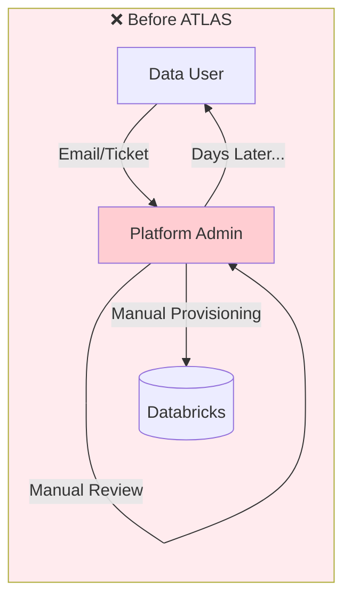
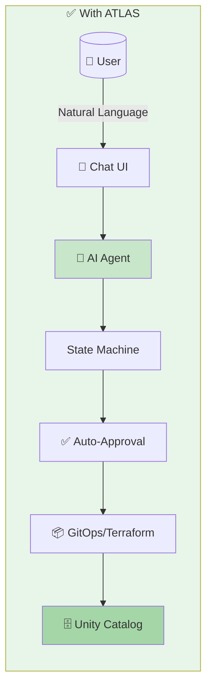
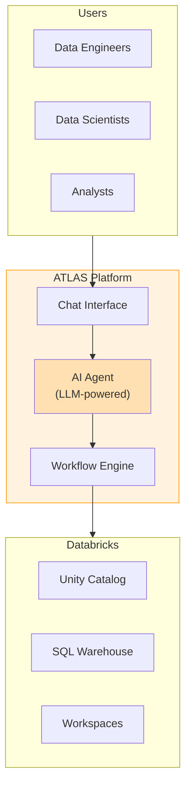
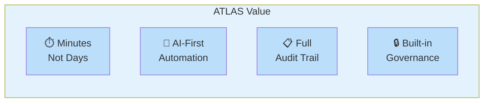

# ATLAS - Executive Teaser Slides
**Duration: 5 minutes | 4 Slides**

---

## Slide 1: Title Slide

### ATLAS
**Agentic Control Tower for Lakehouse Automation & Self-Service**

*Enabling Data Teams Through AI-Powered Self-Service*

![Databricks Logo]

**Presented by: [Your Name]**
**Date: [Date]**

---

## Slide 2: The Challenge

### Today's Data Platform Bottlenecks

| Challenge | Impact |
|-----------|--------|
| 🎫 **Manual Ticketing** | Days/weeks to provision resources |
| 👤 **Admin Dependency** | Platform team becomes bottleneck |
| 📝 **Inconsistent Processes** | No standardization, audit gaps |
| 🔒 **Access Delays** | Users wait for schema/catalog access |

**Result:** Slow time-to-insight, frustrated data teams, overloaded admins

---

### Mermaid Diagram for Slide 2 (Before State)

**To render:** Go to https://mermaid.live and paste the code, then screenshot.

---

## Slide 3: The Solution - ATLAS

### AI-Powered Self-Service Platform

**How it works:**
1. 💬 **Chat Interface** - Users describe what they need in natural language
2. 🤖 **AI Agent** - Understands intent, validates request
3. ✅ **Automated Approval** - Routes to right approver
4. ⚡ **GitOps Provisioning** - Infrastructure as Code, automatic deployment

**Key Capabilities:**
- Schema & Catalog Creation
- Access Grants Management
- Workspace Provisioning
- Service Principal Setup

---

### Mermaid Diagram for Slide 3 (Architecture)

**To render:** Go to https://mermaid.live and paste the code, then screenshot.

---

### Simplified Architecture Diagram for Slide 3

---

## Slide 4: Value & Impact

### Why ATLAS?

| Metric | Before | After |
|--------|--------|-------|
| ⏱️ **Time to Provision** | Days/Weeks | Minutes |
| 👥 **Admin Involvement** | Every request | Exception only |
| 📊 **Audit Trail** | Manual/Incomplete | Automatic/Complete |
| 🔐 **Compliance** | Ad-hoc | Built-in governance |

### Key Benefits

✅ **Self-Service** - Users get what they need, when they need it

✅ **Governance** - Every action tracked, approved, auditable

✅ **Scalability** - AI handles volume, humans handle exceptions

✅ **Standardization** - Consistent infrastructure via GitOps

---

### Mermaid Diagram for Slide 4 (Value)

---

## Rendering Instructions

### Option 1: Mermaid.live (Recommended)
1. Go to https://mermaid.live
2. Paste the mermaid code
3. Adjust theme (Settings → Theme → "default" or "forest")
4. Click "Actions" → "Download PNG"
5. Insert PNG into PowerPoint

### Option 2: VS Code
1. Install "Markdown Preview Mermaid Support" extension
2. Open this file in VS Code
3. Open Markdown preview (Cmd+Shift+V)
4. Screenshot the rendered diagrams

### Option 3: Draw.io
1. Open the `ATLAS_ARCHITECTURE.drawio` file
2. Export as PNG
3. Insert into PowerPoint

---

## PowerPoint Slide Layout Suggestions

### Slide 1 (Title)
- Full-width background (Databricks orange gradient)
- Centered title
- Subtitle below
- Logo in corner

### Slide 2 (Challenge)
- Left side: Bullet points with icons
- Right side: "Before" diagram
- Dark/red theme to indicate problem

### Slide 3 (Solution)
- Left side: 4 numbered steps
- Right side: Architecture diagram
- Green/blue theme for solution

### Slide 4 (Value)
- Before/After comparison table
- 4 value pillars with icons
- Strong call-to-action

---

## Talking Points (5 min)

**Slide 1 (30 sec):** "ATLAS is our AI-powered self-service platform for data teams on Databricks"

**Slide 2 (1 min):** "Today, every request goes through a ticket, waiting for admin review. This creates bottlenecks and slows down our data teams."

**Slide 3 (2 min):** "ATLAS changes this. Users describe what they need in plain English. Our AI agent understands the request, routes it for approval, and provisions resources automatically through GitOps."

**Slide 4 (1.5 min):** "The impact? What used to take days now takes minutes. Full audit trail. Built-in governance. And our platform team focuses on strategy, not tickets."
