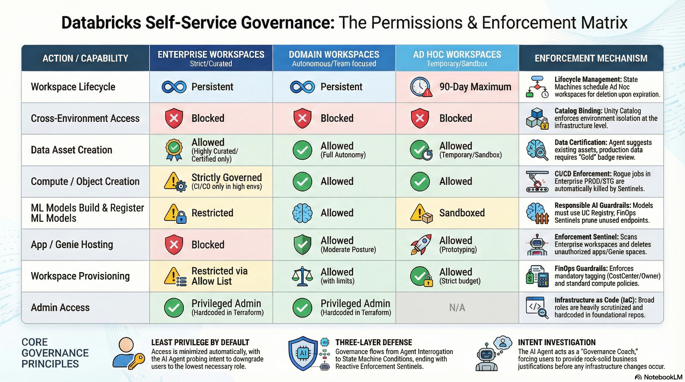

# Self-Service Governance Framework

## Overview
This platform is designed to empower employees with self-service access to data and infrastructure while maintaining a rigorous security and governance posture. Balancing agility with the principles of least privilege, cost optimization, and data integrity requires a multi-layered governance approach.

We operate on the principle of **Least Privilege by Default**, augmented by intelligent automation. Rather than relying solely on manual reviews—which create bottlenecks—our governance model uses a three-tier defense system to guide, enforce, and audit actions across the platform.

---

## The Three Layers of Governance

Governance in the Self-Service Center is not a single gateway, but a continuous, multi-layered process designed to be unobtrusive for safe actions and highly restrictive for risky ones. 

---

### Layer 1: The AI Agent (Proactive Guidance & Chokepoint)
The AI Agent serves as the mandatory first point of contact and primary governance chokepoint for all requests. By placing the LLM in front of the execution layer, we intercept and shape intent before any infrastructure changes occur.

*   **Intent Investigation**: The Agent acts as a "Governance Coach," probing user requests (e.g., "Why do you need Admin access?") to downgrade them to the appropriate least-privilege role.
*   **Justification Refinement**: The Agent forces users to provide a "Rock Solid," logical business reason before allowing a request to proceed to approval.
*   **Cost & Policy Guarding**: The Agent identifies high-cost or blocked requests by performing "dry-runs" against Open Policy Agent (OPA). Because policies are written declaratively in Rego, the Agent knows exactly what is allowed or blocked in real-time and can guide the user to file an Allowlist Exception if needed.
*   **Asset Discovery**: Before allowing a user to request new data or pipelines, the Agent proactively searches existing catalogs and marketplaces, suggesting reusable assets to prevent duplication.

** Important Note **
This is a non-deterministic layer of governance. The agent can make mistakes. It is not a replacement for the deterministic governance of the State Machine Conditions. It is a helpful assistant that can help users make better decisions and shift best practices to the left.

### Layer 2: State Machine Conditions (Proactive Enforcement)
Once the Agent gathers the required parameters and intent, the request is handed off to isolated, workflow-specific State Machines. This layer enforces deterministic business rules and approval structures.

*   **Deterministic Guardrails**: State Machines enforce deterministic business rules and approval structures.
*   **Risk-Based Routing**: State Machines categorize requests by risk level. Low-risk operations (e.g., standard dev workspace access) are fully automated. High-risk operations (e.g., cross-environment access or PROD provisioning) automatically pause (`wait_for_event` pattern) and route to Data Owners or Platform Admins for explicit human-in-the-loop sign-off.
*   **Immutable Fact-Tracking**: Every step, parameter, and approval is recorded as an immutable fact. State Machines use this history to determine the next valid action, ensuring no compliance step can be bypassed.
*   **Standardized Tagging**: The State Machine enforces mandatory FinOps tagging (`CostCenter`, `Project`, `Owner`) on all newly provisioned resources.

### Layer 3: Reactive Enforcers (Continuous Audit, Reporting, & Clean-up)
The final layer exists to catch drift, uncover unauthorized changes, and continuously prune the platform of unused or redundant assets.

*   **Enforcement Sentinels & Open Policy Agent (OPA)**: Background processes that constantly scan workspaces. These Sentinels evaluate discovered resources dynamically against declarative `Rego` policies using OPA. If an object is unauthorized (and lacks an active exception in the Allowlist database), the Sentinel uses an extensible Resource Handler framework to automatically delete, pause, or remediate it.
*   **Asset Deduplication**: Scheduled jobs that scan newly created tables and pipelines to flag highly similar clones (e.g., >90% similarity) as blockers, preventing data swamps.
*   **Entitlement Audits & Revocation**: Agents periodically run "Justification Audits" cross-referencing granted access with project status, and "Entitlement Nudges" confirming with admins if broad privileges are still necessary. Time-bound (JIT) access is automatically revoked when the window expires.

---

## What We Allow (And What We Don't)

To maintain control without stifling innovation, we apply different governance postures across our namespace and environment paradigms.

### Self-Service Governance Permissions Matrix

This matrix demonstrates how limits and agentic guardrails are applied across different workspace types.

| Action / Capability | Enterprise Workspaces (`enterprise-{env}`) | Domain Workspaces (`supply-chain-{env}`) | Ad Hoc Workspaces (`adhoc-{env}`) | Governance Enforcement Mechanism & Approvers |
| :--- | :--- | :--- | :--- | :--- |
| **Workspace Lifecycle** | Persistent | Persistent | **90-Day Maximum** (May be extended via approval) | **Lifecycle Management**: Ad Hoc workspaces are scheduled for deletion via State Machines upon expiration to prevent resource sprawl. |
| **Cross-Environment Access** (e.g., Dev requesting Prod data) | Blocked | Blocked | Blocked | **Catalog Binding**: Unity Catalog enforces environment isolation by binding catalogs to specific workspace environments, preventing cross-environment access at the infrastructure level. |
| **Data Asset Creation** (Tables, Views) | Allowed (Highly Curated / Certified only) | Allowed (Full Autonomy) | Allowed (Temporary / Sandbox) | **Data Certification**: The Agent proactively searches Unity Catalog to suggest existing assets and flags duplicate data. Production datasets must pass a Data Certification Review to receive a "Gold" or "Certified" badge in the Marketplace. |
| **Compute / Object Creation** (Pipelines, Jobs) | Strictly Governed (Higher envs controlled by CI/CD only) | Allowed | Allowed | **CI/CD Enforcement**: In Enterprise PROD/STG environments, direct creation is blocked; any rogue jobs created outside the CI/CD pipeline are automatically killed by the Enforcement Sentinel. |
| **Build & Register ML Models** | Restricted | Allowed | Sandboxed | **Responsible AI Guardrails**: Models must be registered in the UC Model Registry. The Agent checks the Feature Store to prevent redundant feature engineering. The FinOps Sentinel actively monitors for unused models and serving endpoints to prevent wasted spend. |
| **Host Databricks Apps & Genie Spaces** | Blocked by Default (Exception Allowlist Required) | Allowed (Moderate Posture) | Allowed (for prototyping) | **Enforcement Sentinel**: Evaluates resources against OPA policies (e.g., `asset_allowlist.rego`). Unauthorized apps without an approved exception in the Allowlist database are automatically deleted. |
| **Workspace & Compute Provisioning** | Restricted via Allow List | Allowed (with limits) | Allowed (Strict budget limits) | **FinOps Guardrails**: Enforces mandatory tagging (`CostCenter`, `Owner`) and standard compute policies to prevent over-provisioning. |
| **Privileged Exceptions / Admin Access** | Allowed (Hardcoded in Terraform) | Allowed (Hardcoded in Terraform) | N/A | **Infrastructure as Code (IaC)**: Broad admin roles are heavily scrutinized and hardcoded directly in the foundational Terraform repository. |
