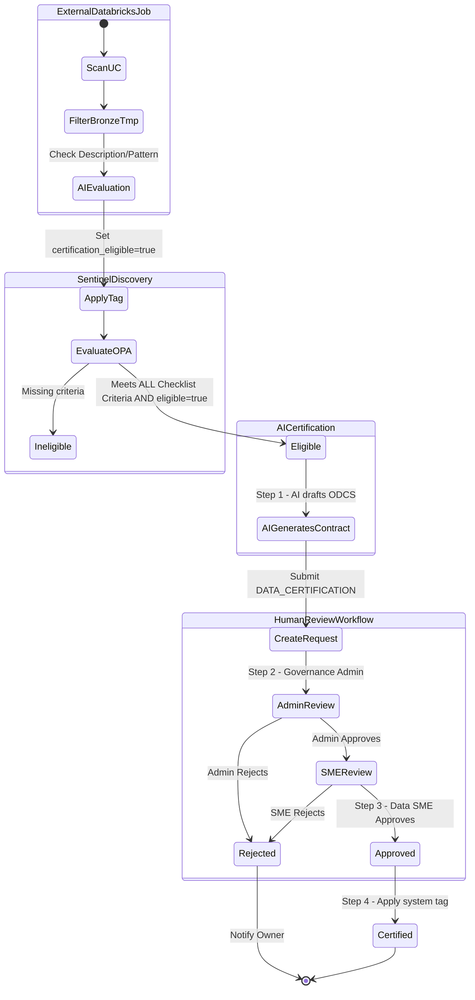

# Self-Service Governance Framework

## Overview
This platform is designed to empower employees with self-service access to data and infrastructure while maintaining a rigorous security and governance posture. Balancing agility with the principles of least privilege, cost optimization, and data integrity requires a multi-layered governance approach.

We operate on the principle of **Least Privilege by Default**, augmented by intelligent automation. Rather than relying solely on manual reviews—which create bottlenecks—our governance model uses a three-tier defense system to guide, enforce, and audit actions across the platform.

---

## The Three Layers of Governance

Governance in the Self-Service Center is not a single gateway, but a continuous, multi-layered process designed to be unobtrusive for safe actions and highly restrictive for risky ones. 

---

### Layer 1: The AI Agent (Proactive Guidance & Chokepoint)
The AI Agent serves as the mandatory first point of contact and primary governance chokepoint for all requests. By placing the LLM in front of the execution layer, we intercept and shape intent before any infrastructure changes occur.

*   **Intent Investigation**: The Agent acts as a "Governance Coach," probing user requests (e.g., "Why do you need Admin access?") to downgrade them to the appropriate least-privilege role.
*   **Justification Refinement**: The Agent forces users to provide a "Rock Solid," logical business reason before allowing a request to proceed to approval.
*   **Cost & Policy Guarding**: The Agent identifies high-cost or blocked requests by performing "dry-runs" against Open Policy Agent (OPA). Because policies are written declaratively in Rego, the Agent knows exactly what is allowed or blocked in real-time and can guide the user to file an Allowlist Exception if needed.
*   **Asset Discovery**: Before allowing a user to request new data or pipelines, the Agent proactively searches existing catalogs and marketplaces, suggesting reusable assets to prevent duplication.

** Important Note **
This is a non-deterministic layer of governance. The agent can make mistakes. It is not a replacement for the deterministic governance of the State Machine Conditions. It is a helpful assistant that can help users make better decisions and shift best practices to the left.

### Layer 2: State Machine Conditions (Proactive Enforcement)
Once the Agent gathers the required parameters and intent, the request is handed off to isolated, workflow-specific State Machines. This layer enforces deterministic business rules and approval structures.

*   **Deterministic Guardrails**: State Machines enforce deterministic business rules and approval structures.
*   **Risk-Based Routing**: State Machines categorize requests by risk level. Low-risk operations (e.g., standard dev workspace access) are fully automated. High-risk operations (e.g., cross-environment access or PROD provisioning) automatically pause (`wait_for_event` pattern) and route to Data Owners or Platform Admins for explicit human-in-the-loop sign-off.
*   **Immutable Fact-Tracking**: Every step, parameter, and approval is recorded as an immutable fact. State Machines use this history to determine the next valid action, ensuring no compliance step can be bypassed.
*   **Standardized Tagging**: The State Machine enforces mandatory FinOps tagging (`CostCenter`, `Project`, `Owner`) on all newly provisioned resources.

### Layer 3: Reactive Enforcers (Continuous Audit, Reporting, & Clean-up)
The final layer exists to catch drift, uncover unauthorized changes, and continuously prune the platform of unused or redundant assets.

*   **Enforcement Sentinels & Open Policy Agent (OPA)**: Background processes that constantly scan workspaces. These Sentinels evaluate discovered resources dynamically against declarative `Rego` policies using OPA. If an object is unauthorized (and lacks an active exception in the Allowlist database), the Sentinel uses an extensible Resource Handler framework to automatically delete, pause, or remediate it.
*   **Asset Deduplication**: Scheduled jobs that scan newly created tables and pipelines to flag highly similar clones (e.g., >90% similarity) as blockers, preventing data swamps.
*   **Entitlement Audits & Revocation**: Agents periodically run "Justification Audits" cross-referencing granted access with project status, and "Entitlement Nudges" confirming with admins if broad privileges are still necessary. Time-bound (JIT) access is automatically revoked when the window expires.

---

## Data Certification Workflow

A key component of our governance framework is the proactive certification of data assets. Governance is uniform across the Enterprise Data Hub (EDH), meaning all eligible production tables must be pushed through certification. To minimize manual entry, we use an AI-assisted, proactive workflow.

The Data Certification flow operates in four distinct phases:

1. **External Tagging Job (Standalone Databricks Job)**
   * A separate Databricks job runs periodically against production catalogs to differentiate which tables actually need certification, filtering out noise (like `*_raw`, `*_tmp`, or ingestion tables). 
   * If deemed a consumption-ready asset, the job applies the `certification_eligible = true` tag to the table in Unity Catalog.

2. **Enforcement Sentinel (Policy as Code Checklist)**
   * The Enforcement Sentinel discovers datasets tagged with `certification_eligible = true` and evaluates them against a strict OPA certification checklist:
     1. **Data Quality**: TDQs and BDQs defined and met.
     2. **Metadata**: Catalog, schema, and column descriptions exist.
     3. **Access Control**: ABAC and RBAC defined.
     4. **Tagging & Classification**: Tags exist with valid values (Owner group, Approver group, Domain, SLO/SLA) and data classification exists (e.g., PII).
   * If a dataset *meets all technical criteria* but is not yet certified, OPA triggers a `START_CERTIFICATION` action (skipping if an active workflow already exists).

3. **AI Certification (Auto-Generation)**
   * The Sentinel intercepts the action and calls an AI Agent to auto-generate a draft Open Data Contract Standard (ODCS) YAML file. The agent uses the metadata, tags, and quality scores collected by Sentinel.
   * A new `DATA_CERTIFICATION` state machine request is spawned with this draft contract.

4. **Certification State Machine (Human Review)**
   * **Governance Admin Review**: Governance admins review the AI-generated contract to ensure platform and policy compliance.
   * **Data SME Review**: Subject Matter Experts review the business logic, descriptions, and rules.
   * **Finalization**: If both reviews pass, the system physically applies the `system.certification_status = 'certified'` tag in Databricks.

---

## Operations Manual: Governance Administration

This section outlines the operational procedures for Governance Administrators managing policies and data certification workflows.

### 1. Setting and Editing Policies
The platform uses Open Policy Agent (OPA) with rules written in Rego to enforce governance policies.

*   **Location of Policies:** All policies are located in the `backend/policies/` directory (e.g., `data_certification.rego`).
*   **Modifying a Policy:**
    1. Navigate to the relevant `.rego` file.
    2. Update the logic for violation conditions (e.g., adjusting threshold percentages for TDQ/BDQ, adding new required tags).
    3. Each policy rule evaluates the input context (like workspace and resource metadata) and yields an array of violation objects containing the `action` (e.g., `KILL`, `START_CERTIFICATION`), `reason`, and `severity`.
*   **Applying Changes:** Once a `.rego` file is modified and saved, the backend's OPA evaluation engine will pick up the changes on the next Enforcement Sentinel run. No restart is strictly necessary for the Rego files themselves if they are evaluated dynamically per run, but testing in a lower environment is strongly advised before pushing to production.

### 2. The Physical Act of Certification
Data certification is a formal process that verifies a dataset meets all enterprise standards for quality, security, and documentation.

*   **Triggering the Workflow:** The Enforcement Sentinel automatically discovers eligible datasets (tagged with `certification_eligible = 'true'`) that meet or violate certification criteria. If a dataset lacks a contract, it triggers the `DATA_CERTIFICATION` workflow.
*   **Reviewing a Pending Request:**
    1. Governance Admins navigate to the **Data Certification** tab in the UI.
    2. Datasets pending certification will display a **"Pending Request →"** link. Clicking this navigates to the specific request in the Self-Service Center.
    3. The request contains the AI-generated draft of the Data Contract (in ODCS YAML format) based on the dataset's metadata.
*   **Admin and SME Approval:**
    1. The Governance Admin reviews the request, verifies compliance, and approves it.
    2. The request then moves to the Data SME (Subject Matter Expert) for a secondary review of business logic and schema descriptions.
    3. Once both parties approve, the State Machine progresses to the `completed` state.
*   **Automated Tagging (The "Physical Act"):** Upon reaching the `completed` state, the system automatically executes a Databricks SQL command to apply the `system.certification_status = 'certified'` tag directly to the table in Unity Catalog. The local asset cache is also updated to reflect the new certified status.

### 3. Monitoring and Auditing
*   **Enforcement Sentinel Runs:** The Sentinel can be run manually via the API or UI to audit the environment immediately.
*   **Failure Notifications:** If a Sentinel run encounters an error, it is marked as `failed` in the UI, and an email notification is automatically dispatched to the configured governance email group (defined in `configuration.yaml`).
*   **Audit Logs:** All enforcement actions (and skipped actions) are recorded in the `enforcement_audit` table in the database for compliance reporting.

