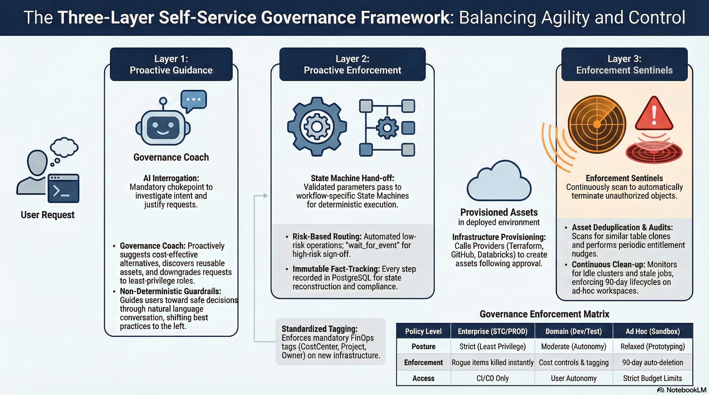
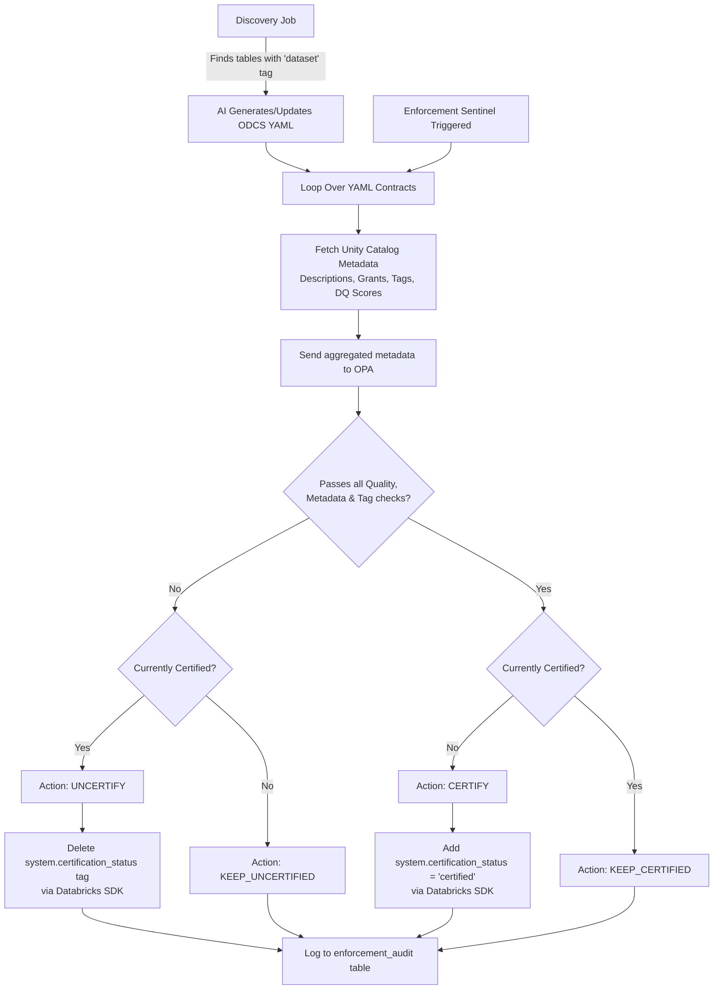

# Self-Service Governance Framework

## Overview
This platform is designed to empower employees with self-service access to data and infrastructure while maintaining a rigorous security and governance posture. Balancing agility with the principles of least privilege, cost optimization, and data integrity requires a multi-layered governance approach.

We operate on the principle of **Least Privilege by Default**, augmented by intelligent automation. Rather than relying solely on manual reviews—which create bottlenecks—our governance model uses a three-tier defense system to guide, enforce, and audit actions across the platform.

---


## The Three Layers of Governance

Governance in the Self-Service Center is not a single gateway, but a continuous, multi-layered process designed to be unobtrusive for safe actions and highly restrictive for risky ones. 



---

### Layer 1: The AI Agent (Proactive Guidance & Chokepoint)
The AI Agent serves as the mandatory first point of contact and primary governance chokepoint for all requests. By placing the LLM in front of the execution layer, we intercept and shape intent before any infrastructure changes occur.

*   **Intent Investigation**: The Agent acts as a "Governance Coach," probing user requests (e.g., "Why do you need Admin access?") to downgrade them to the appropriate least-privilege role.
*   **Justification Refinement**: The Agent forces users to provide a "Rock Solid," logical business reason before allowing a request to proceed to approval.
*   **Cost & Policy Guarding**: The Agent identifies high-cost or blocked requests by performing "dry-runs" against Open Policy Agent (OPA). Because policies are written declaratively in Rego, the Agent knows exactly what is allowed or blocked in real-time and can guide the user to file an Allowlist Exception if needed.
*   **Asset Discovery**: Before allowing a user to request new data or pipelines, the Agent proactively searches existing catalogs and marketplaces, suggesting reusable assets to prevent duplication.

** Important Note **
This is a non-deterministic layer of governance. The agent can make mistakes. It is not a replacement for the deterministic governance of the workflow graphs and the governed `ToolExecutor` (capability scope + OPA + audit). It is a helpful assistant that can help users make better decisions and shift best practices to the left.

### Layer 2: Durable Workflow Graphs (Proactive Enforcement)
Once the Agent gathers the required parameters and intent, the request is handed off to a **durable workflow graph** (a published *Workflow*, compiled to a LangGraph graph and checkpointed to the database). This layer enforces deterministic business rules and approval structures. These graphs replace the legacy custom state-machine engine but keep the same governance guarantees.

*   **Deterministic Guardrails**: A workflow is an ordered list of *gates* (human/event approvals) and *steps* (governed tool calls). The ordering is the rule — e.g. `plan → platform_admin approval → apply`.
*   **Risk-Based Routing**: Gates categorize requests by risk. Low-risk operations (e.g. standard dev workspace access) can **auto-approve** via a declarative condition; high-risk operations (cross-environment access, PROD provisioning) pause at a native LangGraph `interrupt()` and route to managers, Data Owners, or Platform Admins for explicit human-in-the-loop sign-off.
*   **Durable & Resumable**: Graph state is checkpointed per request, so a paused approval survives restarts and crash-resume continues from the exact checkpoint — a granted action is never duplicated.
*   **Immutable Fact-Tracking**: Every step, parameter, and approval is recorded as an immutable fact. The request's UI timeline and the **live graph view** (request detail → *Workflow* tab) are reconstructed from these facts, so the picture stays honest.
*   **Standardized Tagging**: Provisioning steps enforce mandatory FinOps tagging (`CostCenter`, `Project`, `Owner`) on all newly provisioned resources.

### Cross-Cutting: The Governed Tool Executor (Enforcement Chokepoint)
Every tool call — whether the chat agent invokes it or a workflow graph step runs it — routes through a single `ToolExecutor`, so governance is applied uniformly instead of scattered across call sites. For each call it:

*   **Scopes capability**: a mutating tool outside the active workflow's `allowed_tools` is refused structurally, before any policy check.
*   **Runs OPA pre-flight** for mutating tools against the `data.agent.tools` policy (`backend/policies/agent_tools.rego`): deny / require-approval decisions keyed on the tool's side-effect class. This runs in **shadow** mode locally (logged, never blocks) and **enforce** mode in deployed environments (`AGENT_TOOL_OPA_ENFORCE=true`); the workflow entry tool (`execute_workflow`) is carved out so approvals fire in-graph rather than deadlocking initiation.
*   **Enforces idempotency**: a prior success for the same scope+key returns the cached result instead of re-executing.
*   **Audits everything**: each call appends an audit fact (tool, side-effect class, policy decision, result/error).

*   **Observability**: when `MLFLOW_TRACING_ENABLED`, each agent turn emits one MLflow trace with child spans for every LLM call and tool execution; human feedback can be attached to a turn's `trace_id`.

### Layer 3: Reactive Enforcers (Continuous Audit, Reporting, & Clean-up)
The final layer exists to catch drift, uncover unauthorized changes, and continuously prune the platform of unused or redundant assets.

*   **Enforcement Sentinels & Open Policy Agent (OPA)**: Background processes that constantly scan workspaces. These Sentinels evaluate discovered resources dynamically against declarative `Rego` policies using OPA. If an object is unauthorized (and lacks an active exception in the Allowlist database), the Sentinel uses an extensible Resource Handler framework to automatically delete, pause, or remediate it.
*   **Asset Deduplication**: Scheduled jobs that scan newly created tables and pipelines to flag highly similar clones (e.g., >90% similarity) as blockers, preventing data swamps.
*   **Entitlement Audits & Revocation**: Agents periodically run "Justification Audits" cross-referencing granted access with project status, and "Entitlement Nudges" confirming with admins if broad privileges are still necessary. Time-bound (JIT) access is automatically revoked when the window expires.

---

## Data Certification Workflow

A key component of our governance framework is the proactive certification of data assets. Governance is uniform across ATLAS, meaning all eligible production tables must be pushed through certification. To minimize manual entry, we use an AI-assisted, proactive workflow.

The Data Certification flow operates in four distinct phases:

1. **External Tagging Job (Standalone Databricks Job)**
   * A separate Databricks job runs periodically against production catalogs to differentiate which tables actually need certification, filtering out noise (like `*_raw`, `*_tmp`, or ingestion tables). 
   * **Missing Metadata Generation**: During this scan, the job utilizes `dbxmetagen` to automatically generate and apply any missing table and column descriptions in Unity Catalog.

2. **Automated Discovery & Contract Drafting (Data Product Definition)**
   * A discovery job ("Sync Contracts") scans all catalogs, schemas, and tables in Databricks for the `dataset` tag.
   * Tables sharing the same `dataset` tag value are grouped together into a logical Data Product.
   * An AI Agent auto-generates or updates a draft Open Data Contract Standard (ODCS) YAML file for this grouped Data Product, merging Unity Catalog metadata while carefully preserving any manual edits from prior versions.
   * A new `DATA_CERTIFICATION` state machine request is spawned with this draft contract.

3. **Sentinel Evaluation & Certification (Automated Policy as Code)**
   * The newly drafted contract is evaluated by the Enforcement Sentinel during its next run.
   * The Sentinel dynamically fetches the latest metadata and queries the `adoc_dq_history` table for the specified `reliability_window` (a mandatory tag on the table).
   * It evaluates the metadata and data quality rules against the strict OPA certification checklist (`data_certification.rego`).
   * If any table fails the policy checklist (e.g., if there are any failed data quality rules in the history table within the window), the certification is rejected.
   * If all checks pass, the Sentinel automatically applies the `system.certification_status = 'certified'` tag in Databricks to *every* table defined in the contract.
   * Human-in-the-loop review is only required during dev/test/stage phases; once a dataset is in production and properly tagged, the process is fully automated.

#### Data Certification Flow


# Enterprise Databricks Platform Policy Map

## Vision
This opinionated policy set assumes 100+ workspaces and broad self‑service. Controls are designed as guardrails: they constrain how users build on Databricks, not whether they can build at all. They build on Databricks Security Best Practices, well‑architected guidance, and Unity Catalog governance patterns.

## Governance Architecture
As detailed above, our platform enforces policies across three layers, with a governed `ToolExecutor` as the uniform enforcement chokepoint for every action:
1. **The AI Agent (Proactive Guidance & Chokepoint):** Intercepts intent, downgrades risk, and performs dry-runs against OPA to guide users before infrastructure changes.
2. **Durable Workflow Graphs (Proactive Enforcement):** Deterministic gates + governed steps; high-risk operations pause at native human-in-the-loop interrupts; mandatory tagging enforced. Graph state is checkpointed and resumable.
3. **Reactive Enforcers (Continuous Audit):** Background Sentinels continuously evaluate resources against Open Policy Agent (OPA) `.rego` policies to flag, pause, or kill unauthorized assets.

> Note: In the policy table below, the **State Machine** enforcement point denotes this durable workflow-graph layer.

## Severity Scale
- **Critical** – Must be enforced via platform configuration / automation; exceptions require senior security approval and time‑bound exception records.
- **High** – Should be enforced via policies & automation where possible; exceptions require documented risk acceptance.
- **Medium** – Recommended default; deviations allowed with team‑level approval and compensating controls.
- **Low** – Optimization / hygiene; adopt as capacity allows.

---

## Policy Categories

| Category | Policy Rule | Severity | Enforcement Point | Description |
| :--- | :--- | :--- | :--- | :--- |
| **Identity & Access** | Enterprise SSO & MFA | Critical | Platform Config | All human access flows through enterprise SSO; local users disabled. |
| | SCIM/AIM Provisioning | High | Automation | Users/groups provisioned centrally. |
| | Separate Admin Accounts | High | Agent/Process | Admins use separate identities for day-to-day work. |
| | Group-based Access | High | OPA Sentinel | Data access granted to groups, not individuals. |
| | PAT Restrictions | Critical | Platform Config | PATs allowed only in non-prod (≤ 30 days). Disabled in enterprise prod. |
| | Secret Management | Critical | OPA Sentinel | Credentials must be stored in approved secret scopes/managers. |
| **Workspaces & Environments** | Automated Creation | Critical | Automation | Created via account-level automation; manual UI creation disabled. |
| | Workspace Tiering | High | State Machine | Tagged as dev/test/prod and enterprise/domain/ad-hoc. |
| | Enterprise Isolation | High | Agent/Process | Enterprise workspaces host only shared platform services. |
| | Domain Workspaces | High | Architecture | Default home for production data pipelines bound to specific catalogs. |
| | Ad-Hoc/Sandbox Lifecycles | Medium | Automation | Auto-expire after 30-90 days of inactivity. Small compute policies. |
| | Network Controls | Critical | Platform Config | Secure network baseline (private connectivity). Public access disabled for prod. |
| **Compute, Jobs & Automation** | Cluster Policies | Critical | Platform Config | All compute created via cluster/compute policies. "No policy" disabled. |
| | Interactive Clusters in Prod | High | OPA Sentinel | Shared interactive clusters disallowed in prod. |
| | Prod Job Ownership | High | OPA Sentinel | Owned by service principals, use version-controlled code. |
| | Auto-stopping Compute | High | Platform Config | Max idle timeouts enforced. |
| **Service Principals & Tokens** | SP Ownership | High | State Machine | Clear business owner in central registry. |
| | SP Scope | Critical | OPA Sentinel | Least privilege; broad "*" grants prohibited in prod. |
| | SP Lifecycle | High | Automation | Disabled/deleted after 90 days of inactivity. |
| | Human-owned Tokens | Critical | Agent/Process | Never used for production workloads. |
| **Data & AI Governance** | Unity Catalog Centralization | Critical | Architecture | UC is the authoritative control plane. |
| | Catalog Segmentation | High | OPA Sentinel | Segmented by environment and domain. Cross-environment access prohibited. |
| | Governed Tags / ABAC | Critical | OPA Sentinel | Sensitive data classified and restricted via ABAC. |
| | DBFS / Local Storage | High | OPA Sentinel | Prod data must not be stored in DBFS/local volumes. |
| | Data Sharing | Critical | OPA Sentinel | Uses Delta Sharing or clean rooms; direct raw bucket access blocked. |
| **Dashboards, SQL & BI** | Prod SQL Warehouses | High | Platform Config | Must use compute policies (max size, timeouts, tagging). |
| | Embedded Credentials | Critical | OPA Sentinel | Dashboards with embedded credentials cannot be shared with ALL_USERS. |
| | External BI Tools | High | Architecture | Must use service principals/managed identities. |
| **Apps & Genie Spaces** | Apps in Enterprise Prod | High | OPA Sentinel | Must be on platform allowlist. |
| | Apps in Domain Prod | High | Agent/Process | Require CI/CD deployment and review. |
| | App Idle Cleanup | Medium | Automation | Stopped after 30 days inactivity; archived after 60-90 days. |
| | Genie Spaces Prod Data | High | Architecture | Linked to domain workspaces, owned by groups. |
| | Conversational Data Export | Critical | Platform Config | Direct export of sensitive data blocked. |
| **Data Certification** | Data Quality | High | OPA Sentinel | Must have 0 failed rules in `adoc_dq_history` within the `reliability_window` timeframe. |
| | Metadata Completeness | High | OPA Sentinel | Catalog, schema, and all column descriptions must exist. |
| | Access Control | High | OPA Sentinel | RBAC is always required; ABAC must be defined if deemed necessary. |
| | Tagging & Classification | High | OPA Sentinel | Mandatory tags (Owner group, Approver group, Domain, SLO/SLA) and Data Classification (e.g., PII) must be applied. |

---

## Operations Manual: Governance Administration

This section outlines the operational procedures for Governance Administrators managing policies and data certification workflows.

### 1. Setting and Editing Policies
The platform uses Open Policy Agent (OPA) with rules written in Rego to enforce governance policies.

*   **Location of Policies:** All policies are located in the `backend/policies/` directory (e.g., `data_certification.rego`).
*   **Modifying a Policy:**
    1. Navigate to the relevant `.rego` file.
    2. Update the logic for violation conditions (e.g., adjusting threshold percentages for TDQ/BDQ, adding new required tags).
    3. Each policy rule evaluates the input context (like workspace and resource metadata) and yields an array of violation objects containing the `action` (e.g., `KILL`, `CERTIFY`), `reason`, and `severity`.
*   **Applying Changes:** Once a `.rego` file is modified and saved, the backend's OPA evaluation engine will pick up the changes on the next Enforcement Sentinel run. No restart is strictly necessary for the Rego files themselves if they are evaluated dynamically per run, but testing in a lower environment is strongly advised before pushing to production.

### 2. The Physical Act of Certification
Data certification is a formal process that verifies a dataset meets all enterprise standards for quality, security, and documentation.

*   **Triggering the Workflow:** The Enforcement Sentinel automatically discovers eligible datasets (those with an active Data Contract) that meet or violate certification criteria.
*   **Automated Evaluation:**
    1. The Sentinel reads the generated Open Data Contract Standard (ODCS) YAML.
    2. It queries `adoc_dq_history` using the `reliability_window` tag to ensure no data quality rules have failed within that window (`failed_rule_count == 0`).
*   **Automated Tagging (The "Physical Act"):** If the dataset meets all checks (metadata, RBAC, Data Quality), the Sentinel automatically executes a Databricks SQL command to apply the `system.certification_status = 'certified'` tag directly to the table in Unity Catalog. The local asset cache is also updated to reflect the new certified status. Any human-in-the-loop review is restricted to lower environments (dev/test/stage).

### 3. Monitoring and Auditing
*   **Enforcement Sentinel Runs:** The Sentinel can be run manually via the API or UI to audit the environment immediately.
*   **Failure Notifications:** If a Sentinel run encounters an error, it is marked as `failed` in the UI, and an email notification is automatically dispatched to the configured governance email group (defined in `configuration.yaml`).
*   **Audit Logs:** All enforcement actions (and skipped actions) are recorded in the `enforcement_audit` table in the database for compliance reporting.

## How to Contribute
Adding or editing a policy is straightforward because we use Open Policy Agent (OPA) and the Rego policy language.

1. **Add/Edit Policy:** Open the relevant `.rego` file in `backend/policies/` (e.g. `compute_and_jobs.rego`). 
2. **Add Violation Logic:** Add a new `violation_reasons[msg]` block with your logic. Example:
   ```rego
   violation_reasons[msg] {
       input.resource.type == "job"
       input.resource.idle_days > 90
       msg := "Job has not been run in over 90 days."
   }
   ```
3. **Commit:** The Enforcement Sentinel and Agent Policy Tools will dynamically pick up any changes or new `.rego` files automatically. The `common.rego` library handles all the boilerplate for formatting the output and processing allowlist exceptions.

## Workflow Authoring (No-Code)

The workflows in Layer 2 are **data, not code** — DB-backed Workflows with a JSON `graph_spec`. Platform/Governance Admins author and govern them without a deploy, either in the visual editor (*Admin → Workflows*) or directly in chat with the agent. The full operational playbook — authoring loop, validation/dry-run, publish gate, versioning/rollback, and environment promotion — is in the **[Platform Administration Guide](./PLATFORM_ADMINISTRATION.md)**.

## Future Enhancements
- **Policy Editing UI:** Build a frontend interface to allow administrators to write, test, and deploy Rego policies directly from the Self-Service Center without modifying the source code. (Note: no-code authoring of *workflows* already exists; this item is specifically about editing the OPA `.rego` governance policies.)
- **External OPA Hosting:** Currently, policies are evaluated using a local/embedded OPA binary. In the future, this should be moved to a centralized, external OPA Server (e.g. a dedicated container or Databricks Model Serving endpoint) so that other systems and Databricks workspaces can query the exact same central policy definitions.

