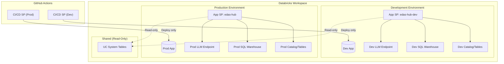
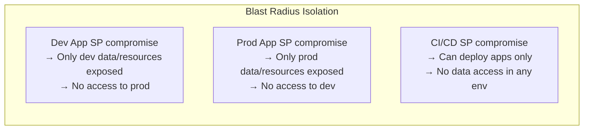

# EDAS Hub - Quick Reference Card

## Deployment Commands

```bash
# Local development (runs frontend + backend locally)
./dev.sh

# Deploy personal instance to Databricks
./deploy.sh dev

# CI/CD auto-deploys on push:
# - develop branch → edas-hub-dev
# - main branch → edas-hub
```

---

## GitHub Secrets & Variables (Per Environment)

### Secrets (sensitive)
| Name | Example |
|------|---------|
| `DATABRICKS_CLIENT_ID` | `00000000-0000-0000-0000-000000000000` |
| `DATABRICKS_CLIENT_SECRET` | `dose...` |

### Variables
| Name | Example |
|------|---------|
| `DATABRICKS_HOST` | `https://workspace.cloud.databricks.com` |
| `DATABRICKS_WAREHOUSE_ID` | `abc123def456` |
| `MODEL_SERVING_AGENT_LLM_ENDPOINT` | `databricks-gemini-2-5-flash` |

---

## Service Principal Architecture

### Security Boundary Diagram



> **Environment Isolation:** Each environment has dedicated resources. Only UC system tables are shared (read-only).

### Service Principal Inventory

| SP Name | Purpose | Environment | Credentials Stored In |
|---------|---------|-------------|----------------------|
| `cicd-edas-hub-dev` | Deploy dev app | Development | GitHub Secrets (dev) |
| `cicd-edas-hub-prod` | Deploy prod app | Production | GitHub Secrets (prod) |
| `app-xxxx edas-hub-dev` | Runtime for dev app | Development | Auto-managed by Databricks |
| `app-xxxx edas-hub` | Runtime for prod app | Production | Auto-managed by Databricks |

### Environment-Specific Resources

| Resource | Development | Production |
|----------|-------------|------------|
| App Name | `edas-hub-dev` | `edas-hub` |
| LLM Endpoint | Dev endpoint | Prod endpoint |
| SQL Warehouse | Dev warehouse | Prod warehouse |
| UC Catalog/Tables | Dev catalog | Prod catalog |
| UC System Tables | Shared (read-only) | Shared (read-only) |

### Principle of Least Privilege

#### CI/CD Service Principals (Deployment Only)
*These SPs should NOT have access to data or runtime resources*

| Permission | Scope | Rationale |
|------------|-------|-----------|
| Workspace Member | Workspace | Required to access workspace |
| Can Manage | Apps only | Deploy and manage app lifecycle |
| ❌ No Unity Catalog access | - | Not needed for deployment |
| ❌ No SQL Warehouse access | - | Not needed for deployment |
| ❌ No Model Serving access | - | Not needed for deployment |

#### App Service Principals (Runtime Only)
*These SPs have data access but cannot deploy or modify infrastructure. Each App SP only has access to its own environment's resources.*

| Permission | Scope | Rationale |
|------------|-------|-----------|
| USE CATALOG | Own environment's catalog only | Read metadata for agent tools |
| USE SCHEMA | Own environment's schemas only | Read metadata for agent tools |
| SELECT | Own environment's tables only | Query data for agent tools |
| SELECT | UC system tables (shared) | Read system metadata |
| Can Query | Own environment's LLM endpoint | Call LLM for agent responses |
| Can Use | Own environment's warehouse | Execute SQL queries |
| ❌ No cross-env access | - | Dev cannot access prod resources |
| ❌ No Workspace admin | - | Cannot modify infrastructure |
| ❌ No Apps permissions | - | Cannot deploy or modify apps |

### Security Boundaries & Blast Radius



**Key Isolation Principles:**
- Dev and Prod environments are completely isolated
- Each App SP can only access its own environment's LLM, SQL Warehouse, and UC tables
- CI/CD SPs have no data access - only deployment permissions
- UC system tables are the only shared resource (read-only)

### Where to Grant Permissions

| SP Type | Permission | Location |
|---------|------------|----------|
| CI/CD | Workspace Member | Admin Console → Users → Add SP |
| CI/CD | Can Manage on Apps | Compute → Apps → Permissions |
| App | USE CATALOG/SCHEMA | Catalog Explorer → Catalog → Permissions |
| App | SELECT on tables | Catalog Explorer → Table → Permissions |
| App | Can Query | Model Serving → Endpoint → Permissions |
| App | Can Use | SQL Warehouses → Warehouse → Permissions |

> **Finding App SP:** Compute → Apps → Your App → Service Principal field (e.g., `app-xxxx edas-hub-dev`)

---

## Architecture Summary

```
GitHub Actions ──► Databricks CLI (OAuth M2M) ──► Workspace
                                                      │
                                                      ▼
                                               ┌─────────────┐
                                               │ Databricks  │
                                               │ App         │
                                               │             │
User Browser ────────────────────────────────► │ React + API │
                                               │             │
                                               └──────┬──────┘
                                                      │
                           ┌──────────────────────────┼──────────────────────────┐
                           ▼                          ▼                          ▼
                    ┌─────────────┐           ┌─────────────┐           ┌─────────────┐
                    │ Model       │           │ Unity       │           │ SQL         │
                    │ Serving     │           │ Catalog     │           │ Warehouse   │
                    │ (LLM)       │           │ (metadata)  │           │ (queries)   │
                    └─────────────┘           └─────────────┘           └─────────────┘
```

---

## Agent Tools

| Tool | What it queries |
|------|-----------------|
| `get_catalog_list` | Unity Catalog → list catalogs |
| `get_schema_list` | Unity Catalog → list schemas |
| `get_table_list` | Unity Catalog → list tables |
| `does_catalog_exist` | SQL Warehouse → SHOW CATALOGS |
| `execute_workflow` | App DB → create request |

---

## Key Files

| File | Purpose |
|------|---------|
| `.github/workflows/deploy-*.yml` | CI/CD pipelines |
| `databricks.yml` | Bundle config for local deploy |
| `backend/app/tools/__init__.py` | Register agent tools |
| `backend/app/model_serving/client.py` | LLM client with OAuth |
| `backend/app/core/config.py` | All app settings |
