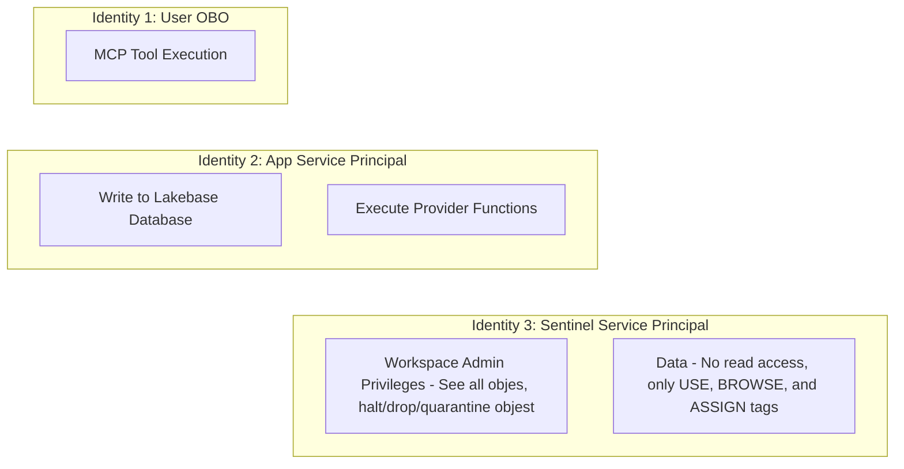

# Service Principal & Identity Design

## Overview

The Self-Service Center relies on a strict separation of privileges to balance user convenience, automated provisioning, and secure governance. We achieve this by utilizing three distinct identities across the architecture:

1. **User (On-Behalf-Of / OBO)** - Used by the Agent layer for read-only validation and context gathering.
2. **App Service Principal (Operational)** - Used by the State Machines for standard provisioning and database interactions.
3. **Sentinel Service Principal (Admin)** - Used exclusively for destructive actions or operations requiring high-level administrative access.

---

## Identity Boundaries

## 1. User (On-Behalf-Of)

The Agent acts as the governance chokepoint and gathers context using Agent Tools (e.g., checking if a catalog exists or querying user entitlements). 

By passing the user's token forward (OBO), the Agent can only "see" what the user is authorized to see in Unity Catalog or the IDP. If the LLM is somehow prompted to execute an unauthorized query or explore off-limits data, it is mathematically bounded by the user's actual permissions.

**Scope:**
- Read-only validation tools.
- LLM context gathering.
- Enforcing the Principle of Least Privilege at the conversational layer.

## 2. App Service Principal (Operational)

State machine transitions and Terraform provisions are executed by the Async Workers Layer. These jobs can take 20+ minutes and happen in the background, meaning the user's OBO token might expire or be unavailable. The App's Service Principal handles this async heavy lifting.

The App SP only has the permissions needed to *create* and *update* standard resources, as well as append facts to the Lakebase database. It operates without human presence but strictly lacks destructive permissions.

**Scope:**
- Writing to the Lakebase database (recording Facts).
- Provisioning standard infrastructure (creating catalogs, workspaces, assigning grants).
- Sending notifications.

## 3. Sentinel Service Principal (Admin)

Provisioning workflows generally only need to create and grant. However, cleanup, auditing, and deletion workflows require `Workspace Admin` or `DROP` privileges. 

By separating the Sentinel SP from the App SP, we severely limit the blast radius if the main application is compromised. The App SP cannot drop a production catalog because it lacks the credentials to do so; only the heavily-guarded Sentinel SP can execute those state machines.

**Scope:**
- `DROP` operations on data assets.
- Hard deletions of infrastructure.
- Break-glass administrative tasks.

## Implementation Considerations

- **OBO Context Passing:** When the Databricks Model Serving endpoint or FastMCP tools are invoked, they must explicitly receive and authenticate using the user's OBO token rather than falling back to the default App SP.
- **Sentinel Worker Segregation:** Sentinel workflows should be routed to a dedicated worker queue or explicitly spawn a "Child Request" (as defined in `ARCHITECTURE.md`) that only a Sentinel-credentialed worker process can pick up.
