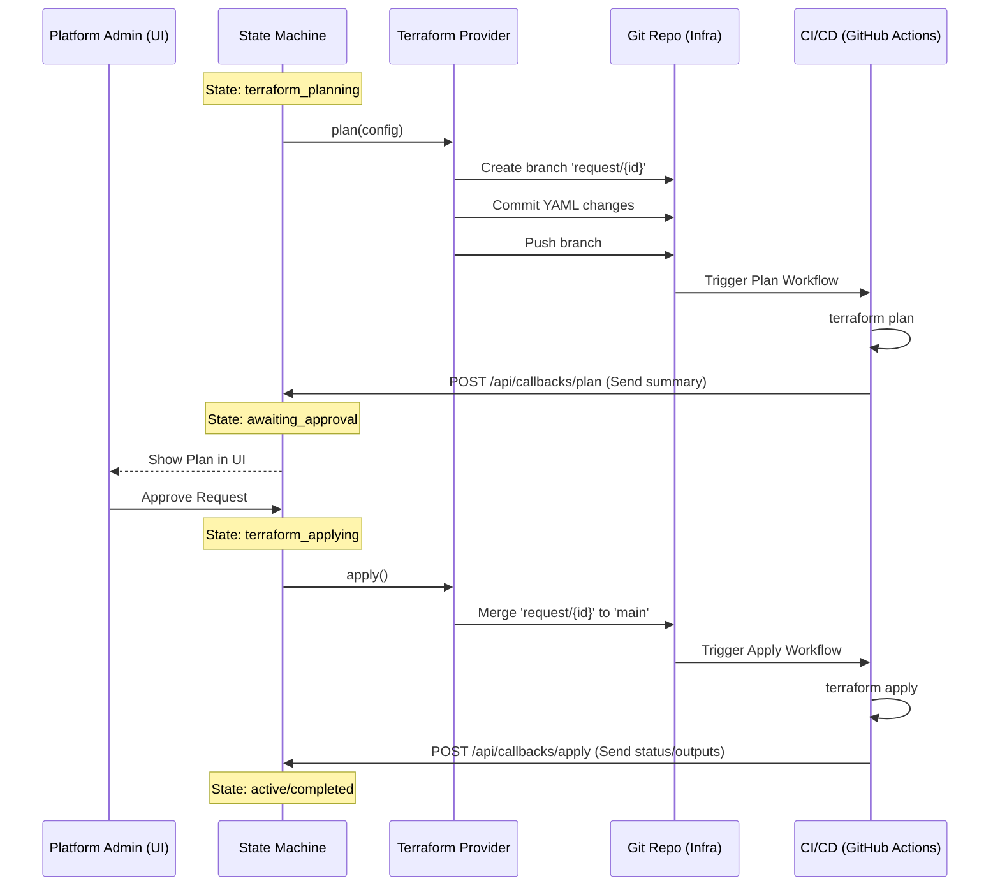

# Terraform Integration (GitOps Pattern)

## Overview
This provider implements a **GitOps** pattern for infrastructure provisioning. Unlike a direct-execution model where the backend runs Terraform directly, this provider acts as an automation bridge to an external Infrastructure-as-Code (IaC) Git repository. 

The core principle is **Isolation through Branching**: every request gets its own branch, allowing for independent `terraform plan` execution and review before merging to `main` for a final `terraform apply`.

## Architecture Flow



## Key Components

### 1. State Machine Integration
State machines using this provider must handle the following sequence:

1.  **`terraform_planning`**: The SM calls `provisioner.plan()`. This is an async state. The SM waits for a callback from the CI system containing the plan result.
2.  **`awaiting_approval`**: Once the plan is received, the SM transitions here. This is a "Human-in-the-loop" state where a Platform Admin reviews the plan in the UI.
3.  **`terraform_applying`**: Upon approval, the SM calls `provisioner.apply()`. This state triggers the merge to `main`. The SM waits for a final callback confirming execution.

### 2. Provider Responsibilities
The `TerraformProvider` handles the low-level Git mechanics:
- **`plan(request_id, target_file, content)`**:
    - Switches to a new branch: `request/{request_id}`.
    - Updates YAML files with the desired state.
    - Pushes the branch to trigger remote CI.
- **`apply(request_id)`**:
    - Merges the request branch into the target branch (usually `main`).
    - Pushes the merge to trigger remote execution.

### 3. CI/CD Requirements
The external repository must host two primary workflows:

#### **Plan Workflow** (`plan.yml`)
- **Trigger**: `on: push: branches: ["request/*"]`
- **Commands**:
    ```bash
    terraform init
    terraform plan -no-color > plan_output.txt
    ```
- **Callback**: Send `plan_output.txt` to the Backend callback API.

#### **Apply Workflow** (`apply.yml`)
- **Trigger**: `on: push: branches: ["main"]`
- **Commands**:
    ```bash
    terraform init
    terraform apply -auto-approve
    ```
- **Callback**: Send success/failure and any `terraform output -json` to the Backend callback API.

## Implementation Details

### Branch Management
By using `request/{request_id}` branches, we ensure:
- **Zero Conflicts**: Multiple requests can be in the "Planning" phase simultaneously.
- **Isolation**: Each plan is specific to the changes in its branch.
- **Auditability**: Every infrastructure change is backed by a Git commit and a recorded plan.
- **Cleanup**: Once merged and applied, the request branch can be safely deleted.

### Environment & Directory Structure
The provider assumes a convention-based directory structure in the IaC repo. This structure is optimized for **YAML-driven configuration**, allowing the Provider to write simple YAML files instead of parsing/generating complex HCL code.

The Terraform `main.tf` is expected to use `yamldecode()` to read these files and iterate over them (e.g., `for_each`) to create resources.

```text
infrastructure-repo/
├── databricks/
│   ├── modules/                 # Reusable Terraform Modules
│   │   ├── unity-catalog/
│   │   └── workspace-config/
│   ├── envs/
│   │   ├── dev/
│   │   │   ├── main.tf          # Calls modules using data from yaml
│   │   │   ├── data/            # The "Database" of YAML files
│   │   │   │   ├── catalogs/
│   │   │   │   │   ├── sales-analytics.yaml
│   │   │   │   │   └── finance-reporting.yaml
│   │   │   │   ├── grants/      # Global/Account level grants
│   │   │   │   │   └── account-groups.yaml
│   │   │   │   └── workspaces/
│   │   │   │       └── project-phoenix.yaml
│   │   │   └── provider.tf
│   │   └── prod/
│   │       └── ...
└── .github/
    └── workflows/
```

### Configuration Examples

The `TerraformProvider` writes to these specific YAML files based on the `Request`.

#### 1. Catalogs & Schemas (`data/catalogs/{name}.yaml`)
Used for `CATALOG_SCHEMA_TABLE` requests.
```yaml
name: "finance_prod"
comment: "Primary catalog for finance team"
properties:
  owner: "group:finance-admins"
schemas:
  - name: "gold"
    comment: "Curated business data"
    tables: [] # Managed by other processes or dbt
  - name: "silver"
    comment: "Cleaned data"
grants:
  - principal: "group:finance-analysts"
    privileges: ["USE_CATALOG", "SELECT"]
  - principal: "group:finance-engineers"
    privileges: ["ALL_PRIVILEGES"]
  - principal: "group:audit-team"
    privileges: ["SELECT"]
```

#### 2. Workspaces (`data/workspaces/{name}.yaml`)
Used for `WORKSPACE_PROVISION` requests.
```yaml
display_name: "Project Phoenix Lab"
region: "us-west-2"
sku: "premium"
tags:
  - key: "CostCenter"
    value: "CC-1234"
  - key: "Project"
    value: "Phoenix"
principals:
  - group_name: "phoenix-devs"
    permission_level: "CAN_MANAGE"
  - group_name: "phoenix-viewers"
    permission_level: "CAN_VIEW"
network:
  privatelink: true
  storage_customer_managed_key: true
```

#### 3. Global Permissions (`data/grants/global.yaml`)
Used for `WORKSPACE_ACCESS` or `USER_ONBOARDING` requests.
```yaml
# Account-level group mapping or metastore admin assignments
metastore_admins:
  - "group:platform-admins"
  - "user:alice@example.com"
account_groups:
  - name: "finance-analysts"
    members:
      - "user:bob@example.com"
```

### The Callback API
The Backend provides a centralized callback endpoint:
`POST /api/v1/callbacks/terraform/{request_id}`

The payload structure:
```json
{
  "action": "plan" | "apply",
  "status": "success" | "failure",
  "summary": "Terraform plan details or apply logs",
  "outputs": {
    "workspace_url": "https://...",
    "metastore_id": "..."
  },
  "error": "Error details if status is failure"
}
```
This callback updates the **Facts** for the request, which in turn triggers the next state transition in the State Machine.
